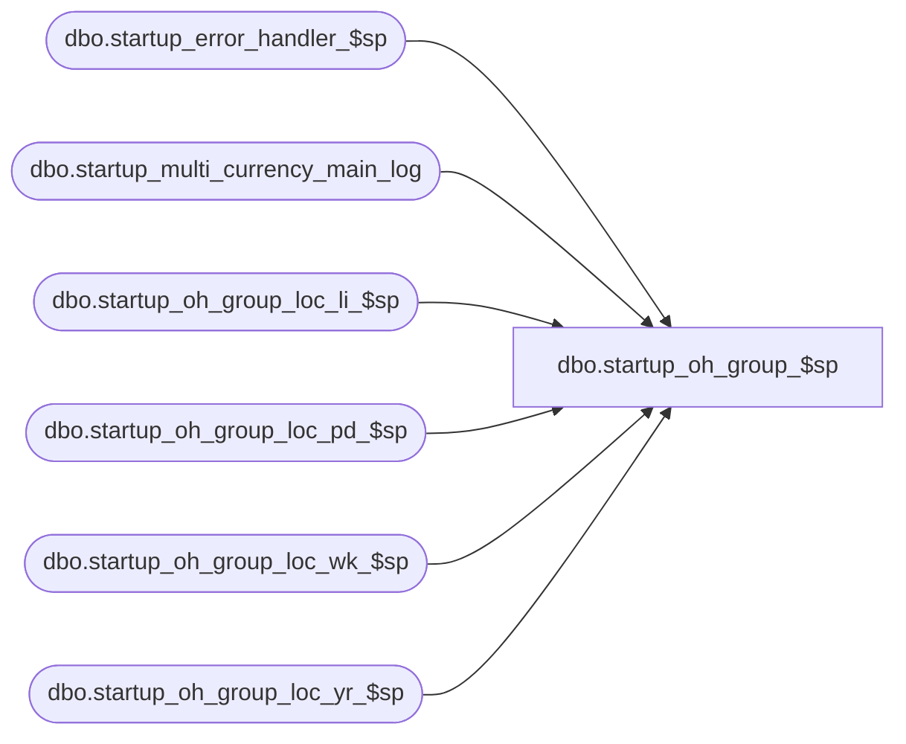

# dbo.startup_oh_group_$sp

**Database:** ma_01  
**Server:** bedrockdb02  

## Architecture Diagram



## Table Dependencies

| Referenced Table |
|---|
| dbo.startup_error_handler_$sp |
| dbo.startup_multi_currency_main_log |
| dbo.startup_oh_group_loc_li_$sp |
| dbo.startup_oh_group_loc_pd_$sp |
| dbo.startup_oh_group_loc_wk_$sp |
| dbo.startup_oh_group_loc_yr_$sp |

## Stored Procedure Code

```sql

```

