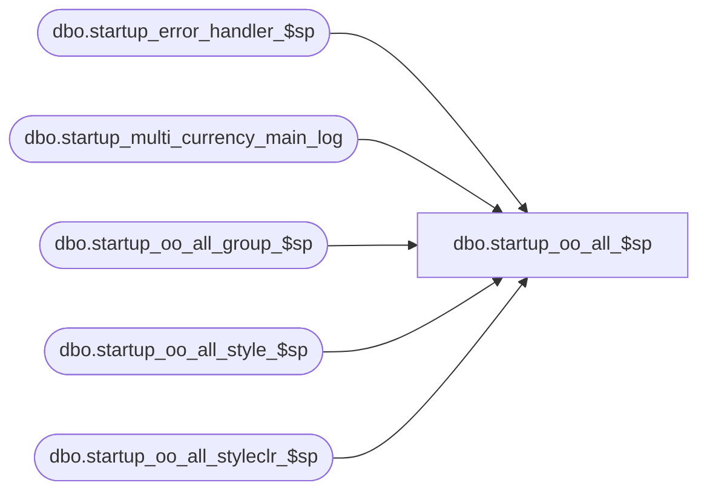

# dbo.startup_oo_all_$sp

**Database:** ma_01  
**Server:** bedrockdb02  

## Architecture Diagram



## Table Dependencies

| Referenced Table |
|---|
| dbo.startup_error_handler_$sp |
| dbo.startup_multi_currency_main_log |
| dbo.startup_oo_all_group_$sp |
| dbo.startup_oo_all_style_$sp |
| dbo.startup_oo_all_styleclr_$sp |

## Stored Procedure Code

```sql

```

