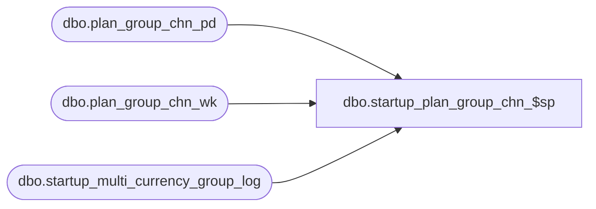

# dbo.startup_plan_group_chn_$sp

**Database:** ma_01  
**Server:** bedrockdb02  

## Architecture Diagram



## Table Dependencies

| Referenced Table |
|---|
| dbo.plan_group_chn_pd |
| dbo.plan_group_chn_wk |
| dbo.startup_multi_currency_group_log |

## Stored Procedure Code

```sql

```

