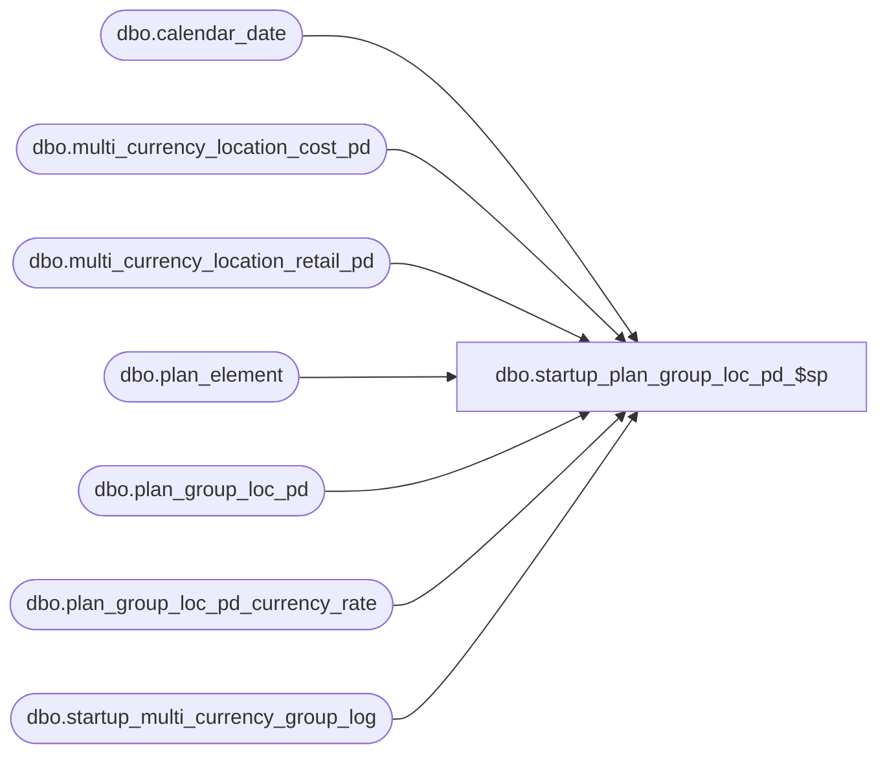

# dbo.startup_plan_group_loc_pd_$sp

**Database:** ma_01  
**Server:** bedrockdb02  

## Architecture Diagram



## Table Dependencies

| Referenced Table |
|---|
| dbo.calendar_date |
| dbo.multi_currency_location_cost_pd |
| dbo.multi_currency_location_retail_pd |
| dbo.plan_element |
| dbo.plan_group_loc_pd |
| dbo.plan_group_loc_pd_currency_rate |
| dbo.startup_multi_currency_group_log |

## Stored Procedure Code

```sql

```

