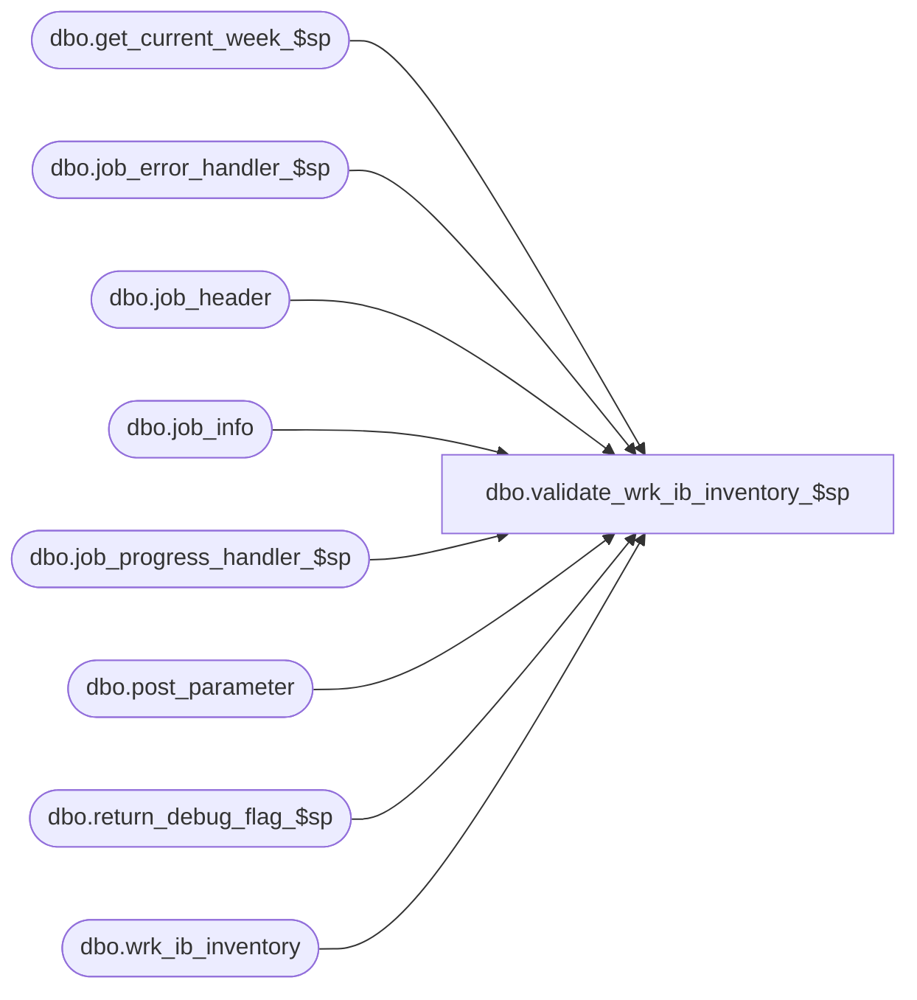

# dbo.validate_wrk_ib_inventory_$sp

**Database:** ma_01  
**Server:** bedrockdb02  

## Architecture Diagram



## Table Dependencies

| Referenced Table |
|---|
| dbo.get_current_week_$sp |
| dbo.job_error_handler_$sp |
| dbo.job_header |
| dbo.job_info |
| dbo.job_progress_handler_$sp |
| dbo.post_parameter |
| dbo.return_debug_flag_$sp |
| dbo.wrk_ib_inventory |

## Stored Procedure Code

```sql

```

