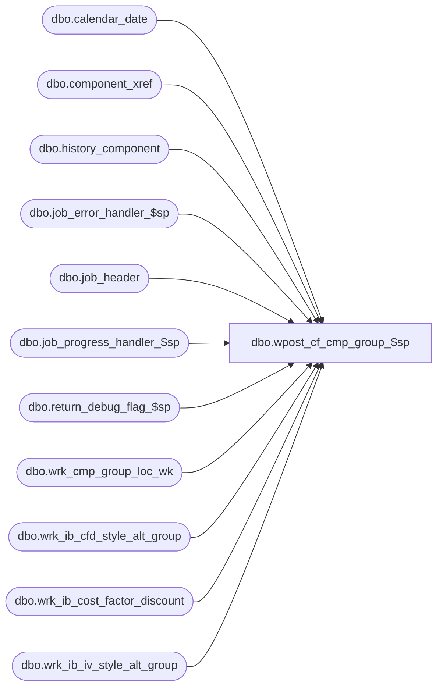

# dbo.wpost_cf_cmp_group_$sp

**Database:** ma_01  
**Server:** bedrockdb02  

## Architecture Diagram



## Table Dependencies

| Referenced Table |
|---|
| dbo.calendar_date |
| dbo.component_xref |
| dbo.history_component |
| dbo.job_error_handler_$sp |
| dbo.job_header |
| dbo.job_progress_handler_$sp |
| dbo.return_debug_flag_$sp |
| dbo.wrk_cmp_group_loc_wk |
| dbo.wrk_ib_cfd_style_alt_group |
| dbo.wrk_ib_cost_factor_discount |
| dbo.wrk_ib_iv_style_alt_group |

## Stored Procedure Code

```sql

```

