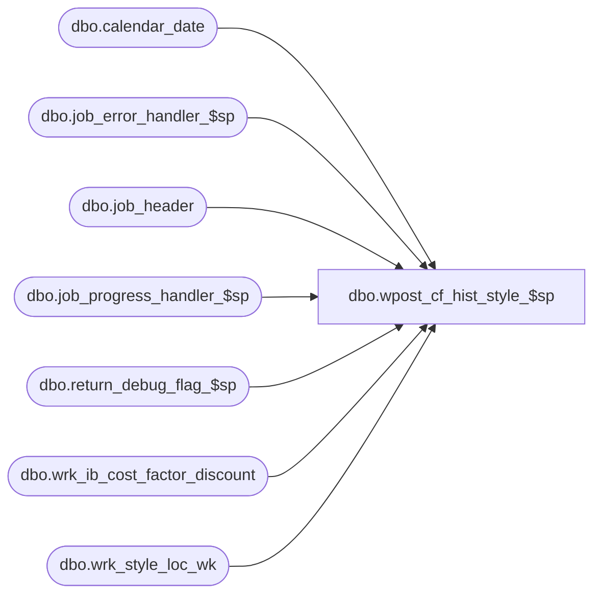

# dbo.wpost_cf_hist_style_$sp

**Database:** ma_01  
**Server:** bedrockdb02  

## Architecture Diagram



## Table Dependencies

| Referenced Table |
|---|
| dbo.calendar_date |
| dbo.job_error_handler_$sp |
| dbo.job_header |
| dbo.job_progress_handler_$sp |
| dbo.return_debug_flag_$sp |
| dbo.wrk_ib_cost_factor_discount |
| dbo.wrk_style_loc_wk |

## Stored Procedure Code

```sql

```

