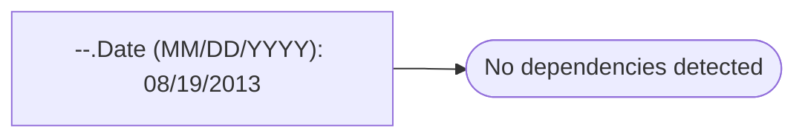

# --.Date (MM/DD/YYYY): 08/19/2013

**Database:** master  
**Server:** bedrockdb02  

## Architecture Diagram



## Table Dependencies

_No table references detected._

## Stored Procedure Code

```sql

```

