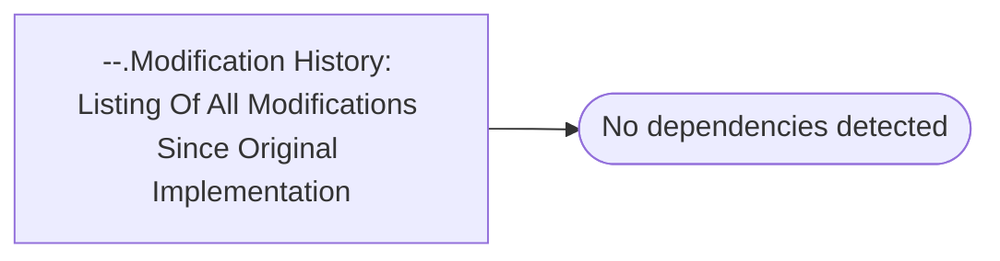

# --.Modification History: Listing Of All Modifications Since Original Implementation

**Database:** master  
**Server:** bedrockdb02  

## Architecture Diagram



## Table Dependencies

_No table references detected._

## Stored Procedure Code

```sql

```

