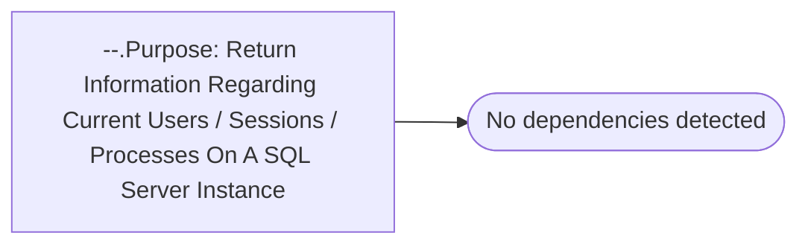

# --.Purpose: Return Information Regarding Current Users / Sessions / Processes On A SQL Server Instance

**Database:** master  
**Server:** bedrockdb02  

## Architecture Diagram



## Table Dependencies

_No table references detected._

## Stored Procedure Code

```sql

```

