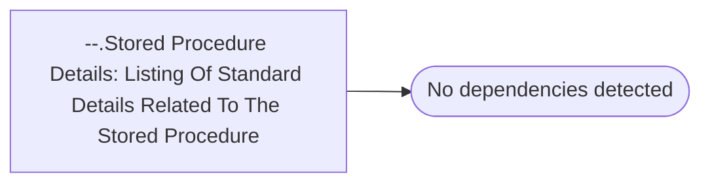

# --.Stored Procedure Details: Listing Of Standard Details Related To The Stored Procedure

**Database:** master  
**Server:** bedrockdb02  

## Architecture Diagram



## Table Dependencies

_No table references detected._

## Stored Procedure Code

```sql

```

