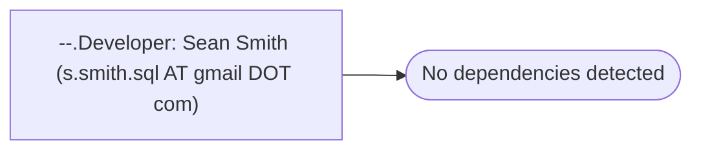

# --.Developer: Sean Smith (s.smith.sql AT gmail DOT com)

**Database:** master  
**Server:** bedrockdb02  

## Architecture Diagram



## Table Dependencies

_No table references detected._

## Stored Procedure Code

```sql

```

