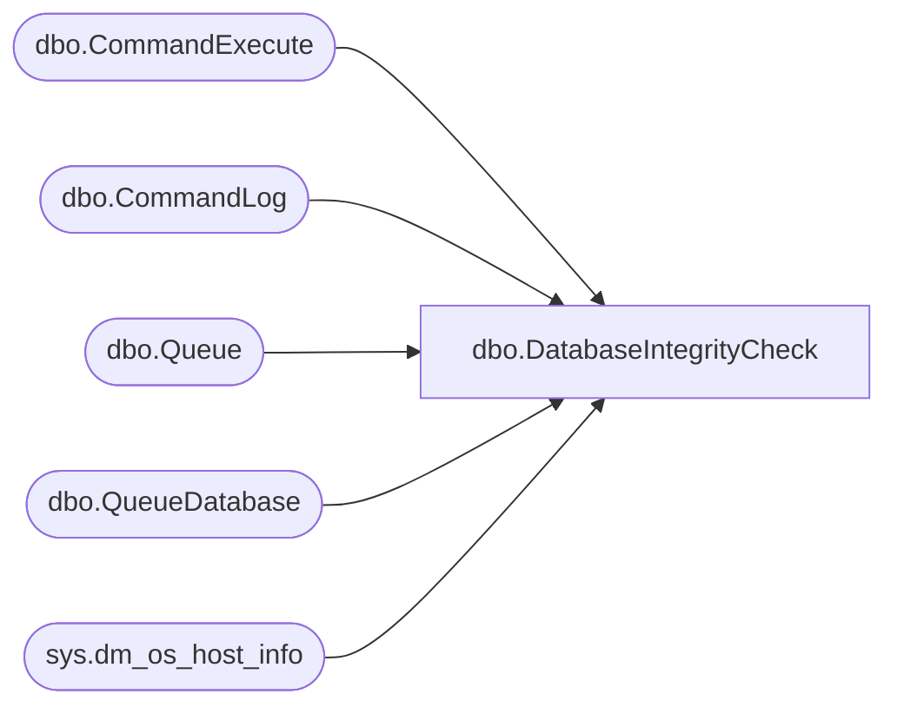

# dbo.DatabaseIntegrityCheck

**Database:** master  
**Server:** bedrockdb02  

## Architecture Diagram



## Table Dependencies

| Referenced Table |
|---|
| dbo.CommandExecute |
| dbo.CommandLog |
| dbo.Queue |
| dbo.QueueDatabase |
| sys.dm_os_host_info |

## Stored Procedure Code

```sql
CREATE PROCEDURE [dbo].[DatabaseIntegrityCheck]
```

