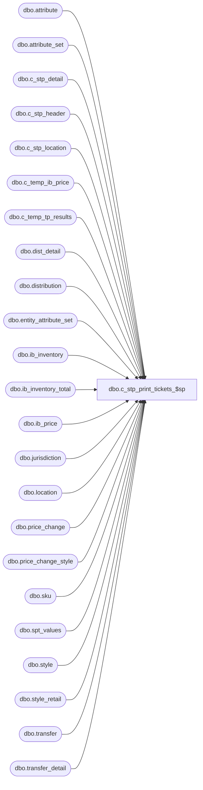

# dbo.c_stp_print_tickets_$sp

**Database:** master  
**Server:** bedrockdb02  

## Architecture Diagram



## Table Dependencies

| Referenced Table |
|---|
| dbo.attribute |
| dbo.attribute_set |
| dbo.c_stp_detail |
| dbo.c_stp_header |
| dbo.c_stp_location |
| dbo.c_temp_ib_price |
| dbo.c_temp_tp_results |
| dbo.dist_detail |
| dbo.distribution |
| dbo.entity_attribute_set |
| dbo.ib_inventory |
| dbo.ib_inventory_total |
| dbo.ib_price |
| dbo.jurisdiction |
| dbo.location |
| dbo.price_change |
| dbo.price_change_style |
| dbo.sku |
| dbo.spt_values |
| dbo.style |
| dbo.style_retail |
| dbo.transfer |
| dbo.transfer_detail |

## Stored Procedure Code

```sql

```

