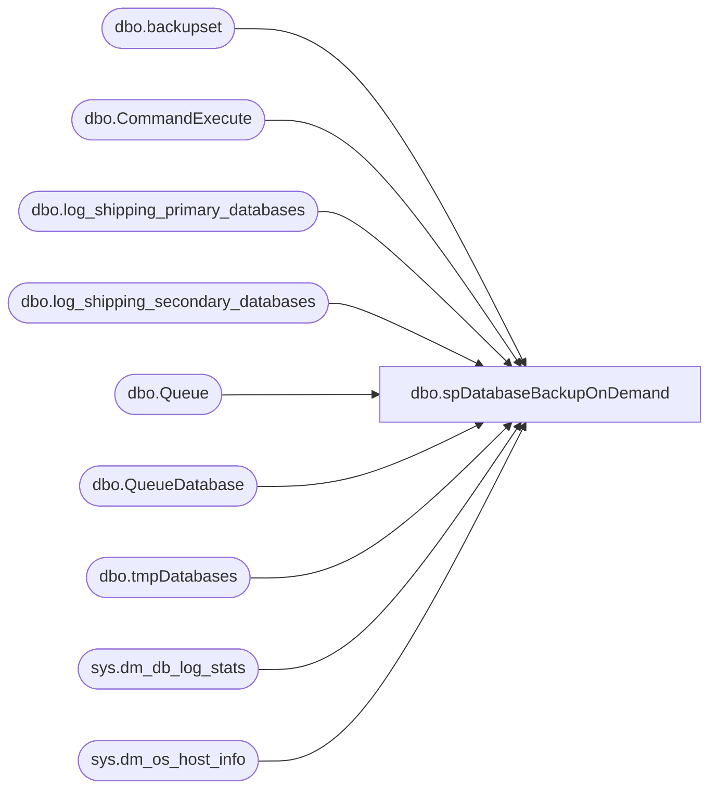

# dbo.spDatabaseBackupOnDemand

**Database:** master  
**Server:** bedrockdb02  

## Architecture Diagram



## Table Dependencies

| Referenced Table |
|---|
| dbo.backupset |
| dbo.CommandExecute |
| dbo.log_shipping_primary_databases |
| dbo.log_shipping_secondary_databases |
| dbo.Queue |
| dbo.QueueDatabase |
| dbo.tmpDatabases |
| sys.dm_db_log_stats |
| sys.dm_os_host_info |

## Stored Procedure Code

```sql
create proc spDatabaseBackupOnDemand
```

