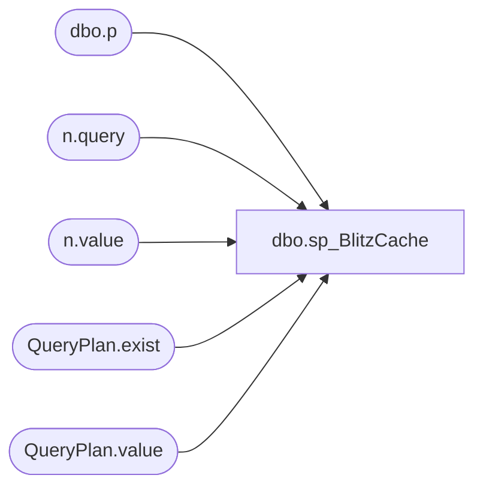

# dbo.sp_BlitzCache

**Database:** master  
**Server:** bedrockdb02  

## Architecture Diagram



## Table Dependencies

| Referenced Table |
|---|
| dbo.p |
| n.query |
| n.value |
| QueryPlan.exist |
| QueryPlan.value |

## Stored Procedure Code

```sql

```

