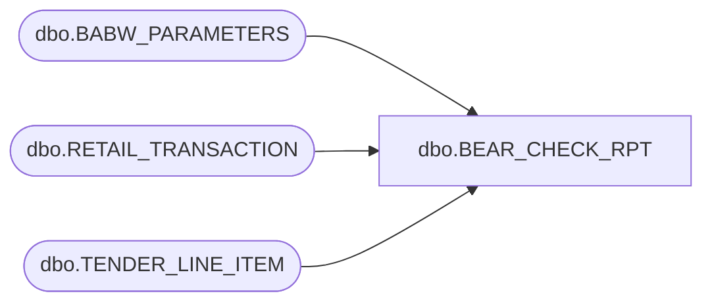

# dbo.BEAR_CHECK_RPT

**Database:** me_01  
**Server:** bedrockdb02  

## Architecture Diagram



## Table Dependencies

| Referenced Table |
|---|
| dbo.BABW_PARAMETERS |
| dbo.RETAIL_TRANSACTION |
| dbo.TENDER_LINE_ITEM |

## Stored Procedure Code

```sql
/*Report Id = 3020
drop procedure dbo.BEAR_CHECK_RPT*/
CREATE     procedure [dbo].[BEAR_CHECK_RPT]
@PRM_BEGIN_DT datetime,
@PRM_END_DT datetime
as

Declare
@Check_Tender1	int,
@Check_Tender2	int

declare CheckTender_cursor cursor SCROLL for
Select CHECK_TENDER_ID1,CHECK_TENDER_ID2 from BABW_PARAMETERS


open CheckTender_cursor
fetch CheckTender_cursor into @Check_Tender1,@Check_Tender2

close CheckTender_cursor
deallocate CheckTender_cursor

SELECT  RT.RTL_TRN_ID,
	RT.AMOUNT,
	RT.BEGIN_DATETIME, 
	RT.END_DATETIME,
	RT.WORKSTATION_NO,
	RT.RTL_TRN_NO,
	TN.TENDER_TYPE_ID,
	TN.TENDER_TYPE_CODE,
	TN.TENDER_AMOUNT,
	TN.ACCOUNT_NO

	
FROM    
	RETAIL_TRANSACTION RT 
		INNER JOIN TENDER_LINE_ITEM TN 
		ON ((RT.RTL_TRN_ID = TN.RTL_TRN_ID) and (RT.STORE_NO = TN.STORE_NO))
WHERE   (END_DATETIME between @PRM_BEGIN_DT and @PRM_END_DT)  
	AND RT.RTL_TRN_TYPE_CODE = 'SALE'
	AND RT.SUSPENDED_FLG = 0
	AND RT.TRAINING_FLG = 0
	and RT.VOID_FLG=0
        and RT.VOIDED_FLG=0
        and RT.VOIDING_FLG=0
	and (TN.TENDER_TYPE_ID = @Check_Tender1 or TN.TENDER_TYPE_ID = @Check_Tender2)
```

