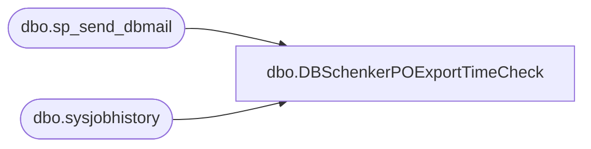

# dbo.DBSchenkerPOExportTimeCheck

**Database:** me_01  
**Server:** bedrockdb02  

## Architecture Diagram



## Table Dependencies

| Referenced Table |
|---|
| dbo.sp_send_dbmail |
| dbo.sysjobhistory |

## Stored Procedure Code

```sql
-- =============================================
-- Author:		Justin Cross 
-- Create date: 11/08/2024
-- Description:	Check if the MERCHANDISING - Process - DB Schenker PO Export job completed with in the last 12 hours, Sends Email to EntSys if job did not complete or hung. 
-- =============================================
CREATE PROCEDURE [dbo].[DBSchenkerPOExportTimeCheck]
AS
BEGIN
DECLARE @recip VARCHAR(1000), 
        @prof VARCHAR(1000),
        @subj VARCHAR(1000), 
        @text VARCHAR(8000),
        @LastRunDateTime DATETIME;

SET @recip = 'enterprisesystemsalerts@buildabear.com; JustinCr@buildabear.com';
SET @subj = 'ALERT MERCHANDISING - Process - DB Schenker PO Export Job Not Completed';
SET @prof = 'Merchadmin';

-- Get the last run date and time of step 0
SELECT TOP 1 @LastRunDateTime = CONVERT(DATETIME, RTRIM(run_date)) + 
    (run_time / 10000 * 3600 + (run_time % 10000) / 100 * 60 + run_time % 100) / 86400.0
FROM msdb.dbo.sysjobhistory
WHERE job_id = '0F678910-0CD2-434B-88A4-4D55A5424111'
AND step_id = 0
AND run_status = 1
ORDER BY run_date DESC, run_time DESC;

-- Check if the last run was within the last 12 hours
IF @LastRunDateTime IS NULL OR @LastRunDateTime < DATEADD(HOUR, -12, GETDATE())
BEGIN
    SET @text = '<html><p style="font-family: Arial; font-size: 1em; margin: 0% 3%;">The SQL Server Agent Job "MERCHANDISING - Process - DB Schenker PO Export" has not completed within the last 12 hours on BEDROCKDB02.' + 
    '<br/>  Check the status of the job and refer to https://build-a-bear.atlassian.net/wiki/spaces/ES/pages/3554607105/ALERT+MERCHANDISING+-+Process+-+DB+Schenker+PO+Export+Job+Not+Completed' +
    '</p><br/>' +
    '<p style="font-family: Arial; font-size: .6em; margin: 0% 3%;">This email has been generated from [BEDROCKDB02].[me_01].[dbo].[DBSchenkerPOExportTimeCheck]' +
    '</p>' +
    '</html>';
    
    EXEC msdb.dbo.sp_send_dbmail
        @profile_name = @prof,
        @recipients = @recip,
        @body = @text,
        @subject = @subj,
        @body_format = 'HTML';
END
END
```

