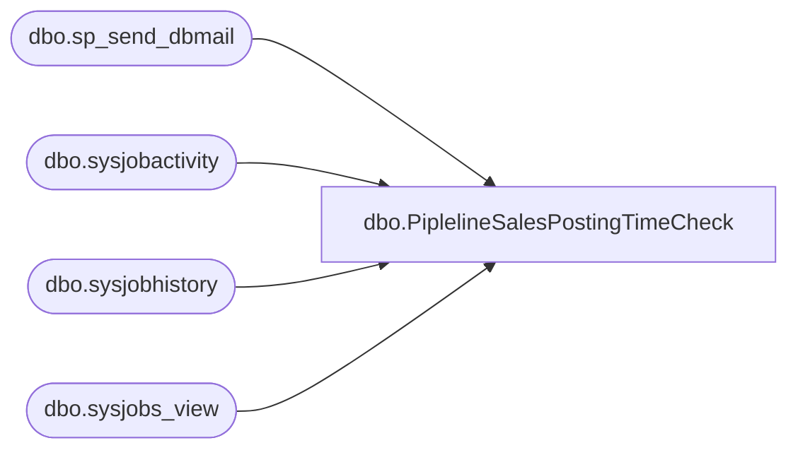

# dbo.PiplelineSalesPostingTimeCheck

**Database:** me_01  
**Server:** bedrockdb02  

## Architecture Diagram



## Table Dependencies

| Referenced Table |
|---|
| dbo.sp_send_dbmail |
| dbo.sysjobactivity |
| dbo.sysjobhistory |
| dbo.sysjobs_view |

## Stored Procedure Code

```sql
-- =============================================
-- Author:		Justin Cross (modified from Lizzy Timm's TXT ALERT)
-- Create date: 01/25/2024
-- Description:	Check if the MERCHANDISING - Process - Pipeline Sales Posting job is running for longer than 2 hours and send an email alert to ES Alerts if it is
-- =============================================
CREATE PROCEDURE [dbo].[PiplelineSalesPostingTimeCheck]
AS
BEGIN
--SET NOCOUNT ON
DECLARE @recip VARCHAR(1000), 
        @prof VARCHAR(1000),
		@subj VARCHAR(1000), 
		@query VARCHAR(2000),
		@text VARCHAR(8000)
DECLARE @JOB_NAME SYSNAME = 'MERCHANDISING - Process - Pipeline Sales Posting'; 
SET @recip = 'enterprisesystemsalerts@buildabear.com; JustinCr@buildabear.com; Paulk@buildabear.com'
SET @subj = 'ALERT MERCHANDISING - Process - Pipeline Sales Posting Job Running Longer than 2 Hours'
SET @prof = 'Merchadmin'
IF EXISTS(     
     SELECT
        ja.session_id,                
        ja.job_id,
        j.name AS job_name,       
        ja.start_execution_date,  
        ja.last_executed_step_id,     
        ja.last_executed_step_date,   
        ja.stop_execution_date,       
        ja.next_scheduled_run_date,
        ja.job_history_id,            
        jh.run_status     
       
 FROM msdb.dbo.sysjobactivity ja
        LEFT JOIN msdb.dbo.sysjobhistory jh ON ja.job_history_id = jh.instance_id AND ja.job_id = jh.job_id
        JOIN msdb.dbo.sysjobs_view j ON ja.job_id = j.job_id AND ja.job_id = j.job_id
        WHERE 1=1
                     -- AND ja.job_history_id IS NOT NULL
                      AND (
               (
                             CAST(ja.start_execution_date AS DATE) = CAST(GETDATE() AS DATE)
                             AND j.name = @JOB_NAME
                             AND jh.run_status IS NULL
                             AND DATEDIFF(MINUTE, ja.start_execution_date, GETDATE()) > 120
							 AND DATEDIFF(MINUTE, ja.start_execution_date, GETDATE()) < 330 -- Jobs running longer than 2 hours cut off alert after 5 hours
                             )
              OR
                (
                             CAST(ja.start_execution_date AS DATE) = CAST(DATEADD(DAY, -1, GETDATE()) AS DATE) -- Check if job started yesterday
                             AND j.name = @JOB_NAME
                             AND jh.run_status IS NULL
                             AND DATEDIFF(MINUTE, ja.start_execution_date, GETDATE()) % (24 * 60) > 120
							 AND DATEDIFF(MINUTE, ja.start_execution_date, GETDATE()) % (24 * 60) < 330 -- Check if running into next calendar day longer than 2 hours cut off after 5 hours

                             ))

	)
BEGIN
    SET @text = '<html><p style="font-family: Arial; font-size: 1em; margin: 0% 3%;">The SQL Server Agent Job "MERCHANDISING - Process - Pipeline Sales Posting" is running longer than 2 hours on BEDROCKDB02.' + 
    '<br/>  Check the status of the job and refer to https://build-a-bear.atlassian.net/wiki/spaces/ES/pages/268173313/Sales+Posting+Pipeline+Stuck confluence document.' +
    '</p><br/>' +
    '<p style="font-family: Arial; font-size: .6em; margin: 0% 3%;">This email has been generated from [BEDROCKDB02].[me_01].[dbo].[PiplelineSalesPostingTimeCheck]' +
    '</p>' +
    '</html>'
    EXEC msdb.dbo.sp_send_dbmail
        @profile_name = @prof,
	    @recipients = @recip,
        @body = @text,
        @subject = @subj,
        @body_format = 'HTML'
END
END
```

