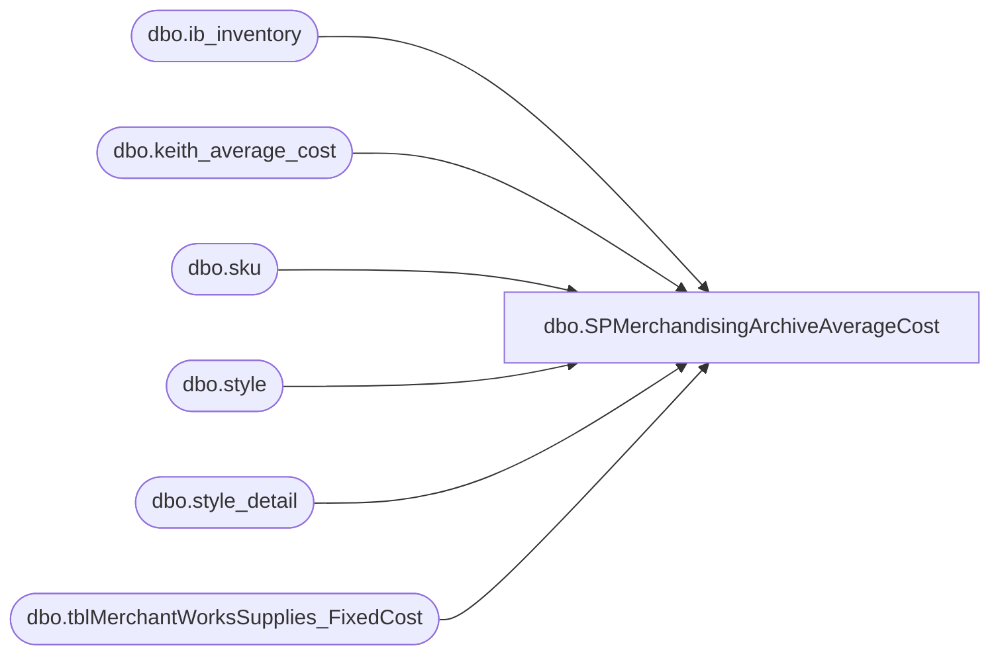

# dbo.SPMerchandisingArchiveAverageCost

**Database:** me_01  
**Server:** bedrockdb02  

## Architecture Diagram



## Table Dependencies

| Referenced Table |
|---|
| dbo.ib_inventory |
| dbo.keith_average_cost |
| dbo.sku |
| dbo.style |
| dbo.style_detail |
| dbo.tblMerchantWorksSupplies_FixedCost |

## Stored Procedure Code

```sql
CREATE procedure [dbo].[SPMerchandisingArchiveAverageCost]
as
set nocount on
-- =====================================================================================================
-- Name: SPMerchandisingArchiveAverageCost
--
-- Description:Build Average Cost Table.
-- Revision History
--		Name:			Date:			Comments: This Proc replaces existing DTS pkg on Beehive called Archive_Average_Cost_V1
--		Dan Tweedie 	    03/02/2015		Created proc.	
--		Dan Tweedie			08/04/2015		Altered proc to capture average cost as normal, 
--											but then replace the values with data from Kodiak.Beardata.dbo.tblMerchantWorksSupplies_FixedCost if data exists, otherwise use avg cost
-- =====================================================================================================

TRUNCATE TABLE keith_average_cost

INSERT INTO keith_average_cost
SELECT s.style_code,
	s.short_desc,
	CASE 
		WHEN sum(ii.transaction_cost) = 0
			OR sum(ii.transaction_units) = 0
			THEN 0.00
		WHEN sum(ii.transaction_units) < 0
			THEN sd.last_net_final_po_cost
		ELSE sum(ii.transaction_cost) / sum(ii.transaction_units)
		END average_cost
FROM (
	SELECT sku_id,
		transaction_units,
		transaction_cost,
		transaction_date
	FROM ib_inventory(NOLOCK)
	) ii
INNER JOIN sku sk(NOLOCK) ON ii.sku_id = sk.sku_id
INNER JOIN style s(NOLOCK) ON sk.style_id = s.style_id
INNER JOIN style_detail sd(NOLOCK) ON s.style_id = sd.style_id
WHERE cast(convert(VARCHAR(10), ii.transaction_date, 101) AS DATETIME) <= cast(convert(VARCHAR(10), getdate(), 101) AS DATETIME) --'2006-10-09'
GROUP BY s.style_code, s.short_desc, sd.last_net_final_po_cost

--NEW CODE 08/03/2015
IF (Object_ID('tempdb..#cost') IS NOT NULL) DROP TABLE #cost
select distinct isnull(right('000000' + cast(fc.style_code as varchar), 6), ac.style_code) style_code, 
	   isnull(fc.fixed_cost, ac.average_cost) cost
into #cost
from Kodiak.Beardata.dbo.tblMerchantWorksSupplies_FixedCost fc
full outer join keith_average_cost ac with (nolock) on right('000000' + cast(fc.style_code as varchar), 6) = ac.style_code

truncate table keith_average_cost

INSERT INTO keith_average_cost
select s.style_code, s.short_desc, c.cost as average_cost
from #cost c
join style s with (nolock) on c.style_code = s.style_code
```

