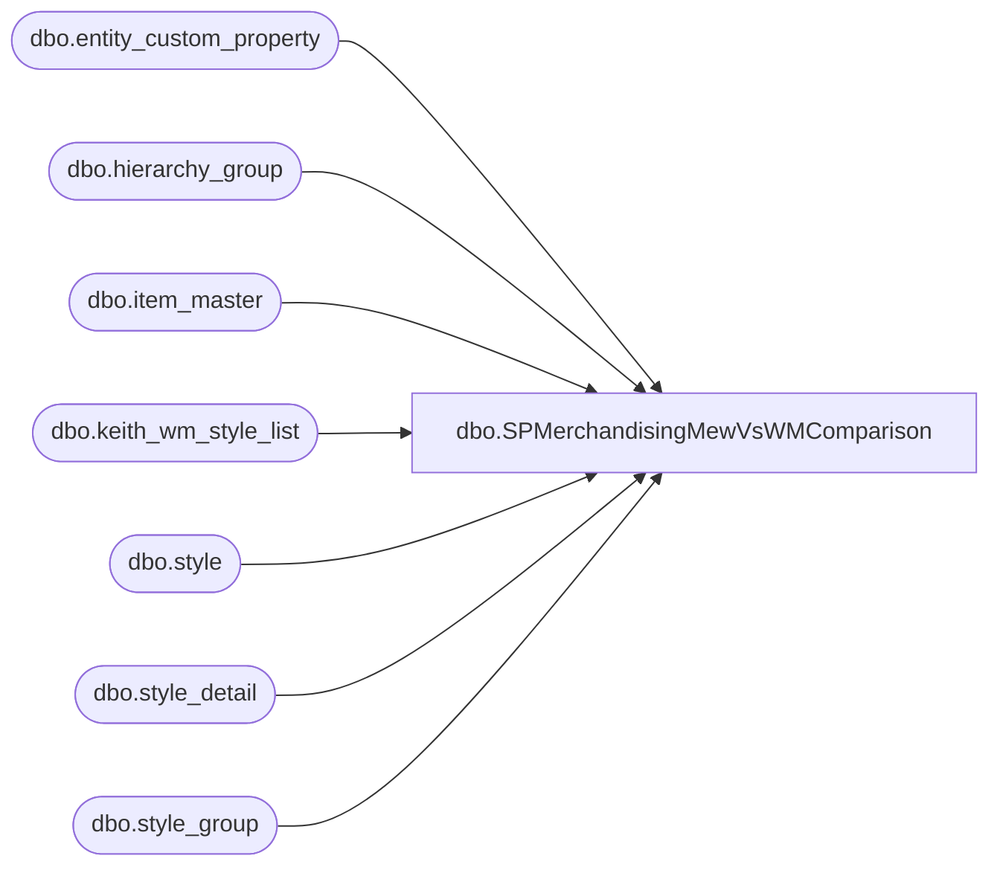

# dbo.SPMerchandisingMewVsWMComparison

**Database:** me_01  
**Server:** bedrockdb02  

## Architecture Diagram



## Table Dependencies

| Referenced Table |
|---|
| dbo.entity_custom_property |
| dbo.hierarchy_group |
| dbo.item_master |
| dbo.keith_wm_style_list |
| dbo.style |
| dbo.style_detail |
| dbo.style_group |

## Stored Procedure Code

```sql
CREATE procedure [dbo].[SPMerchandisingMewVsWMComparison]
as
set nocount on
-- =====================================================================================================
-- Name: SPMerchandisingMewVsWMComparison
--
-- Description: Build WM Style List
--
-- Revision History -- Replaces DTS package on Beehive called Maintenance_MEW_vs_WM_Comparo
--		Name:			Date:			Comments:
--		Dan Tweedie	    03/02/2015		Created proc.	
-- =====================================================================================================

TRUNCATE TABLE keith_wm_style_list

INSERT INTO keith_wm_style_list
SELECT STYLE
FROM wmdb01.wmprod.dbo.item_master

DELETE
FROM keith_wm_style_list
WHERE STYLE IN (
		SELECT s.style_code AS MEW_STYLE
		FROM wmdb01.WMPROD.dbo.item_master AS wmim
		INNER JOIN style s(NOLOCK) ON s.style_code = wmim.STYLE
		INNER JOIN style_detail sd(NOLOCK) ON s.style_id = sd.style_id
		INNER JOIN style_group sg(NOLOCK) ON s.style_id = sg.style_id
		INNER JOIN hierarchy_group hg(NOLOCK) ON sg.hierarchy_group_id = hg.hierarchy_group_id
		INNER JOIN entity_custom_property ecp ON s.style_id = ecp.parent_id
		WHERE substring(hg.hierarchy_group_code, 7, 2) = '60'
			AND custom_property_id = 2
			AND parent_type = 1
			AND ecp.custom_property_value <> wmim.STD_PACK_QTY
		)

DELETE
FROM keith_wm_style_list
WHERE STYLE IN (
		SELECT style AS MEW_STYLE
		FROM wmdb01.WMPROD.dbo.item_master AS wmim
		INNER JOIN style s(NOLOCK) ON s.style_code = wmim.STYLE
		INNER JOIN style_group sg(NOLOCK) ON s.style_id = sg.style_id
		INNER JOIN hierarchy_group hg(NOLOCK) ON sg.hierarchy_group_id = hg.hierarchy_group_id
		WHERE substring(hg.hierarchy_group_code, 7, 2) <> '60'
			AND s.distribution_multiple <> wmim.STD_PACK_QTY
		)
```

