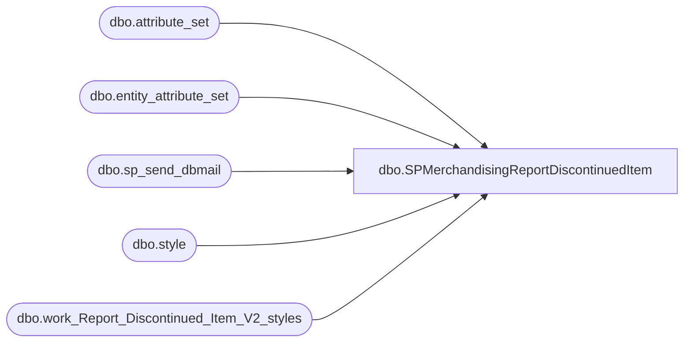

# dbo.SPMerchandisingReportDiscontinuedItem

**Database:** me_01  
**Server:** bedrockdb02  

## Architecture Diagram



## Table Dependencies

| Referenced Table |
|---|
| dbo.attribute_set |
| dbo.entity_attribute_set |
| dbo.sp_send_dbmail |
| dbo.style |
| dbo.work_Report_Discontinued_Item_V2_styles |

## Stored Procedure Code

```sql
CREATE procEDURE [dbo].[SPMerchandisingReportDiscontinuedItem]
AS
SET NOCOUNT ON

-- =====================================================================================================
-- Name:SPMerchandisingReportDiscontinuedItem
--
-- Description: Export to discontinued_item_report /work_Report_Discontinued_Item_V2_styles
--
-- Input:	
--
-- Output: 
--
-- Dependencies: 
--				 
-- Revision History
--		Name:			Date:			Comments: This Proc is replaces DTS pkg on Beehive called Report_Discontinued_Item_V2
--		Dan Tweedie	    03/04/2015		Created proc.	
-- =====================================================================================================
IF (Object_ID('tempdb..##MAHITEMP4_XLS') IS NOT NULL) DROP TABLE ##MAHITEMP4_XLS
SELECT s.style_code AS "Style Code",
	s.short_desc AS "Short Description",
	ats.attribute_set_label AS "MSTAT"
INTO ##MAHITEMP4_XLS
FROM style s(NOLOCK)
INNER JOIN entity_attribute_set eas(NOLOCK) ON s.style_id = eas.parent_id
INNER JOIN attribute_set ats(NOLOCK) ON eas.attribute_set_id = ats.attribute_set_id
WHERE eas.attribute_id = 74
	AND eas.attribute_set_id = 7400004
	AND s.style_code NOT IN (
		SELECT style_code
		FROM work_Report_Discontinued_Item_V2_styles
		)

if (SELECT count(*) FROM ##MAHITEMP4_XLS) > 0

BEGIN

	DECLARE @1query VARCHAR(1000)
		,@1file_name VARCHAR(100)
		,@1file_location VARCHAR(100)
		,@1server VARCHAR(20)
		,@1database VARCHAR(20)
		,@1sqlcmd VARCHAR(1000)
		,@1query_text VARCHAR(1000)
		,@1file VARCHAR(1000)
		,@1body VARCHAR(1000)
		,@1subj VARCHAR(1000)

	SELECT @1query_text = 'set nocount on select * from ##MAHITEMP4_XLS'

	SET @1query = @1query_text
	SET @1file_location = '\\kermode\FileRepository\MERCHANDISING\DBCompare\'
	SET @1file_name = 'discontinued_items_report.csv'
	SET @1server = 'bedrockdb02'
	SET @1database = 'me_01'
	SET @1sqlcmd = 'sqlcmd -S' + @1server + ' -d' + @1database + ' -Q' + '"' + @1query + '"' + ' -o' + '"' + @1file_location + @1file_name + '"' + ' -s"," -w1000 -W'

	EXEC master..xp_cmdshell @1sqlcmd

	EXEC msdb.dbo.sp_send_dbmail @profile_name = 'MerchAdmin',
		@recipients='helenh@buildabear.com',
		@file_attachments = '\\kermode\FileRepository\MERCHANDISING\DBCompare\discontinued_items_report.csv',
		@body = 'If you have any problems with this report, please contact EntSysSupport@buildabear.com',
		@subject = 'Merchandising Discontinued Items Report'


END

	TRUNCATE TABLE work_Report_Discontinued_Item_V2_styles

	INSERT INTO work_Report_Discontinued_Item_V2_styles
	SELECT s.style_code
	FROM style s(NOLOCK)
	INNER JOIN entity_attribute_set eas(NOLOCK) ON s.style_id = eas.parent_id
	INNER JOIN attribute_set ats(NOLOCK) ON eas.attribute_set_id = ats.attribute_set_id
	WHERE 
			eas.attribute_id = 74
		AND eas.attribute_set_id = 7400004
```

