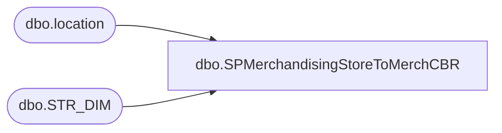

# dbo.SPMerchandisingStoreToMerchCBR

**Database:** me_01  
**Server:** bedrockdb02  

## Architecture Diagram



## Table Dependencies

| Referenced Table |
|---|
| dbo.location |
| dbo.STR_DIM |

## Stored Procedure Code

```sql
CREATE proc [dbo].[SPMerchandisingStoreToMerchCBR]

as

-- =====================================================================================================
-- Name: SPMerchandisingStoreToMerchCBR
--
-- Description: Moves CBR files from POS COMM server to Kermode File Repository, creates CBR file for Pipeline to post carton receipts from stores
--
-- Revision History
--		Name:			Date:			Comments: 
--		Dan Tweedie 	    05/08/2015	Created proc.	
--		Dan Tweedie			10/14/2015	Updated path for comm server for file retrieval to \\deapp01\d$\nsbpolldata\ instead of \\posappcomms01\d$\nsbpolldata\
-- =====================================================================================================

set nocount on

IF (Object_ID('tempdb..#stores') IS NOT null) DROP TABLE #stores
SELECT l.location_code
into #stores
FROM kodiak.BABWMstrData.dbo.STR_DIM s 
join location l (nolock) on right('0000' + cast(s.STR_NUM as varchar(4)), 4) = l.location_code
       and l.active_flag = 1
order by l.location_code

IF (Object_ID('tempdb..#DIR') IS NOT null) DROP TABLE #DIR
create table #DIR
(DIR nvarchar(max))

IF (Object_ID('tempdb..#CBR') IS NOT null) DROP TABLE #CBR
create table #cbr
(carton_nbr varchar(100))

declare @stores int,
		@store varchar(4),
		@etlDirectoryCheck varchar(500),
		@etlHistoryCheck varchar(500),
		@posFileCheck varchar(500),
		@dir varchar(500),
		@bulkInsert varchar(500),
		@files int,
		@filename varchar(100),
		@filepath varchar(500),
		@move varchar(500)

select @stores = count(*) from #stores

while @stores > 0

BEGIN

	select @store = min(location_code) from #stores
	select @etlDirectoryCheck = 'if not exist \\kermode\FileRepository\Merchandising\CartonBatchReceipts\' + @store +  ' mkdir \\kermode\FileRepository\MERCHANDISING\CartonBatchReceipts\' + @store 
	select @etlHistoryCheck = 'if not exist \\kermode\FileRepository\Merchandising\CartonBatchReceipts\' + @store + '\HISTORY\ mkdir \\kermode\FileRepository\MERCHANDISING\CartonBatchReceipts\' + @store + '\HISTORY\'
	select @posFileCheck = 'if exist \\deapp01\d$\nsbpolldata\01' + @store + '\cbr\*.txt move /Y \\deapp01\d$\nsbpolldata\01' + @store + '\cbr\*.txt \\kermode\FileRepository\MERCHANDISING\CartonBatchReceipts\' + @store + '\'
	select @dir = 'dir \\kermode\FileRepository\Merchandising\CartonBatchReceipts\' + @store + '\*.txt /B'
	
	exec master..xp_cmdshell @etlDirectoryCheck
	exec master..xp_cmdshell @etlHistoryCheck
	exec master..xp_cmdshell @posFileCheck

	insert #DIR
	exec master..xp_cmdshell @dir
	delete from #DIR where DIR is null or DIR = 'File Not Found'
	
		---BULK INSERT LOOP
		select @files = count(*) from #DIR

		while @files > 0
			begin

				select @filename = max(DIR) from #DIR
				select @filepath = '\\kermode\FileRepository\MERCHANDISING\CartonBatchReceipts\' + @store + '\' + @filename
				select @bulkinsert = 'bulk insert #CBR from ''' + @filepath + ''' with (FIELDTERMINATOR = ''	'', ROWTERMINATOR = ''\n'')'
				exec (@bulkinsert)
				
				select @move = 'move ' + @filepath + ' \\kermode\FileRepository\MERCHANDISING\CartonBatchReceipts\' + @store + '\HISTORY\'

				exec master..xp_cmdshell @move
								
				delete from #DIR where DIR = @filename
				select @files = count(*) from #DIR
								
				if @files = 0
					break
				else
					continue
			end
	
	--IF STORE'S CBR DATA WAS CAPTURED, OUTPUT TO CBR FILE ON PIPELINE
	if (select count(*) from #CBR) > 0
		begin	
			--STAGE CBR FOR FILE OUTPUT
			IF (Object_ID('me_01..tmpCBR_OUT') IS NOT null) DROP TABLE tmpCBR_OUT
			select 'BC' BC, 
				   'A' A, 
				   carton_nbr, 
				   @store store, 
				   '099060199' code
			into tmpCBR_OUT
			from #CBR

			---OUTPUT CBR FILE
			declare @query varchar(1000),
					@date varchar(200),
					@file_name varchar(100),
					@file_location varchar(1000),
					@server varchar(20),
					@database varchar(20),
					@bcp varchar(1000)

			set @date = convert(varchar, datepart(yyyy, getdate())) + convert(varchar, datepart(mm, getdate())) + convert(varchar, datepart(dd, getdate())) + convert(varchar, datepart(hh, getdate())) + convert(varchar, datepart(mi, getdate())) + convert(varchar, datepart(ss, getdate()))
			set @query = 'set nocount on select * from me_01.dbo.tmpCBR_OUT'
			set @file_location = '\\pipeapp01\Company01\Text File to IM Import Tables  - Batch Carton\'
			set @file_name = 'STSIMCTN.STORE_' + @store + '_CBR.' + @date + '.GO'
			set @server = 'bedrockdb02'
			set @database = 'me_01'
			set @bcp = 'bcp "' + @query + '" queryout "' + @file_location + @file_name + '"  -T -c -S' + @server 
			exec master..xp_cmdshell @bcp
		end

	truncate table #DIR
	truncate table #CBR

	delete from #stores where location_code = @store
	select @stores = count(*) from #stores

	if @stores = 0
		break
	else
		continue

	EXEC pipeapp01.master..xp_cmdshell 'PipelineScheduleClient Start 16499 0'
	

END
```

