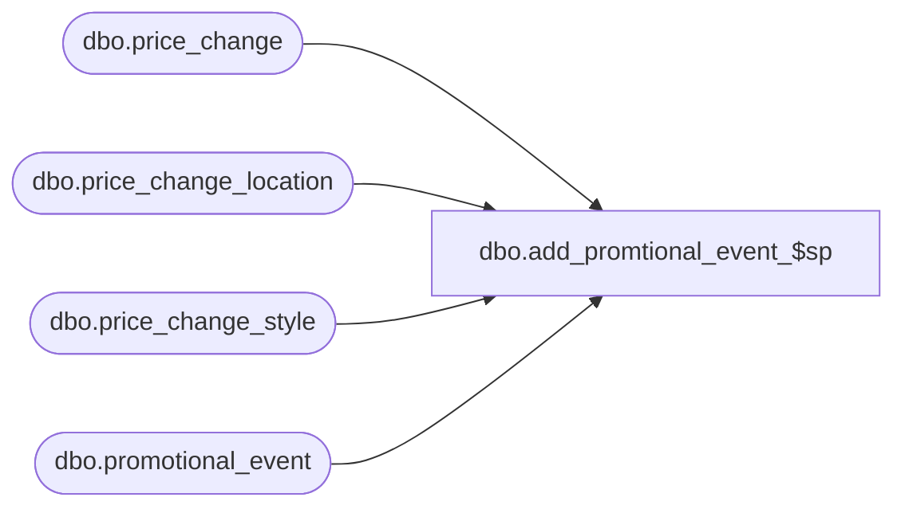

# dbo.add_promtional_event_$sp

**Database:** me_01  
**Server:** bedrockdb02  

## Architecture Diagram



## Table Dependencies

| Referenced Table |
|---|
| dbo.price_change |
| dbo.price_change_location |
| dbo.price_change_style |
| dbo.promotional_event |

## Stored Procedure Code

```sql
CREATE PROCEDURE [dbo].[add_promtional_event_$sp]
@price_change_id DECIMAL(12,0), @event_type SMALLINT

AS

BEGIN

DECLARE @error_number AS INTEGER

INSERT INTO promotional_event
	( id
	, event_number, event_type, description
	, start_date, end_date 
	, location_id, style_id )
SELECT
	newid()
	, price_change_no, @event_type event_type, price_change_description
	, effective_from_date, effective_to_date
	, location_id, style_id
FROM		price_change
INNER JOIN 	price_change_location ON price_change.price_change_id = price_change_location.price_change_id
INNER JOIN 	price_change_style ON price_change_style.price_change_id = price_change_location.price_change_id AND price_change_style.price_change_id = price_change.price_change_id
WHERE
	price_change.price_change_id = @price_change_id

SELECT @error_number = @@ERROR

IF @error_number <> 0

    BEGIN

		RAISERROR (N'add_promtional_event_$sp -- Error inserting rows into promotional event.   Error: %d', 16, 1, @error_number)

    END

END
```

