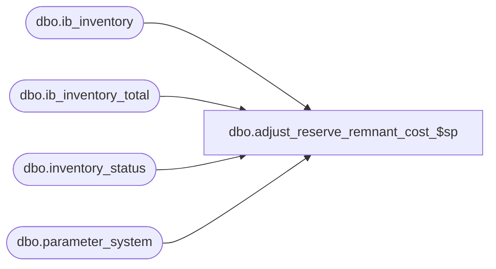

# dbo.adjust_reserve_remnant_cost_$sp

**Database:** me_01  
**Server:** bedrockdb02  

## Architecture Diagram



## Table Dependencies

| Referenced Table |
|---|
| dbo.ib_inventory |
| dbo.ib_inventory_total |
| dbo.inventory_status |
| dbo.parameter_system |

## Stored Procedure Code

```sql
-----------------------------------------------------------------------------------------------------------------------------
--	Main Query: Create Procedure
-----------------------------------------------------------------------------------------------------------------------------

CREATE PROCEDURE dbo.adjust_reserve_remnant_cost_$sp

	@Batch_No AS INT = NULL

AS

SET TRANSACTION ISOLATION LEVEL READ UNCOMMITTED
SET NOCOUNT ON

-----------------------------------------------------------------------------------------------------------------------------
--	Exit procedure if installed_eom_flag in parameter_system is false
-----------------------------------------------------------------------------------------------------------------------------

IF NOT EXISTS (SELECT 1 FROM parameter_system WHERE installed_eom_flag = 1)
BEGIN

	RETURN

END

-----------------------------------------------------------------------------------------------------------------------------
--	Declarations / Sets: Declare And Set Variables
-----------------------------------------------------------------------------------------------------------------------------
DECLARE @Customer_Order_Modify_Transaction_Type_Code SMALLINT = 1661

DECLARE @Available_Status_Id SMALLINT = (SELECT inventory_status_id FROM inventory_status WHERE inventory_status_code = '001')
DECLARE @Reserved_Status_Id SMALLINT = (SELECT inventory_status_id FROM inventory_status WHERE inventory_status_code = '009')

DECLARE @Expand_And_Multiply AS TABLE

	(
		 inventory_status_id SMALLINT NOT NULL
		,multiplier INT NOT NULL
	)

INSERT INTO @Expand_And_Multiply

	(
		 inventory_status_id
		,multiplier
	)

VALUES
	 (@Available_Status_Id, 1)
	,(@Reserved_Status_Id, -1)

DECLARE @Current_Date_Time AS DATETIME = GETDATE()
DECLARE @Current_Date AS SMALLDATETIME = CONVERT(SMALLDATETIME, CONVERT(VARCHAR(8), @Current_Date_Time, 112))

-----------------------------------------------------------------------------------------------------------------------------
--	Error Trapping: Check If Temp Table(s) Already Exist(s) And Drop If Applicable
-----------------------------------------------------------------------------------------------------------------------------
IF OBJECT_ID (N'tempdb.dbo.#temp_ib_inventory_total_update_values', N'U') IS NOT NULL
BEGIN

	DROP TABLE dbo.#temp_ib_inventory_total_update_values

END

-----------------------------------------------------------------------------------------------------------------------------
--	Table Create: Shell Table for "ib_inventory_total" Update
-----------------------------------------------------------------------------------------------------------------------------
CREATE TABLE dbo.#temp_ib_inventory_total_update_values
	(
		 sku_id DECIMAL (13, 0) NULL
		,location_id SMALLINT NULL
		,inventory_status_id SMALLINT NULL
		,transaction_units DECIMAL (14, 2)  NULL
		,transaction_cost DECIMAL (14, 2)  NULL
		,transaction_cost_local DECIMAL (14, 2)  NULL
		,transaction_valuation_retail DECIMAL (14, 2)  NULL
		,transaction_selling_retail DECIMAL (14, 2)  NULL
		,price_status_id SMALLINT NULL
	)

-----------------------------------------------------------------------------------------------------------------------------
--	Populate ib_inventory
-- Move actual_reserved_quantity in dbo.#temp_ib_reserve_inventory from available to reserve inventory status in ib_inventory
-- Records are inserted as of current date
-----------------------------------------------------------------------------------------------------------------------------
INSERT INTO dbo.#temp_ib_inventory_total_update_values

	(
		 sku_id
		,location_id
		,inventory_status_id
		,transaction_units
		,transaction_cost
		,transaction_cost_local
		,transaction_valuation_retail
		,transaction_selling_retail
		,price_status_id
	)

SELECT
	 sqINS.sku_id
	,sqINS.location_id
	,sqINS.inventory_status_id
	,sqINS.transaction_units
	,sqINS.transaction_cost
	,sqINS.transaction_cost_local
	,sqINS.transaction_valuation_retail
	,sqINS.transaction_selling_retail
	,sqINS.price_status_id
FROM

	(
		INSERT INTO dbo.ib_inventory

			(
				 sku_id
				,location_id
				,price_status_id
				,transaction_date
				,transaction_type_code
				,inventory_status_id
				,other_location_id
				,transaction_reason_id
				,document_number
				,transaction_units
				,transaction_cost
				,transaction_valuation_retail
				,transaction_selling_retail
				,price_change_type
				,units_affected
				,transaction_cost_local
				,transaction_no
				,batch_no
				,register_no
			)

		OUTPUT
			 inserted.sku_id
			,inserted.location_id
			,inserted.inventory_status_id
			,inserted.transaction_units
			,inserted.transaction_cost
			,inserted.transaction_cost_local
			,inserted.transaction_valuation_retail
			,inserted.transaction_selling_retail
			,inserted.price_status_id

		SELECT
			 TRRC.sku_id
			,TRRC.location_id
			,IIT.price_status_id
			,@Current_Date AS transaction_date
			,@Customer_Order_Modify_Transaction_Type_Code AS transaction_type_code
			,EM.inventory_status_id
			,NULL AS other_location_id
			,NULL AS transaction_reason_id
			,NULL AS document_number
			,IIT.total_on_hand_units * EM.multiplier AS transaction_units
			,IIT.total_on_hand_cost * EM.multiplier AS transaction_cost
			,IIT.total_on_hand_valuation_retail * EM.multiplier AS transaction_valuation_retail
			,IIT.total_on_hand_selling_retail * EM.multiplier AS transaction_selling_retail
			,NULL AS price_change_type
			,NULL AS units_affected
			,IIT.total_on_hand_cost_local * EM.multiplier AS transaction_cost_local
			,NULL AS transaction_no
			,@Batch_No AS batch_no
			,NULL AS register_no
		FROM
			dbo.#temp_reserve_remnant_cost TRRC
		INNER JOIN dbo.ib_inventory_total IIT
			ON IIT.sku_id = TRRC.sku_id
			AND IIT.location_id = TRRC.location_id
			AND IIT.inventory_status_id = @Reserved_Status_Id
		CROSS JOIN @Expand_And_Multiply EM
		WHERE
			(IIT.total_on_hand_cost <> 0 OR IIT.total_on_hand_cost_local <> 0)
			AND IIT.total_on_hand_units = 0

	) sqINS

-----------------------------------------------------------------------------------------------------------------------------
--	Update ib_inventory_total using data inserted into ib_inventory
-----------------------------------------------------------------------------------------------------------------------------

IF EXISTS (SELECT * FROM dbo.#temp_ib_inventory_total_update_values ttIBITUV)
BEGIN

	MERGE
		dbo.ib_inventory_total IBIT

	USING
		(
			SELECT
				sku_id
				,location_id
				,inventory_status_id
				,price_status_id
				,SUM(transaction_units) AS transaction_units
				,SUM(transaction_cost) AS transaction_cost
				,SUM(transaction_cost_local) AS transaction_cost_local
				,SUM(transaction_selling_retail) AS transaction_selling_retail
				,SUM(transaction_valuation_retail) AS transaction_valuation_retail
			FROM
				dbo.#temp_ib_inventory_total_update_values
			GROUP BY
				sku_id
				,location_id
				,inventory_status_id
				,price_status_id
		) X
		ON X.location_id = IBIT.location_id
			AND X.sku_id = IBIT.sku_id
			AND X.inventory_status_id = IBIT.inventory_status_id

	WHEN MATCHED THEN

		UPDATE
		SET
			IBIT.price_status_id = X.price_status_id
			,IBIT.total_on_hand_units = IBIT.total_on_hand_units + X.transaction_units
			,IBIT.total_on_hand_cost = IBIT.total_on_hand_cost + X.transaction_cost
			,IBIT.total_on_hand_cost_local = IBIT.total_on_hand_cost_local + X.transaction_cost_local
			,IBIT.total_on_hand_selling_retail = IBIT.total_on_hand_selling_retail + X.transaction_selling_retail
			,IBIT.total_on_hand_valuation_retail = IBIT.total_on_hand_valuation_retail + X.transaction_valuation_retail

	WHEN NOT MATCHED BY TARGET THEN

		INSERT
			(
				sku_id
				,location_id
				,inventory_status_id
				,price_status_id
				,total_on_hand_units
				,total_on_hand_cost
				,total_on_hand_cost_local
				,total_on_hand_selling_retail
				,total_on_hand_valuation_retail
			)
		VALUES
			(
				X.sku_id
				,X.location_id
				,X.inventory_status_id
				,X.price_status_id
				,X.transaction_units
				,X.transaction_cost
				,X.transaction_cost_local
				,X.transaction_selling_retail
				,X.transaction_valuation_retail
			);

END
```

