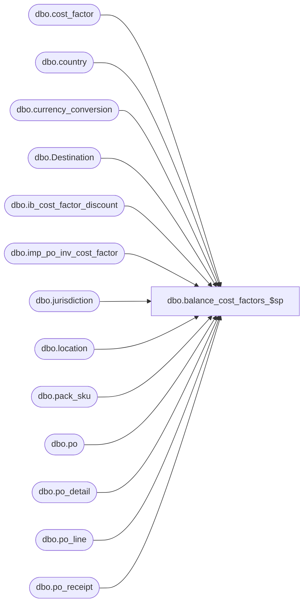

# dbo.balance_cost_factors_$sp

**Database:** me_01  
**Server:** bedrockdb02  

## Architecture Diagram



## Table Dependencies

| Referenced Table |
|---|
| dbo.cost_factor |
| dbo.country |
| dbo.currency_conversion |
| dbo.Destination |
| dbo.ib_cost_factor_discount |
| dbo.imp_po_inv_cost_factor |
| dbo.jurisdiction |
| dbo.location |
| dbo.pack_sku |
| dbo.po |
| dbo.po_detail |
| dbo.po_line |
| dbo.po_receipt |

## Stored Procedure Code

```sql
CREATE PROC [dbo].[balance_cost_factors_$sp]
	@po_receipt_id DECIMAL(12,0), 
	@po_number NVARCHAR(20), 
	@shipment_number NVARCHAR(20),
	@cancel_flag BIT,
	@receive_date SMALLDATETIME

AS 

/* 
Proc name : balance_cost_factors_$sp
Desc	  : Created in Merch 4.3 R2 By Pierrette L.
			The purpose of this procedure is to make sure the cost factors totals that has been posted to IB when a po_receipt became Received
			balance with the cost factors provided by Sourcing through the sourcing interface table: imp_po_inv_cost_factor.

*/
BEGIN
	
	DECLARE @error_msg NVARCHAR(2000)
		
	-- Exchange rate variable
	DECLARE @exchange_rate FLOAT
	
	-- Cursor variables	
	DECLARE 
		@current_cost_factor_id SMALLINT, @current_cost_factor_code NVARCHAR(15), @current_discrepancy DECIMAL(6,2)
		, @crs_cost_factor_flag BIT
	
	-- Loop variables
	DECLARE 
		@max_ordered_units INT
		, @updated_sku_id DECIMAL(13), @updated_ib_id DECIMAL(13)
	
	SET @crs_cost_factor_flag = 0

	BEGIN TRY

		-- Get PO Receipt document number now rather than always join to the po_receipt table
		DECLARE @po_receipt_number NVARCHAR(20)
		SELECT @po_receipt_number = document_no FROM po_receipt WHERE po_receipt_id = @po_receipt_id
	
		IF (@cancel_flag = 0)
		BEGIN

			---------------------------------------------------------------------------------------------------------------------------------------------
			---------------------------------------------------------------------------------------------------------------------------------------------
			-- SP: REWORKED SUMMARY OF COST FACTORS TO NOT USE SUBQUERIES
			
			-- Summarize cost factors in imp_po_inv_cost_factor (from sourcing)
			IF NOT object_id(N'tempdb..#cf_summary_sourcing') IS NULL
				DROP TABLE #cf_summary_sourcing

			CREATE TABLE #cf_summary_sourcing
				( cost_factor_id SMALLINT, cost_factor_code NVARCHAR(15)
				, cf_amount DECIMAL(14,2)
				, PRIMARY KEY (cost_factor_id) )

			INSERT INTO #cf_summary_sourcing
				( cost_factor_id, cost_factor_code
				, cf_amount )
			SELECT
				CostFactor.cost_factor_id, CostFactor.cost_factor_code
				, SUM(Sourcing.total_cost_factor_amount) cf_amount
			FROM
				imp_po_inv_cost_factor Sourcing
			INNER JOIN cost_factor CostFactor ON Sourcing.cost_factor_code = CostFactor.cost_factor_code
			WHERE
				Sourcing.po_number = @po_number AND Sourcing.shipment_number = @shipment_number
			GROUP BY
				CostFactor.cost_factor_id, CostFactor.cost_factor_code

			-- Summarize cost factors in ib_cost_facotr_discount

			IF NOT object_id(N'tempdb..#cf_summary_ib') IS NULL
				DROP TABLE #cf_summary_ib

			CREATE TABLE #cf_summary_ib
				( cost_factor_id SMALLINT, cost_factor_code NVARCHAR(15)
				, cf_amount DECIMAL(14,2)
				, PRIMARY KEY (cost_factor_id) )

			INSERT INTO #cf_summary_ib
				( cost_factor_id, cost_factor_code
				, cf_amount )
			SELECT
				CostFactor.cost_factor_id, CostFactor.cost_factor_code
				, SUM(IB.extended_cost) cf_amount
			FROM
				ib_cost_factor_discount IB
			INNER JOIN cost_factor CostFactor ON IB.cost_factor_discount_id = CostFactor.cost_factor_id
			WHERE
				IB.document_number = @po_receipt_number AND IB.transaction_type_code = 290
			GROUP BY
				CostFactor.cost_factor_id, CostFactor.cost_factor_code
	 
			-- Find out if there is some of the cost factors discrepancy between what was posted to ib_cost_factor_discount
			-- for the current po_receipt document and data provided by Sourcing in imp_po_inv_cost_factor.

			IF NOT object_id(N'tempdb..#cf_discrepancy') IS NULL
				DROP TABLE #cf_discrepancy

			CREATE TABLE #cf_discrepancy
				( cost_factor_id SMALLINT, cost_factor_code NVARCHAR(15)
				, cost_discrepancy DECIMAL(14,2)
				, PRIMARY KEY (cost_factor_id) )

			INSERT INTO #cf_discrepancy
				( cost_factor_id, cost_factor_code
				, cost_discrepancy )
			SELECT 
				SourcingSummary.cost_factor_id, SourcingSummary.cost_factor_code
				, (SourcingSummary.cf_amount - IBSummary.cf_amount) cost_discrepancy
			FROM #cf_summary_sourcing SourcingSummary
			INNER JOIN #cf_summary_ib IBSummary ON SourcingSummary.cost_factor_id = IBSummary.cost_factor_id
			WHERE 
				SourcingSummary.cf_amount <> IBSummary.cf_amount
			---------------------------------------------------------------------------------------------------------------------------------------------
			---------------------------------------------------------------------------------------------------------------------------------------------

			-- If there is nothing in #cf_discrepancy, simply rteurn from this procedure at this point
			IF NOT EXISTS (SELECT 1 FROM #cf_discrepancy)
				RETURN
			
			-- Get the exchage_rate to apply: po_receipt only apply to a single location, so it could be retrieved once
			SELECT @exchange_rate = cc.exchange_rate
			FROM po_receipt p, location l, jurisdiction j, country co, currency_conversion cc
			WHERE p.po_receipt_id = @po_receipt_id
			AND p.location_id = l.location_id
			AND l.jurisdiction_id = j.jurisdiction_id
			AND j.country_id = co.country_id 
			AND co.currency_id = cc.to_currency_id 
			AND cc.currency_conversion_type = 1
			AND cc.effective_from_date <= @receive_date
			AND (cc.effective_to_date >= @receive_date
				OR cc.effective_to_date IS NULL)

			---------------------------------------------------------------------------------------------------------------------------------------------
			---------------------------------------------------------------------------------------------------------------------------------------------
			-- SP: Decided not to change this table
			-- max_qty column appears to represent sku_id with highest number of ordered units

			IF NOT object_id(N'tempdb..#tt_largest_sku') IS NULL
				DROP TABLE #tt_largest_sku
			
			CREATE TABLE #tt_largest_sku
				( sku_id DECIMAL(13,0) NOT NULL, max_qty INT NOT NULL
				, PRIMARY KEY (sku_id) )

			---------------------------------------------------------------------------------------------------------------------------------------------
			---------------------------------------------------------------------------------------------------------------------------------------------
		
			-- Some of the cost factors have discrepancy
			-- if some cost factors are found with a discrepancy then the sku with the largest units received will take the discrepancy
			
			-- We need a cursor on #tt_cost_factor_discrepancy
			DECLARE crs_cost_disc CURSOR FOR
			SELECT cost_factor_id, cost_factor_code, cost_discrepancy 
			FROM #cf_discrepancy 
			ORDER BY cost_factor_id

			OPEN crs_cost_disc
			SET @crs_cost_factor_flag = 1

			FETCH NEXT FROM crs_cost_disc INTO @current_cost_factor_id, @current_cost_factor_code, @current_discrepancy

			WHILE @@FETCH_STATUS = 0
			BEGIN

				------------------------------------------------------------------------------------------------------------------------------------------
				------------------------------------------------------------------------------------------------------------------------------------------
				-- SP: Populate #tt_largest_sku
				
				-- Deal with packs first				
				INSERT INTO #tt_largest_sku 
					( sku_id, max_qty )
				SELECT
					PackSkuDetail.sku_id, SUM(PODetail.ordered_units * PackSkuDetail.sku_quantity) total_qty
				FROM 
					po_detail PODetail
				INNER JOIN po_line POLine ON PODetail.po_line_id = POLine.po_line_id AND PODetail.po_id = POLine.po_id
				INNER JOIN po POHeader ON POLine.po_id = POHeader.po_id
				INNER JOIN imp_po_inv_cost_factor Sourcing ON POHeader.po_no = Sourcing.po_number AND POLine.line_no = Sourcing.po_line_number
				INNER JOIN pack_sku PackSkuDetail ON PODetail.pack_id = PackSkuDetail.pack_id
				WHERE 
					Sourcing.po_number = @po_number AND Sourcing.shipment_number = @shipment_number 
						AND Sourcing.cost_factor_code = @current_cost_factor_code
					AND PODetail.pack_id IS NOT NULL
				GROUP BY
					PackSkuDetail.sku_id
					
				-- Next deal with loose skus (Use UPDATE AND INSERT Instead of UNION)
				UPDATE Destination
				SET
					Destination.max_qty = Destination.max_qty + PODetail.ordered_units
				FROM
					#tt_largest_sku Destination
				INNER JOIN po_detail PODetail ON Destination.sku_id = PODetail.sku_id 
				INNER JOIN po_line POLine ON PODetail.po_line_id = POLine.po_line_id AND PODetail.po_id = POLine.po_id
				INNER JOIN po POHeader ON POLine.po_id = POHeader.po_id
				INNER JOIN imp_po_inv_cost_factor Sourcing ON POHeader.po_no = Sourcing.po_number AND POLine.line_no = Sourcing.po_line_number
				WHERE 
					Sourcing.po_number = @po_number AND Sourcing.shipment_number = @shipment_number 
						AND Sourcing.cost_factor_code = @current_cost_factor_code
					AND PODetail.pack_id IS NULL
					
				INSERT INTO #tt_largest_sku 
					( sku_id, max_qty )
				SELECT 
					PODetail.sku_id, PODetail.ordered_units
				FROM 
					po_detail PODetail
				INNER JOIN po_line POLine ON PODetail.po_line_id = POLine.po_line_id AND PODetail.po_id = POLine.po_id
				INNER JOIN po POHeader ON POLine.po_id = POHeader.po_id
				INNER JOIN imp_po_inv_cost_factor Sourcing ON POHeader.po_no = Sourcing.po_number AND POLine.line_no = Sourcing.po_line_number
				LEFT OUTER JOIN #tt_largest_sku Destination ON PODetail.sku_id = Destination.sku_id
				WHERE 
					Sourcing.po_number = @po_number AND Sourcing.shipment_number = @shipment_number 
						AND Sourcing.cost_factor_code = @current_cost_factor_code
					AND PODetail.pack_id IS NULL
					AND Destination.sku_id IS NULL
					
				------------------------------------------------------------------------------------------------------------------------------------------
				------------------------------------------------------------------------------------------------------------------------------------------
				
				------------------------------------------------------------------------------------------------------------------------------------------
				------------------------------------------------------------------------------------------------------------------------------------------
				-- SP
				-- Determine maximum number of ordered units
				SELECT @max_ordered_units = MAX(max_qty) FROM #tt_largest_sku
				-- Determine highest sku_id matching this number of ordered units
				SELECT @updated_sku_id = MAX(sku_id) FROM #tt_largest_sku WHERE max_qty = @max_ordered_units
				-- We want to apply the difference to this sku, but ONLY ONE entry in ib_cost_factor_discount
				SELECT @updated_ib_id = MAX(IB.ib_cost_factor_discount_id)
				FROM
					ib_cost_factor_discount IB
				WHERE
					IB.sku_id = @updated_sku_id AND IB.cost_factor_discount_id = @current_cost_factor_id
					AND IB.document_number = @po_receipt_number
					AND IB.transaction_type_code = 290
							
				-- Apply the current discrepancy to the @updated_ib_id:
				UPDATE ib_cost_factor_discount 
				SET 
					extended_cost = extended_cost + @current_discrepancy 
					, extended_cost_local = (extended_cost + @current_discrepancy) * @exchange_rate
				WHERE ib_cost_factor_discount_id = @updated_ib_id
				
				TRUNCATE TABLE #tt_largest_sku

				FETCH NEXT FROM crs_cost_disc INTO @current_cost_factor_id, @current_cost_factor_code, @current_discrepancy
				
			END

			CLOSE crs_cost_disc
			DEALLOCATE crs_cost_disc
			SET @crs_cost_factor_flag = 0
			
		END
		
		ELSE -- @cancel_flag = 1
		BEGIN
		
				------------------------------------------------------------------------------------------------------------------------------------------
				------------------------------------------------------------------------------------------------------------------------------------------
				-- SP: Insert records into ib_cost_factor_discount to ensure balnce for this PO receipt is zero
				INSERT INTO ib_cost_factor_discount
					( sku_id, location_id, cost_factor_discount_id
					, document_number, transaction_date
					, transaction_type_code
					, extended_cost, extended_cost_local )
				SELECT
					sku_id, location_id, cost_factor_discount_id
					, document_number, transaction_date
					, transaction_type_code
					, -1 * SUM(extended_cost) extended_cost, 0 extended_cost_local
				FROM
					ib_cost_factor_discount
				WHERE
					document_number = @po_receipt_number
				GROUP BY
					sku_id, location_id, cost_factor_discount_id
					, document_number, transaction_date
					, transaction_type_code
				HAVING SUM(extended_cost) <> 0
				
				INSERT INTO ib_cost_factor_discount
					( sku_id, location_id, cost_factor_discount_id
					, document_number, transaction_date
					, transaction_type_code
					, extended_cost, extended_cost_local )
				SELECT
					sku_id, location_id, cost_factor_discount_id
					, document_number, transaction_date
					, transaction_type_code
					, 0 extended_cost, -1 * SUM(extended_cost_local) extended_cost_local
				FROM
					ib_cost_factor_discount
				WHERE
					document_number = @po_receipt_number
				GROUP BY
					sku_id, location_id, cost_factor_discount_id
					, document_number, transaction_date
					, transaction_type_code
				HAVING SUM(extended_cost_local) <> 0
					
				------------------------------------------------------------------------------------------------------------------------------------------
				------------------------------------------------------------------------------------------------------------------------------------------
				
		END
				
	END TRY
	
	BEGIN CATCH
	
		IF @crs_cost_factor_flag = 1
		BEGIN
			CLOSE crs_cost_disc
			DEALLOCATE crs_cost_disc
		END
	
		SET @error_msg = N'Error in procedure balance_cost_factors_$sp: ' + CAST(ERROR_NUMBER() AS NVARCHAR) + N' ' + ERROR_MESSAGE()
		RAISERROR (@error_msg, -- Message text.
               16, -- Severity.
               1) -- State.
               
	END CATCH
	
END
```

