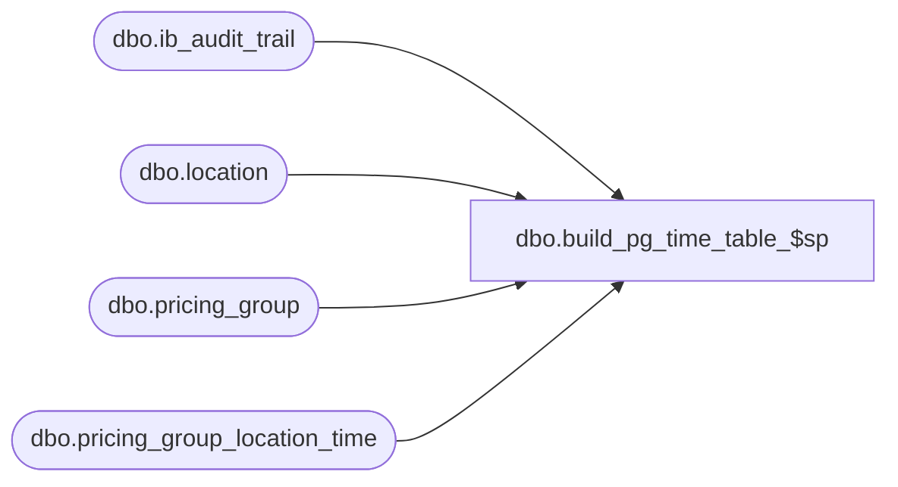

# dbo.build_pg_time_table_$sp

**Database:** me_01  
**Server:** bedrockdb02  

## Architecture Diagram



## Table Dependencies

| Referenced Table |
|---|
| dbo.ib_audit_trail |
| dbo.location |
| dbo.pricing_group |
| dbo.pricing_group_location_time |

## Stored Procedure Code

```sql
CREATE PROCEDURE [dbo].[build_pg_time_table_$sp]  as

/*
	Version		: 1.00
	Created		: Geoffrey B.
	Description	: This procedure is used to populate pricing_group_location_time after it's creation.

	History:	Date		Defect
			Oct 22,2010	121943	delete duplicate rows: a location could only belong to one pricing group
						during a laps of time.
						Keep the row that has the latest begin_date and end_date NULL

			Sep 18,2012	138294	changed to use the first part of the application_type_id to match against
						the pricing_group table's pricing_group_id, as users can change the pricing_group_code
						at any time.


			Sep 24,2012	138294	revised proc to keep the orignal insert but to additionally add any missing rows
						for those pricing groups that may have been renamed and were not initially picked up.

*/

DECLARE @location_id smallint,  @pricing_group_location_id decimal(12,0) , @begin_date smalldatetime, 
		@location_id1 smallint, @begin_date1 smalldatetime ,@end_date1 smalldatetime , @pricing_group_location_id1 decimal(12,0)

DECLARE c_pricing_group_set CURSOR FOR
select pricing_group_location_id,location_id, begin_date from pricing_group_location_time order by location_id


BEGIN

truncate table  pricing_group_location_time

-- (original Insert)
-- insert pricing_group additions and replacements based on pricing_group_code
-- This was used originally, since some customers may have dropped and then recreated
-- the pricing_group, Doing so would have created new pricing_group_ids

insert into pricing_group_location_time 
(pricing_group_location_id, pricing_group_id, location_id, begin_date)
select at.application_type_id, pg.pricing_group_id, l.location_id, at.entry_date
from ib_audit_trail at join location l  
on at.application_identifier = l.location_code
join pricing_group pg 
on at.application_level = pg.pricing_group_code           -- (CURRENT - match by name)
where at.application_type = N'Pricing group locations'
and (action = N'Add' or action = N'Modify');


-- insert additional pricing_group additions and replacements based on pricing_group_id
-- to retrieve from the audit_trail, those pricing groups that may have been renamed

insert into pricing_group_location_time 
(pricing_group_location_id, pricing_group_id, location_id, begin_date)
select at.application_type_id, pg.pricing_group_id, l.location_id, at.entry_date
from ib_audit_trail at join location l  
on at.application_identifier = l.location_code
join pricing_group pg 
on CAST(SUBSTRING(at.application_type_id,1,(len(at.application_type_id) - 7)) as smallint) = pg.pricing_group_id      --  (NEW - match by id)
where at.application_type = N'Pricing group locations'
and (action = N'Add' or action = N'Modify')
and at.application_type_id not in (select distinct at2.pricing_group_location_id from pricing_group_location_time at2); -- (exclusion list)


--add an end_date when a location is removed from a pricing_group
	
-- action==Delete
update pricing_group_location_time
set end_date = end_dates.entry_date
from pricing_group_location_time p, (select at.application_type_id,l.location_id, at.entry_date
									 from ib_audit_trail at join location l  
									 on at.application_identifier = l.location_code
									where application_type = N'Pricing group locations'
									and action = N'Delete') end_dates
where p.pricing_group_location_id = end_dates.application_type_id 
and p.location_id = end_dates.location_id;


-- action==Modify
update pricing_group_location_time
set end_date = end_dates.entry_date
from pricing_group_location_time p, (select at.application_type_id, l.location_id old_location_id, at.entry_date
									from ib_audit_trail at join location l  
									on at.old_value = l.location_code
									where application_type = N'Pricing group locations'
									and action = N'Modify') end_dates
where p.pricing_group_location_id = end_dates.application_type_id 
and p.location_id = end_dates.old_location_id;

--truncate dates
update pricing_group_location_time
set end_date = cast ( convert(nchar(10), end_date,120) as smalldatetime);

update pricing_group_location_time
set begin_date = cast ( convert(nchar(10), begin_date,120) as smalldatetime);

-- Need to delete rows if there is another row in the table for the same location
-- with a greater begin_date and end_date = NULL
-- We just need to keep one row per location with the latest begin_date and end_date = NULL
-- Defect # 121943
DELETE a FROM pricing_group_location_time a
WHERE a.end_date IS NULL
AND EXISTS( SELECT 1 FROM pricing_group_location_time b WITH (NOLOCK)
			WHERE b.location_id = a.location_id
			AND b.begin_date > a.begin_date
			AND end_date IS NULL )

-- begin_date, end_date overlap
OPEN c_pricing_group_set
FETCH NEXT FROM c_pricing_group_set into @pricing_group_location_id,@location_id, @begin_date

WHILE (@@FETCH_STATUS = 0)
BEGIN
	DECLARE c_pricing_group_set1 CURSOR FOR
	SELECT pricing_group_location_id,location_id, begin_date,end_date FROM pricing_group_location_time
	WHERE location_id = @location_id and end_date is not null

	open c_pricing_group_set1
	FETCH NEXT FROM c_pricing_group_set1 into @pricing_group_location_id1,@location_id1, @begin_date1, @end_date1
	WHILE (@@FETCH_STATUS = 0)
	BEGIN
			-- start=end=new_start date
		if (@begin_date1 = @end_date1 and @end_date1 = @begin_date 
					and @pricing_group_location_id1 <> @pricing_group_location_id ) 
					
					delete pricing_group_location_time 
					where pricing_group_location_id = @pricing_group_location_id1 
					and location_id = @location_id1

			-- end=new_start date
		if (@end_date1 = @begin_date and @pricing_group_location_id1 <> @pricing_group_location_id ) 
					
					update pricing_group_location_time set end_date = end_date-1
					where pricing_group_location_id = @pricing_group_location_id1 
					and location_id = @location_id1


		FETCH NEXT FROM c_pricing_group_set1 into @pricing_group_location_id1,@location_id1, @begin_date1, @end_date1

	END
	CLOSE c_pricing_group_set1 
	DEALLOCATE c_pricing_group_set1
					
				
FETCH NEXT FROM c_pricing_group_set into @pricing_group_location_id,@location_id, @begin_date					 

END

CLOSE c_pricing_group_set
DEALLOCATE c_pricing_group_set


END
```

