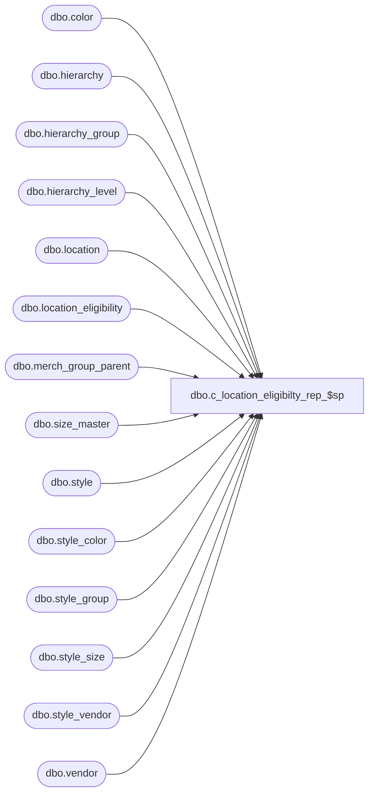

# dbo.c_location_eligibilty_rep_$sp

**Database:** me_01  
**Server:** bedrockdb02  

## Architecture Diagram



## Table Dependencies

| Referenced Table |
|---|
| dbo.color |
| dbo.hierarchy |
| dbo.hierarchy_group |
| dbo.hierarchy_level |
| dbo.location |
| dbo.location_eligibility |
| dbo.merch_group_parent |
| dbo.size_master |
| dbo.style |
| dbo.style_color |
| dbo.style_group |
| dbo.style_size |
| dbo.style_vendor |
| dbo.vendor |

## Stored Procedure Code

```sql
CREATE PROCEDURE [dbo].[c_location_eligibilty_rep_$sp]
	@from_loc_crit AS NVARCHAR(20)
	, @to_loc_crit AS NVARCHAR(20)
	, @from_style_crit AS NVARCHAR(20)
	, @to_style_crit AS NVARCHAR(20)
	, @from_vendor_crit AS NVARCHAR(20)
	, @to_vendor_crit AS NVARCHAR(20)
	, @from_color_crit AS NVARCHAR(3)
	, @to_color_crit AS NVARCHAR(3)
	, @from_size_crit AS NVARCHAR(17)
	, @to_size_crit AS NVARCHAR(17)
AS
	SELECT DISTINCT
		location_id
		, style.style_id
		, style_color.color_id
		, style_size.size_master_id
		, CAST(N'' as NVARCHAR(30)) inherited_from
		, 1 eligibility_flag
	INTO
		#style_location_eligibility
	FROM
		location
		, style
		, style_color
		, color
		, style_size
		, size_master
		, style_vendor
		, vendor
	WHERE
		style.style_id = style_color.style_id
		AND style.style_id = style_size.style_id
		AND style_color.color_id = color.color_id
		AND style_size.size_master_id = size_master.size_master_id
		AND style_vendor.style_id = style.style_id
		AND style_vendor.style_id = style_color.style_id
		AND style_vendor.vendor_id = vendor.vendor_id
		
		-- Style Criteria
		AND (style.style_code BETWEEN @from_style_crit AND @to_style_crit
			OR (UPPER(@from_style_crit) = N'ALL' AND UPPER(@to_style_crit) = N'ALL'))

		-- Location Criteria
		AND (location.location_code BETWEEN @from_loc_crit AND @to_loc_crit
			OR (UPPER(@from_loc_crit) = N'ALL' AND UPPER(@to_loc_crit) = N'ALL'))

		-- Vendor Criteria
		AND (vendor.vendor_code BETWEEN @from_vendor_crit AND @to_vendor_crit
			OR (UPPER(@from_vendor_crit) = N'ALL' AND UPPER(@to_vendor_crit) = N'ALL'))

		-- Color Criteria
		AND (color.color_code BETWEEN @from_color_crit AND @to_color_crit
			OR (UPPER(@from_color_crit) = N'ALL' AND UPPER(@to_color_crit) = N'ALL'))

		-- Size Criteria
		AND (size_master.size_code BETWEEN @from_size_crit AND @to_size_crit
			OR (UPPER(@from_size_crit) = N'ALL' AND UPPER(@to_size_crit) = N'ALL'))


	DECLARE @hierarchy_level_id INT

	-- init @hierarchy_level_id to top level of hierarchy
	SET @hierarchy_level_id = 
		(SELECT 
			hierarchy_level_id 
		FROM
			hierarchy_level
			, hierarchy
		WHERE
			hierarchy_level.parent_level_id IS NULL
			AND hierarchy_level.hierarchy_id = hierarchy.hierarchy_id
			AND hierarchy.hierarchy_type = 1 
			AND hierarchy.alternate_flag = 0 
			AND hierarchy.active_flag = 1
		)

	-- Update the temp table with data from each level of the hierarchy from the 
	-- eligibility table
	WHILE @hierarchy_level_id IS NOT NULL
	BEGIN
		-- Update rows in temp table with hierarchy level eligibility
		UPDATE
			#style_location_eligibility
		SET 
			eligibility_flag = location_eligibility.eligibility_flag
			, inherited_from = hierarchy_group.hierarchy_group_code
		FROM 
			location_eligibility
			, merch_group_parent
			, hierarchy_group
			, style_group
		WHERE
			location_eligibility.hierarchy_group_id = merch_group_parent.parent_hierarchy_group_id
			AND hierarchy_group.hierarchy_group_id = location_eligibility.hierarchy_group_id
			AND hierarchy_group.hierarchy_group_id = merch_group_parent.parent_hierarchy_group_id
			AND merch_group_parent.hierarchy_group_id = style_group.hierarchy_group_id
			AND merch_group_parent.hierarchy_level_id = @hierarchy_level_id
			AND #style_location_eligibility.location_id = location_eligibility.location_id
			AND #style_location_eligibility.style_id = style_group.style_id
		
			-- Color/Size exception join
			AND (#style_location_eligibility.color_id = location_eligibility.color_id
				OR location_eligibility.color_id IS NULL)
			AND (#style_location_eligibility.size_master_id = location_eligibility.size_master_id
				OR location_eligibility.size_master_id IS NULL)


		-- update @hierarchy_level_id to next level of hierarchy
		SET @hierarchy_level_id = 
			(SELECT 
				hierarchy_level_id 
			FROM
				hierarchy_level
				, hierarchy
			WHERE
				hierarchy_level.parent_level_id = @hierarchy_level_id
				AND hierarchy_level.hierarchy_id = hierarchy.hierarchy_id
				AND hierarchy.hierarchy_type = 1 
				AND hierarchy.alternate_flag = 0 
				AND hierarchy.active_flag = 1
			)
	END

	-- Update rows in temp table with style level eligibility
	UPDATE
		#style_location_eligibility
	SET 
		eligibility_flag = location_eligibility.eligibility_flag
		, inherited_from = style.style_code
	FROM 
		location_eligibility
		, style
	WHERE
		location_eligibility.style_id IS NOT NULL
		AND style.style_id = location_eligibility.style_id
		AND #style_location_eligibility.location_id = location_eligibility.location_id
		AND #style_location_eligibility.style_id = location_eligibility.style_id
		
		-- Color/Size exception join
		AND (#style_location_eligibility.color_id = location_eligibility.color_id
			OR location_eligibility.color_id IS NULL)
		AND (#style_location_eligibility.size_master_id = location_eligibility.size_master_id
			OR location_eligibility.size_master_id IS NULL)

	SELECT
		location.location_code
		, location.location_name
		, style.style_code
		, style.short_desc
		, color.color_code
		, style_color.short_desc
		, size_master.size_code
		, CASE WHEN eligibility_flag = 0 THEN N'F'
			ELSE N'T'
			END eligibility_flag
		, inherited_from
		, vendor.vendor_code
		, vendor.vendor_name
	FROM
		#style_location_eligibility
		, location
		, style
		, style_color
		, color
		, size_master
		, style_vendor
		, vendor
	WHERE
		#style_location_eligibility.location_id = location.location_id
		AND #style_location_eligibility.style_id = style.style_id	
		AND style.style_id = style_color.style_id
		AND #style_location_eligibility.style_id = style_color.style_id
		AND #style_location_eligibility.color_id = style_color.color_id
		AND #style_location_eligibility.color_id = color.color_id
		AND style_color.color_id = color.color_id
		AND #style_location_eligibility.size_master_id = size_master.size_master_id
		AND #style_location_eligibility.style_id = style_vendor.style_id	
		AND style.style_id = style_vendor.style_id
		AND style_color.style_id = style_vendor.style_id
		AND style_vendor.vendor_id = vendor.vendor_id

		-- Vendor Criteria
		AND (vendor.vendor_code BETWEEN @from_vendor_crit AND @to_vendor_crit
			OR (UPPER(@from_vendor_crit) = N'ALL' AND UPPER(@to_vendor_crit) = N'ALL'))
```

