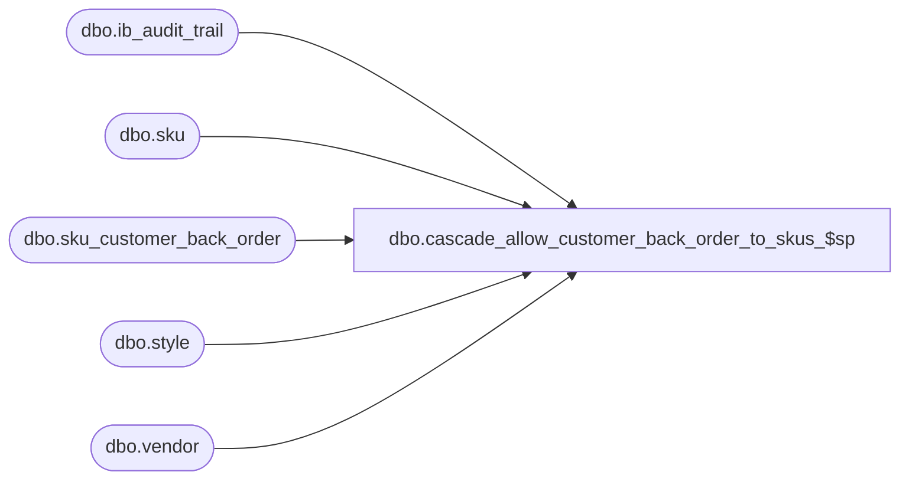

# dbo.cascade_allow_customer_back_order_to_skus_$sp

**Database:** me_01  
**Server:** bedrockdb02  

## Architecture Diagram



## Table Dependencies

| Referenced Table |
|---|
| dbo.ib_audit_trail |
| dbo.sku |
| dbo.sku_customer_back_order |
| dbo.style |
| dbo.vendor |

## Stored Procedure Code

```sql
CREATE PROCEDURE cascade_allow_customer_back_order_to_skus_$sp
	@vendor_id INT,
	@user_firstname NVARCHAR(30),
	@user_lastname NVARCHAR(30)
AS
BEGIN
	DECLARE @allowBackOrderFlag INT;
	SELECT @allowBackOrderFlag = COALESCE(allow_customer_back_order, 0) FROM vendor WHERE vendor_id = @vendor_id;

	UPDATE s SET updatestamp = updatestamp + 1
	FROM style s
	INNER JOIN sku k ON k.style_id = s.style_id
	INNER JOIN sku_customer_back_order scbo ON scbo.sku_id = k.sku_id and vendor_id = @vendor_id
	WHERE allow_customer_back_order >= @allowBackOrderFlag;

	INSERT INTO ib_audit_trail
		(entry_date, application, activity, application_type_id, application_type, application_identifier, application_level, application_key
		, [action], field_affected, old_value, new_value, [status], employee_last_name, employee_first_name)
		SELECT
		GETDATE(), 'PROD', '', scbo.sku_id, 'Style', s.style_code, 'SKU', NULL
		, 'Delete', 'allow_customer_back_order', scbo.allow_customer_back_order, NULL, NULL, @user_lastname, @user_firstname
		FROM sku_customer_back_order scbo
		INNER JOIN sku k ON scbo.sku_id = k.sku_id
		INNER JOIN style s ON k.style_id = s.style_id
		WHERE scbo.allow_customer_back_order >= @allowBackOrderFlag AND scbo.vendor_id = @vendor_id;

	DELETE FROM sku_customer_back_order
	WHERE allow_customer_back_order >= @allowBackOrderFlag AND vendor_id = @vendor_id;
END
```

