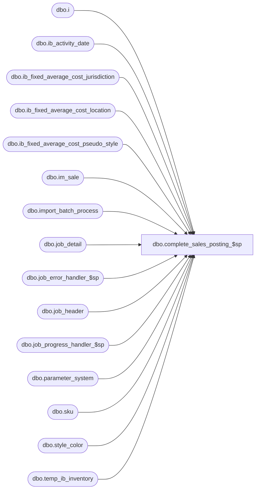

# dbo.complete_sales_posting_$sp

**Database:** me_01  
**Server:** bedrockdb02  

## Architecture Diagram



## Table Dependencies

| Referenced Table |
|---|
| dbo.i |
| dbo.ib_activity_date |
| dbo.ib_fixed_average_cost_jurisdiction |
| dbo.ib_fixed_average_cost_location |
| dbo.ib_fixed_average_cost_pseudo_style |
| dbo.im_sale |
| dbo.import_batch_process |
| dbo.job_detail |
| dbo.job_error_handler_$sp |
| dbo.job_header |
| dbo.job_progress_handler_$sp |
| dbo.parameter_system |
| dbo.sku |
| dbo.style_color |
| dbo.temp_ib_inventory |

## Stored Procedure Code

```sql
CREATE PROCEDURE [dbo].[complete_sales_posting_$sp]

AS

/*
	Version		: 1.00
	Created		: 2011/06/10
	Created by	: Pierrette Lemay
	Description	: This procedure is part of the Sales Posting process and was created as a fix for defect #127741 & #127742.
				  It's called by the .Net component once all the threads completed.
				  It UPDATE/INSERT ib_activity_date, truncates the im_sale table if there is no incomplete job or 
				  delete the rows in im_sale that have been posted successfully.
	History		: September 25, 2012 cleanup the ib_average_cost_* tables according the value in parameter_system.

*/

BEGIN
	DECLARE @line_id SMALLINT, @job_type TINYINT, @job_id SMALLINT, @c_true BIT, @c_false BIT,  @job_count SMALLINT,
			@proc_name NVARCHAR(30), @table_name NVARCHAR(30), @crs_job_flag BIT, @range_start DECIMAL(24,0), @batch_start DECIMAL(24,0),
			@operation_name NVARCHAR(30), @sql_err_num	DECIMAL(38,0), @error_msg NVARCHAR(4000), @exist_flag BIT, @avg_cost_type nchar(1),
			@job_batch_size DECIMAL(10,0), @return_flag BIT, @current_job_id INT, @range_end DECIMAL(24,0), @batch_end DECIMAL(24,0),
			@avg_cost_level TINYINT, @avg_cost_cleanup_days SMALLINT, @floor_date SMALLDATETIME;
			
	IF NOT object_id(N'tempdb..#sale_activity_date_cons') IS NULL
		DROP TABLE #sale_activity_date_cons;
		
	CREATE TABLE #sale_activity_date_cons (
		[style_id] [decimal](12, 0) NOT NULL,
		[color_id] [smallint] NULL,
		[location_id] [smallint] NOT NULL,
		[first_sale_date] [smalldatetime] NULL,
		[last_sale_date] [smalldatetime] NULL);

	SELECT   @line_id		= 10
			, @job_type		= 1
			, @job_id		= -1
			, @proc_name	= N'complete_sales_posting_$sp'
			, @c_false		= 0
			, @c_true		= 1
			, @exist_flag	= 0
			, @job_count	= 0
			, @crs_job_flag = 0
			, @avg_cost_type = ib_average_cost_type
			, @avg_cost_level = ib_average_cost_location_level
			, @avg_cost_cleanup_days = ib_average_cost_cleanup_days
	FROM parameter_system;
 
	BEGIN TRY
		-- Find out if we need to maintain ib_activity_date
		SELECT @exist_flag = 1
		FROM import_batch_process i, job_detail d
		WHERE i.job_type = 1
		AND i.job_id = d.job_id;
		
		-- Log progress if job_params.debug_flag is true 
		EXEC job_progress_handler_$sp @job_type, @job_id, @proc_name, @line_id, @c_false;
		
		IF (@exist_flag = 1)
		BEGIN
			SET @line_id = 20;
			
			-- step #1: insert the information we need to update ib_activity date
				-- in one new table after all jobs completed.
				-- We do that after the threads work in order to avoid deadlocks between
				-- jobs trying to get an exclusive lock on ib_activity_date.
			INSERT INTO #sale_activity_date_cons
				( style_id
				 , color_id
				 , location_id
				 , first_sale_date
				 , last_sale_date )
			SELECT sku.style_id
				  , style_color.color_id
				  , t.location_id
				  , MIN(t.transaction_date) 
				  , MAX(t.transaction_date) 
			FROM temp_ib_inventory t, sku, style_color
			WHERE t.transaction_type_code IN (600, 605, 622)
			AND t.sku_id = sku.sku_id
			AND sku.style_color_id = style_color.style_color_id
			GROUP BY sku.style_id, style_color.color_id, t.location_id 
			
			-- Log progress if job_params.debug_flag is true 
			EXEC job_progress_handler_$sp @job_type, @job_id, @proc_name, @line_id, @c_false;
			
			BEGIN TRAN
				
			-- step #2: use then content of sale_activity_date_cons to update ib_activity_date
				-- case1 : row exists in ib_activity_date and first_sale_date is set but 
				-- we are currently posting a sale from an earlier date: update first_sale_date
			SET @line_id = 30;
			
			UPDATE i
			SET i.first_sale_date = t.first_sale_date
			FROM ib_activity_date i, #sale_activity_date_cons t
			WHERE i.style_id = t.style_id
			AND i.color_id = t.color_id
			AND i.location_id = t.location_id
			AND i.first_sale_date > t.first_sale_date;
			
			-- Log progress if job_params.debug_flag is true 
			EXEC job_progress_handler_$sp @job_type, @job_id, @proc_name, @line_id, @c_false;
			
				-- case2 : row exists in ib_activity_date and first_sale_date is NULL, 
				-- in this case update both columns: first/last sale_date.
			SET @line_id = 40;
			
			UPDATE i
			SET i.first_sale_date = t.first_sale_date,
				i.last_sale_date = t.last_sale_date
			FROM ib_activity_date i, #sale_activity_date_cons t
			WHERE i.style_id = t.style_id
			AND i.color_id = t.color_id
			AND i.location_id = t.location_id
			AND i.first_sale_date IS NULL;
			
			-- Log progress if job_params.debug_flag is true 
			EXEC job_progress_handler_$sp @job_type, @job_id, @proc_name, @line_id, @c_false;
				
				-- case3 : We're currently posting a sale with a transaction_date > last_sale_date
			SET @line_id = 50;
			
			UPDATE i
			SET i.last_sale_date = t.last_sale_date
			FROM ib_activity_date i, #sale_activity_date_cons t
			WHERE i.style_id = t.style_id
			AND i.color_id = t.color_id
			AND i.location_id = t.location_id
			AND i.last_sale_date < t.last_sale_date;
			
			-- Log progress if job_params.debug_flag is true 
			EXEC job_progress_handler_$sp @job_type, @job_id, @proc_name, @line_id, @c_false;
			
			-- step #3: Insert the missing rows in ib_activity_date
			SET @line_id = 60;
			
			INSERT INTO ib_activity_date 
				( style_id, color_id, location_id, first_sale_date, last_sale_date)
			SELECT style_id, color_id, location_id, first_sale_date, last_sale_date 
			FROM #sale_activity_date_cons c
			WHERE NOT EXISTS (SELECT 1 FROM ib_activity_date i
							  WHERE i.style_id = c.style_id
							  AND i.color_id = c.color_id
							  AND i.location_id = c.location_id);
							  
			-- Log progress if job_params.debug_flag is true 
			EXEC job_progress_handler_$sp @job_type, @job_id, @proc_name, @line_id, @c_false;
		
			-- step #4: Insert the step 5 in job_detail
			SET @line_id = 70;
			
			INSERT INTO job_detail
					 (job_id, job_step_id, time_stamp)
			SELECT i.job_id, 5, GETDATE()
			FROM import_batch_process i,
				(SELECT d.job_id, COUNT(*) cnt_step
				 FROM job_detail d, import_batch_process b
				 WHERE b.job_type = 1
				 AND d.job_id = b.job_id
				 GROUP BY d.job_id
				 HAVING COUNT(*) = 4)  T
			WHERE i.job_type = 1
			AND i.job_id = T.job_id;
			
			-- Log progress if job_params.debug_flag is true 
			EXEC job_progress_handler_$sp @job_type, @job_id, @proc_name, @line_id, @c_false;
			
			-- step #5: Update job_header end_time and set completed_flag to 1 for all jobs part of this posting process.
			SET @line_id = 80;
			
			UPDATE h
			SET completed_flag = 1,
			    end_time = GETDATE()
			FROM job_header h
			WHERE h.job_type = 1
			AND h.completed_flag = 0
			AND EXISTS ( SELECT 1 
				     FROM import_batch_process i,
					(SELECT d.job_id, COUNT(*) cnt_step
					 FROM job_detail d, import_batch_process b
					 WHERE b.job_type = 1
					 AND d.job_id = b.job_id
					 GROUP BY d.job_id
					 HAVING COUNT(*) = 5)  T
				     WHERE i.job_type = 1
				     AND i.job_id = T.job_id
				     AND i.job_id = h.job_id );
				     
			COMMIT TRAN;
			
			-- Log progress if job_params.debug_flag is true 
			EXEC job_progress_handler_$sp @job_type, @job_id, @proc_name, @line_id, @c_false;
		END
		
		SET @line_id = 90;
		-- Start cleanup of im_sale		
		SELECT @job_count = count(*) 
		FROM job_header
		WHERE job_type = @job_type
		AND completed_flag = 0;
		
		-- Log progress if job_params.debug_flag is true 
		EXEC job_progress_handler_$sp @job_type, @job_id, @proc_name, @line_id, @c_false;

		IF (@job_count = 0) -- im_sale could be truncated
		BEGIN
			SET @line_id = 100

			TRUNCATE TABLE im_sale
		
			-- Log progress if job_params.debug_flag is true 
			EXEC job_progress_handler_$sp @job_type, @job_id, @proc_name, @line_id, @c_false;
		END
		ELSE
		BEGIN
			SET @line_id = 110

			DECLARE crs_jobs CURSOR FOR
			SELECT h.job_id, h.range_start, h.range_end, h.batch_start, h.batch_end
			FROM import_batch_process p, job_header h
			WHERE p.job_type = @job_type
			AND p.job_id = h.job_id
			AND p.job_type = h.job_type
			AND h.completed_flag = 1;
			
			OPEN crs_jobs
			SET @crs_job_flag = 1

			FETCH NEXT FROM crs_jobs INTO @current_job_id, @range_start, @range_end, @batch_start, @batch_end

			WHILE @@FETCH_STATUS = 0
			BEGIN
				SET @line_id = 120;
				
				BEGIN TRAN
				
				DELETE im_sale 
				WHERE im_sale_number BETWEEN @range_start AND @range_end
				AND location_id BETWEEN @batch_start AND @batch_end;
								
				COMMIT TRAN
				
				FETCH NEXT FROM crs_jobs INTO @current_job_id, @range_start, @range_end, @batch_start, @batch_end;
			END
	      
      		CLOSE crs_jobs;
			DEALLOCATE crs_jobs;
			SET @crs_job_flag = 0;
			
			-- Log progress if job_params.debug_flag is true 
			EXEC job_progress_handler_$sp @job_type, @job_id, @proc_name, @line_id, @c_false;	
		END
		
		SET @line_id = 130
		-- Need to cleanup of ib_fixed_average_cost_* tables
		IF (@avg_cost_type = N'F')
		BEGIN
			-- Start by retrieving the flore date from when we want to keep data in the ib_fixed_average_cost_* tables
			SELECT @floor_date = DATEADD(day, -@avg_cost_cleanup_days, GETDATE());
			
			BEGIN TRAN
				IF (@avg_cost_level = 1)
					DELETE ib_fixed_average_cost_location WHERE transaction_date < @floor_date;
				ELSE 
					DELETE ib_fixed_average_cost_jurisdiction WHERE transaction_date < @floor_date;
					
				DELETE ib_fixed_average_cost_pseudo_style WHERE transaction_date < @floor_date;		
			COMMIT TRAN		
		END
		
	END TRY

	BEGIN CATCH
		-- Test if the transaction is uncommittable.
		IF (@@TRANCOUNT > 0)
			ROLLBACK TRANSACTION;

		IF (@crs_job_flag = 1)
		BEGIN
			CLOSE crs_jobs;
			DEALLOCATE crs_jobs;
		END

		IF @line_id = 10	
			SELECT  @table_name			= N'import_batch_process'
					, @operation_name	= N'SELECT'
					, @error_msg		= ERROR_MESSAGE()
					, @sql_err_num		= ERROR_NUMBER()
		ELSE IF @line_id = 20
			SELECT  @table_name			= N'#sale_activity_date_cons'
					, @operation_name	= N'INSERT'
					, @error_msg		= ERROR_MESSAGE()
					, @sql_err_num		= ERROR_NUMBER()
		ELSE IF @line_id BETWEEN 30 AND 50
			SELECT  @table_name			= N'ib_activity_date'
					, @operation_name	= N'UPDATE'
					, @error_msg		= ERROR_MESSAGE()
					, @sql_err_num		= ERROR_NUMBER()
		ELSE IF @line_id = 60
			SELECT  @table_name			= N'ib_activity_date'
					, @operation_name	= N'INSERT'
					, @error_msg		= ERROR_MESSAGE()
					, @sql_err_num		= ERROR_NUMBER()
		ELSE IF @line_id = 70
			SELECT  @table_name			= N'job_detail'
					, @operation_name	= N'INSERT'
					, @error_msg		= ERROR_MESSAGE()
					, @sql_err_num		= ERROR_NUMBER()
		ELSE IF @line_id = 80
			SELECT  @table_name			= N'job_header'
					, @operation_name	= N'UPDATE'
					, @error_msg		= ERROR_MESSAGE()
					, @sql_err_num		= ERROR_NUMBER()
		ELSE IF @line_id = 90
			SELECT  @table_name			= N'job_header'
					, @operation_name	= N'SELECT'
					, @error_msg		= ERROR_MESSAGE()
					, @sql_err_num		= ERROR_NUMBER()						
		ELSE IF @line_id = 100
			SELECT  @table_name			= N'im_sale'
					, @operation_name	= N'TRUNCATE TABLE'
					, @error_msg		= ERROR_MESSAGE()
					, @sql_err_num		= ERROR_NUMBER()
		ELSE IF @line_id = 110
			SELECT  @table_name			= N'crs_jobs'
					, @operation_name	= N'OPEN CURSOR'
					, @error_msg		= ERROR_MESSAGE()
					, @sql_err_num		= ERROR_NUMBER()
		ELSE IF @line_id = 120
			SELECT  @table_name			= N'im_sale'
					, @operation_name	= N'DELETE'
					, @sql_err_num		= ERROR_NUMBER()
					, @error_msg		= ERROR_MESSAGE()
		ELSE IF @line_id = 130
			SELECT  @table_name			= N'ib_fixed_average_cost_*'
					, @operation_name	= N'DELETE'
					, @sql_err_num		= ERROR_NUMBER()
					, @error_msg		= ERROR_MESSAGE()

		EXEC job_error_handler_$sp 
			@job_type 
			, @job_id 
			, @proc_name 
			, @line_id 
			, @sql_err_num 
			, @table_name 
			, @operation_name 
			, @error_msg 
			, @c_true
	END CATCH
END
```

