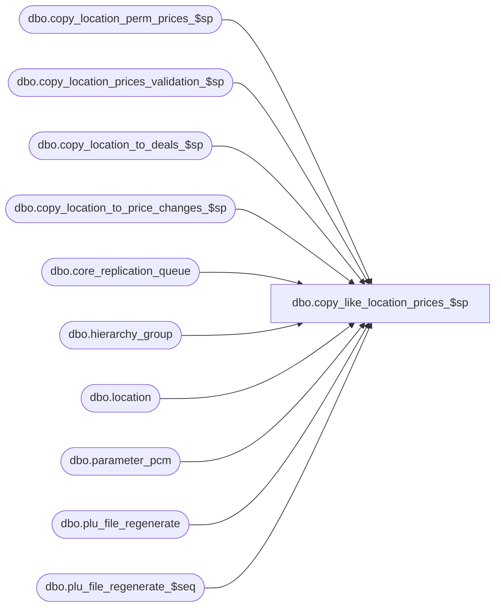

# dbo.copy_like_location_prices_$sp

**Database:** me_01  
**Server:** bedrockdb02  

## Architecture Diagram



## Table Dependencies

| Referenced Table |
|---|
| dbo.copy_location_perm_prices_$sp |
| dbo.copy_location_prices_validation_$sp |
| dbo.copy_location_to_deals_$sp |
| dbo.copy_location_to_price_changes_$sp |
| dbo.core_replication_queue |
| dbo.hierarchy_group |
| dbo.location |
| dbo.parameter_pcm |
| dbo.plu_file_regenerate |
| dbo.plu_file_regenerate_$seq |

## Stored Procedure Code

```sql
-----------------------------------------------------------------------------------------------------------------------------
--	Main Query: Create Procedure
-----------------------------------------------------------------------------------------------------------------------------

CREATE PROCEDURE dbo.copy_like_location_prices_$sp

	 @Like_Location_ID AS SMALLINT
	,@New_Location_ID AS SMALLINT
	,@Employee_First_Name AS NVARCHAR (30)
	,@Employee_Last_Name AS NVARCHAR (30)
	,@Copy_Permanent_Prices BIT = 1
	,@Copy_Permanent_Price_Changes BIT = 0
	,@Copy_Promo_Price_Changes BIT = 0
	,@Copy_Deals BIT = 0
	,@Pre_Validate AS BIT
	,@Called_By_New_Location_Save AS BIT = 0
	,@Is_Valid AS BIT OUTPUT
	,@Error_Code AS SMALLINT = 0 OUTPUT

AS

--	Object GUID: 0DCB2CD3-6910-4F42-8788-E324A6D98FF8

SET TRANSACTION ISOLATION LEVEL READ UNCOMMITTED
SET NOCOUNT ON


-----------------------------------------------------------------------------------------------------------------------------
--	Declarations / Sets: Declare And Set Variables
-----------------------------------------------------------------------------------------------------------------------------

DECLARE
	 @Error_Line AS INT
	,@Error_Message AS NVARCHAR (4000)
	,@Error_Number AS INT
	,@Error_Procedure AS NVARCHAR (128)
	,@Error_Severity AS INT
	,@Error_State AS INT

-----------------------------------------------------------------------------------------------------------------------------
--	Error Trapping: Check If "@To_Location_ID" Has Pre-Existing Data (Conditional)
-----------------------------------------------------------------------------------------------------------------------------

-- Enumeriation for procedure specific error codes
-- 0: No error
-- 1: Pricing by instruction is not enabled
-- 2: Locations are not in the same jurisdiction
-- 3: Permanent prices must be copied before copying price changes
-- 4: Permanent prices and permanent price changes must be copied before copying promtional price changes
-- 5: Validation against IB tables or style location retail tables failed
-- 6: System Error

-- Pricing by instruction must be enabled
IF NOT EXISTS (SELECT 1 FROM parameter_pcm WHERE price_by_instruction_flag = 1)
BEGIN

	SET @Is_Valid = 0
	SET @Error_Code = 1
	RETURN

END

DECLARE
	@Like_Jurisdiction_ID AS SMALLINT = (SELECT jurisdiction_id FROM location WHERE location_id = @Like_Location_ID)
	,@New_Jurisdiction_ID AS SMALLINT = (SELECT jurisdiction_id FROM location WHERE location_id = @New_Location_ID)

IF (@Like_Jurisdiction_ID <> @New_Jurisdiction_ID)
BEGIN

	SET @Is_Valid = 0
	SET @Error_Code = 2
	RETURN

END

IF @Pre_Validate = 1
BEGIN

	EXECUTE dbo.copy_location_prices_validation_$sp

		 @Location_ID = @New_Location_ID
		,@Display_Output = 0
		,@Is_Valid = @Is_Valid OUTPUT


	IF @Is_Valid = 0
	BEGIN

		SET @Error_Code = 5
		RETURN

	END

END
ELSE BEGIN

	SET @Is_Valid = 1

END

DECLARE @Regenerate_Flag AS BIT = 0

BEGIN TRY

	IF (@Copy_Permanent_Prices = 1)
	BEGIN

		EXEC dbo.copy_location_perm_prices_$sp

			@From_Location_ID = @Like_Location_ID
			,@To_Location_ID = @New_Location_ID
			,@Employee_First_Name = @Employee_First_Name
			,@Employee_Last_Name = @Employee_Last_Name
			,@Pre_Validate = 0
			,@Is_Valid = @Is_Valid OUTPUT
			,@Regenerate_Flag = @Regenerate_Flag OUTPUT

		IF (@Copy_Permanent_Price_Changes = 1)
		BEGIN

			EXEC dbo.copy_location_to_price_changes_$sp

				@Like_Location_ID = @Like_Location_ID
				,@New_Location_ID = @New_Location_ID
				,@Employee_First_Name = @Employee_First_Name
				,@Employee_Last_Name = @Employee_Last_Name
				,@Copy_Promo_Price_Changes = @Copy_Promo_Price_Changes
				,@Regenerate_Flag = @Regenerate_Flag OUTPUT

		END
		ELSE IF (@Copy_Permanent_Price_Changes = 0 AND @Copy_Promo_Price_Changes = 1)
		BEGIN

			SET @Is_Valid = 0
			SET @Error_Code = 4
			RETURN

		END


	END

	ELSE IF (@Copy_Permanent_Prices = 0)
	BEGIN

		IF (@Copy_Permanent_Price_Changes = 1 OR @Copy_Promo_Price_Changes = 1)
		BEGIN

			SET @Is_Valid = 0
			SET @Error_Code = 3
			RETURN

		END

	END

	IF (@Copy_Deals = 1)
	BEGIN

		EXEC dbo.copy_location_to_deals_$sp

				@Like_Location_ID = @Like_Location_ID
				,@New_Location_ID = @New_Location_ID
				,@Employee_First_Name = @Employee_First_Name
				,@Employee_Last_Name = @Employee_Last_Name
				,@Regenerate_Flag = @Regenerate_Flag OUTPUT

	END

	IF (@Regenerate_Flag = 1 AND @Called_By_New_Location_Save = 0)
	BEGIN

		DECLARE @Enterprise_Group_ID AS INT = (SELECT hierarchy_group_id FROM hierarchy_group HG WHERE hierarchy_id = 1 AND parent_group_id IS NULL)

		IF (@Enterprise_Group_ID IS NOT NULL)
		BEGIN

			DECLARE @Plu_File_Regenerate AS TABLE
				(
					plu_file_regenerate_id DECIMAL (12, 0)
					,hierarchy_group_id INT
					,location_id SMALLINT
					,regenerate_type TINYINT
				)

			IF EXISTS (SELECT 1 FROM location L WHERE L.location_id = @New_Location_ID AND (L.generate_plu_file_flag = 1 OR L.generate_thin_plu_file_flag = 1))
			BEGIN

				INSERT INTO @Plu_File_Regenerate
					(
						plu_file_regenerate_id
						,hierarchy_group_id
						,location_id
						,regenerate_type
					)
				SELECT
					sqI.plu_file_regenerate_id
					,@Enterprise_Group_ID AS hierarchy_group_id
					,@New_Location_ID AS location_id
					,1 AS regenerate_type
				FROM
					(
						INSERT INTO dbo.plu_file_regenerate_$seq
							( dummycol )
						OUTPUT
								inserted.plu_file_regenerate_seq_id AS plu_file_regenerate_id
						VALUES
								( 0 )
					) sqI

				DELETE FROM dbo.plu_file_regenerate_$seq

				INSERT INTO dbo.plu_file_regenerate
					(
						plu_file_regenerate_id
						,hierarchy_group_id
						,location_id
						,regenerate_type
					)
				SELECT
					plu_file_regenerate_id
					,hierarchy_group_id
					,location_id
					,regenerate_type
				FROM
					@Plu_File_Regenerate

				INSERT INTO dbo.core_replication_queue
					(
						entity_code
						,replication_action
						,action_date
						,[entity_id]
						,other_entity_id
						,primary_entity_key
						,secondary_entity_key
						,replication_data
					)
				SELECT
					913 AS entity_code
					,N'I' AS replication_action
					,CONVERT (SMALLDATETIME, CONVERT (VARCHAR (24), GETDATE (), 113)) AS action_date
					,plu_file_regenerate_id AS [entity_id]
					,0 AS other_entity_id
					,N'N/A' AS primary_entity_key
					,N'N/A' AS secondary_entity_key
					,N'N/A' AS replication_data
				FROM
					@Plu_File_Regenerate

			END

		END

	END

	RETURN

END TRY
BEGIN CATCH

	SET @Error_Code = 6

	SET @Error_Line = ERROR_LINE ()
	SET @Error_Message = N'Msg %d, Level %d, State %d, Procedure %s, Line %d' + NCHAR (13) + NCHAR (10) + ERROR_MESSAGE ()
	SET @Error_Number = ERROR_NUMBER ()
	SET @Error_Procedure = ERROR_PROCEDURE ()
	SET @Error_Severity = ERROR_SEVERITY ()
	SET @Error_State = ERROR_STATE ()


	RAISERROR

		(
			 @Error_Message
			,@Error_Severity
			,@Error_State
			,@Error_Number -- Original Error Number
			,@Error_Severity -- Original Error Severity
			,@Error_State -- Original Error State
			,@Error_Procedure -- Original Error Procedure Name
			,@Error_Line -- Original Error Line Number
		)

END CATCH
```

