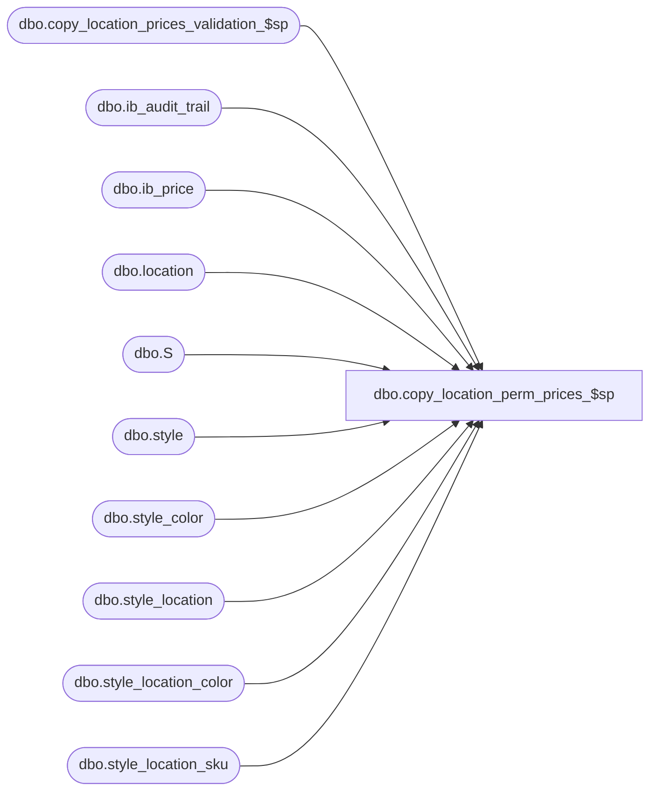

# dbo.copy_location_perm_prices_$sp

**Database:** me_01  
**Server:** bedrockdb02  

## Architecture Diagram



## Table Dependencies

| Referenced Table |
|---|
| dbo.copy_location_prices_validation_$sp |
| dbo.ib_audit_trail |
| dbo.ib_price |
| dbo.location |
| dbo.S |
| dbo.style |
| dbo.style_color |
| dbo.style_location |
| dbo.style_location_color |
| dbo.style_location_sku |

## Stored Procedure Code

```sql
-----------------------------------------------------------------------------------------------------------------------------
--	Main Query: Create Procedure
-----------------------------------------------------------------------------------------------------------------------------

CREATE PROCEDURE dbo.copy_location_perm_prices_$sp

	 @From_Location_ID AS SMALLINT
	,@To_Location_ID AS SMALLINT
	,@Employee_First_Name AS NVARCHAR (30)
	,@Employee_Last_Name AS NVARCHAR (30)
	,@Pre_Validate AS BIT
	,@Is_Valid AS BIT OUTPUT
	,@Regenerate_Flag AS BIT OUTPUT

AS

--	Object GUID: 0DCB2CD3-6910-4F42-8788-E324A6D98FF8

SET TRANSACTION ISOLATION LEVEL READ UNCOMMITTED
SET NOCOUNT ON

SET @Regenerate_Flag = 0

-----------------------------------------------------------------------------------------------------------------------------
--	Declarations / Sets: Declare And Set Variables
-----------------------------------------------------------------------------------------------------------------------------

DECLARE
	 @Date_Now AS SMALLDATETIME
	,@Error_Line AS INT
	,@Error_Message AS NVARCHAR (4000)
	,@Error_Number AS INT
	,@Error_Procedure AS NVARCHAR (128)
	,@Error_Severity AS INT
	,@Error_State AS INT
	,@Jurisdiction_ID AS SMALLINT
	,@Row_Count AS INT


SET @Date_Now = CONVERT (SMALLDATETIME, CONVERT (VARCHAR (8), GETDATE (), 112))


SET @Jurisdiction_ID = (SELECT L.jurisdiction_id FROM dbo.location L WHERE L.location_id = @To_Location_ID)


SET @Row_Count = 0


-----------------------------------------------------------------------------------------------------------------------------
--	Error Trapping: Check If "@To_Location_ID" Has Pre-Existing Data (Conditional)
-----------------------------------------------------------------------------------------------------------------------------

IF @Pre_Validate = 1
BEGIN

	EXECUTE dbo.copy_location_prices_validation_$sp

		 @Location_ID = @To_Location_ID
		,@Display_Output = 0
		,@Is_Valid = @Is_Valid OUTPUT


	IF @Is_Valid = 0
	BEGIN

		RETURN

	END

END
ELSE BEGIN

	SET @Is_Valid = 1

END


-----------------------------------------------------------------------------------------------------------------------------
--	Error Trapping: Check If Temp Table(s) Already Exist(s) And Drop If Applicable
-----------------------------------------------------------------------------------------------------------------------------

IF OBJECT_ID (N'tempdb.dbo.#style_location', N'U') IS NOT NULL
BEGIN

	DROP TABLE dbo.#style_location

END


IF OBJECT_ID (N'tempdb.dbo.#style_location_color', N'U') IS NOT NULL
BEGIN

	DROP TABLE dbo.#style_location_color

END


IF OBJECT_ID (N'tempdb.dbo.#style_location_sku', N'U') IS NOT NULL
BEGIN

	DROP TABLE dbo.#style_location_sku

END


-----------------------------------------------------------------------------------------------------------------------------
--	Table Create: Create Shell Tables For Data Capture
-----------------------------------------------------------------------------------------------------------------------------

CREATE TABLE dbo.#style_location

	(
		 style_location_id DECIMAL (13, 0)
		,style_id DECIMAL (12, 0)
		,current_selling_retail DECIMAL (14, 2)
		,current_valuation_retail DECIMAL (14, 2)
		,current_price_status_id SMALLINT
	)


CREATE TABLE dbo.#style_location_color

	(
		 style_location_color_id DECIMAL (13, 0)
		,style_id DECIMAL (12, 0)
		,style_color_id DECIMAL (13, 0)
		,current_selling_retail DECIMAL (14, 2)
		,current_valuation_retail DECIMAL (14, 2)
		,current_price_status_id SMALLINT
	)


CREATE TABLE dbo.#style_location_sku

	(
		 style_location_sku_id DECIMAL (13, 0)
		,style_id DECIMAL (12, 0)
		,style_color_id DECIMAL (13, 0)
		,current_selling_retail DECIMAL (14, 2)
		,current_valuation_retail DECIMAL (14, 2)
		,current_price_status_id SMALLINT
		,sku_id DECIMAL (13, 0)
	)


-----------------------------------------------------------------------------------------------------------------------------
--	Style / Location: Populate Data Into "style_location" Table
-----------------------------------------------------------------------------------------------------------------------------

BEGIN TRY

	BEGIN TRANSACTION

		INSERT INTO dbo.#style_location

			(
				 style_location_id
				,style_id
				,current_selling_retail
				,current_valuation_retail
				,current_price_status_id
			)

		SELECT
			 sqINS.style_location_id
			,sqINS.style_id
			,sqINS.current_selling_retail
			,sqINS.current_valuation_retail
			,sqINS.current_price_status_id
		FROM

			(
				INSERT INTO dbo.style_location

					(
						 style_location_id
						,style_id
						,location_id
						,jurisdiction_id
						,original_selling_retail
						,original_valuation_retail
						,original_price_status_id
						,current_selling_retail
						,current_valuation_retail
						,current_price_status_id
						,mix_match_rule_id1
						,mix_match_rule_id2
						,mix_match_rule_id3
						,mix_match_rule_id4
					)

				OUTPUT
					 inserted.style_location_id
					,inserted.style_id
					,inserted.current_selling_retail
					,inserted.current_valuation_retail
					,inserted.current_price_status_id

				SELECT
					 ROW_NUMBER () OVER
										(
											PARTITION BY
												S.style_id
											ORDER BY
												(SELECT NULL)
										) + ((100000 * S.style_id) + S.last_item_id) AS style_location_id
					,SL.style_id
					,@To_Location_ID AS location_id
					,@Jurisdiction_ID AS jurisdiction_id
					,SL.original_selling_retail
					,SL.original_valuation_retail
					,SL.original_price_status_id
					,SL.current_selling_retail
					,SL.current_valuation_retail
					,SL.current_price_status_id
					,SL.mix_match_rule_id1
					,SL.mix_match_rule_id2
					,SL.mix_match_rule_id3
					,SL.mix_match_rule_id4
				FROM
					dbo.style_location SL
					INNER JOIN dbo.style S ON S.style_id = SL.style_id
						AND S.style_status >= 3 -- Ordered (And Above) Styles Only
				WHERE
					SL.location_id = @From_Location_ID
			) sqINS


		SET @Row_Count = @@ROWCOUNT


-----------------------------------------------------------------------------------------------------------------------------
--	Style / Location: Populate Data Into "ib_price" Table
-----------------------------------------------------------------------------------------------------------------------------

		IF @Row_Count > 0
		BEGIN

			INSERT INTO dbo.ib_price

				(
					 style_id
					,color_id
					,location_id
					,jurisdiction_id
					,pricing_group_id
					,temp_price_flag
					,[start_date]
					,end_date
					,valuation_retail_price
					,selling_retail_price
					,price_status_id
					,document_number
					,cancel_promo_flag
					,effective_date
					,price_change_type
					,insert_guid
					,style_color_id
					,sku_id
				)

			SELECT
				 ttSL.style_id
				,NULL AS color_id
				,@To_Location_ID AS location_id
				,@Jurisdiction_ID AS jurisdiction_id
				,NULL AS pricing_group_id
				,0 AS temp_price_flag
				,@Date_Now AS [start_date]
				,NULL AS end_date
				,ttSL.current_valuation_retail AS valuation_retail_price
				,ttSL.current_selling_retail AS selling_retail_price
				,ttSL.current_price_status_id AS price_status_id
				,NULL AS document_number
				,0 AS cancel_promo_flag
				,@Date_Now AS effective_date
				,NULL AS price_change_type
				,NULL AS insert_guid
				,NULL AS style_color_id
				,NULL AS sku_id
			FROM
				dbo.#style_location ttSL
			WHERE
				ttSL.current_valuation_retail IS NOT NULL
				AND ttSL.current_selling_retail IS NOT NULL
				AND ttSL.current_price_status_id IS NOT NULL


-----------------------------------------------------------------------------------------------------------------------------
--	Style / Location: Populate Data Into "style" Table
-----------------------------------------------------------------------------------------------------------------------------

			UPDATE
				S
			SET
				S.last_item_id = S.last_item_id + sqTO.occurrences
			FROM
				dbo.style S
				INNER JOIN

					(
						SELECT
							 ttSL.style_id
							,COUNT (*) AS occurrences
						FROM
							dbo.#style_location ttSL
						GROUP BY
							ttSL.style_id
					) sqTO ON sqTO.style_id = S.style_id

			IF OBJECT_ID (N'tempdb.dbo.#style_location', N'U') IS NOT NULL
			BEGIN

				DROP TABLE dbo.#style_location

			END

			SET @Regenerate_Flag = 1

			SET @Row_Count = 0

		END


-----------------------------------------------------------------------------------------------------------------------------
--	Style / Location / Color: Populate Data Into "style_location_color" Table
-----------------------------------------------------------------------------------------------------------------------------

		INSERT INTO dbo.#style_location_color

			(
				 style_location_color_id
				,style_id
				,style_color_id
				,current_selling_retail
				,current_valuation_retail
				,current_price_status_id
			)

		SELECT
			 sqINS.style_location_color_id
			,sqINS.style_id
			,sqINS.style_color_id
			,sqINS.current_selling_retail
			,sqINS.current_valuation_retail
			,sqINS.current_price_status_id
		FROM

			(
				INSERT INTO dbo.style_location_color

					(
						 style_location_color_id
						,style_id
						,location_id
						,style_color_id
						,jurisdiction_id
						,original_selling_retail
						,original_valuation_retail
						,original_price_status_id
						,current_selling_retail
						,current_valuation_retail
						,current_price_status_id
						,mix_match_rule_id1
						,mix_match_rule_id2
						,mix_match_rule_id3
						,mix_match_rule_id4
					)

				OUTPUT
					 inserted.style_location_color_id
					,inserted.style_id
					,inserted.style_color_id
					,inserted.current_selling_retail
					,inserted.current_valuation_retail
					,inserted.current_price_status_id

				SELECT
					 ROW_NUMBER () OVER
										(
											PARTITION BY
												S.style_id
											ORDER BY
												(SELECT NULL)
										) + ((100000 * S.style_id) + S.last_item_id) AS style_location_color_id
					,SCL.style_id
					,@To_Location_ID AS location_id
					,SCL.style_color_id
					,@Jurisdiction_ID AS jurisdiction_id
					,SCL.original_selling_retail
					,SCL.original_valuation_retail
					,SCL.original_price_status_id
					,SCL.current_selling_retail
					,SCL.current_valuation_retail
					,SCL.current_price_status_id
					,SCL.mix_match_rule_id1
					,SCL.mix_match_rule_id2
					,SCL.mix_match_rule_id3
					,SCL.mix_match_rule_id4
				FROM
					dbo.style_location_color SCL
					INNER JOIN dbo.style S ON S.style_id = SCL.style_id
						AND S.style_status >= 3 -- Ordered (And Above) Styles Only
				WHERE
					SCL.location_id = @From_Location_ID
			) sqINS


		SET @Row_Count = @@ROWCOUNT


-----------------------------------------------------------------------------------------------------------------------------
--	Style / Location / Color: Populate Data Into "ib_price" Table
-----------------------------------------------------------------------------------------------------------------------------

		IF @Row_Count > 0
		BEGIN

			INSERT INTO dbo.ib_price

				(
					 style_id
					,color_id
					,location_id
					,jurisdiction_id
					,pricing_group_id
					,temp_price_flag
					,[start_date]
					,end_date
					,valuation_retail_price
					,selling_retail_price
					,price_status_id
					,document_number
					,cancel_promo_flag
					,effective_date
					,price_change_type
					,insert_guid
					,style_color_id
					,sku_id
				)

			SELECT
				 ttSLC.style_id
				,SC.color_id
				,@To_Location_ID AS location_id
				,@Jurisdiction_ID AS jurisdiction_id
				,NULL AS pricing_group_id
				,0 AS temp_price_flag
				,@Date_Now AS [start_date]
				,NULL AS end_date
				,ttSLC.current_valuation_retail AS valuation_retail_price
				,ttSLC.current_selling_retail AS selling_retail_price
				,ttSLC.current_price_status_id AS price_status_id
				,NULL AS document_number
				,0 AS cancel_promo_flag
				,@Date_Now AS effective_date
				,NULL AS price_change_type
				,NULL AS insert_guid
				,ttSLC.style_color_id
				,NULL AS sku_id
			FROM
				dbo.#style_location_color ttSLC
				INNER JOIN dbo.style_color SC ON SC.style_color_id = ttSLC.style_color_id
			WHERE
				ttSLC.current_valuation_retail IS NOT NULL
				AND ttSLC.current_selling_retail IS NOT NULL
				AND ttSLC.current_price_status_id IS NOT NULL


-----------------------------------------------------------------------------------------------------------------------------
--	Style / Location / Color: Populate Data Into "style" Table
-----------------------------------------------------------------------------------------------------------------------------

			UPDATE
				S
			SET
				S.last_item_id = S.last_item_id + sqTO.occurrences
			FROM
				dbo.style S
				INNER JOIN

					(
						SELECT
							 ttSLC.style_id
							,COUNT (*) AS occurrences
						FROM
							dbo.#style_location_color ttSLC
						GROUP BY
							ttSLC.style_id
					) sqTO ON sqTO.style_id = S.style_id

			IF OBJECT_ID (N'tempdb.dbo.#style_location_color', N'U') IS NOT NULL
			BEGIN

				DROP TABLE dbo.#style_location_color

			END

			SET @Regenerate_Flag = 1

			SET @Row_Count = 0

		END


-----------------------------------------------------------------------------------------------------------------------------
--	Style / Location / SKU: Populate Data Into "style_location_sku" Table
-----------------------------------------------------------------------------------------------------------------------------

		INSERT INTO dbo.#style_location_sku

			(
				 style_location_sku_id
				,style_id
				,style_color_id
				,current_selling_retail
				,current_valuation_retail
				,current_price_status_id
				,sku_id
			)

		SELECT
			 sqINS.style_location_sku_id
			,sqINS.style_id
			,sqINS.style_color_id
			,sqINS.current_selling_retail
			,sqINS.current_valuation_retail
			,sqINS.current_price_status_id
			,sqINS.sku_id
		FROM

			(
				INSERT INTO dbo.style_location_sku

					(
						 style_location_sku_id
						,style_id
						,location_id
						,style_color_id
						,size_master_id
						,jurisdiction_id
						,original_selling_retail
						,original_valuation_retail
						,original_price_status_id
						,current_selling_retail
						,current_valuation_retail
						,current_price_status_id
						,sku_id
					)

				OUTPUT
					 inserted.style_location_sku_id
					,inserted.style_id
					,inserted.style_color_id
					,inserted.current_selling_retail
					,inserted.current_valuation_retail
					,inserted.current_price_status_id
					,inserted.sku_id

				SELECT
					 ROW_NUMBER () OVER
										(
											PARTITION BY
												S.style_id
											ORDER BY
												(SELECT NULL)
										) + ((100000 * S.style_id) + S.last_item_id) AS style_location_sku_id
					,SLS.style_id
					,@To_Location_ID AS location_id
					,SLS.style_color_id
					,SLS.size_master_id
					,@Jurisdiction_ID AS jurisdiction_id
					,SLS.original_selling_retail
					,SLS.original_valuation_retail
					,SLS.original_price_status_id
					,SLS.current_selling_retail
					,SLS.current_valuation_retail
					,SLS.current_price_status_id
					,SLS.sku_id
				FROM
					dbo.style_location_sku SLS
					INNER JOIN dbo.style S ON S.style_id = SLS.style_id
						AND S.style_status >= 3 -- Ordered (And Above) Styles Only
				WHERE
					SLS.location_id = @From_Location_ID
			) sqINS


		SET @Row_Count = @@ROWCOUNT


-----------------------------------------------------------------------------------------------------------------------------
--	Style / Location / SKU: Populate Data Into "ib_price" Table
-----------------------------------------------------------------------------------------------------------------------------

		IF @Row_Count > 0
		BEGIN

			INSERT INTO dbo.ib_price

				(
					 style_id
					,color_id
					,location_id
					,jurisdiction_id
					,pricing_group_id
					,temp_price_flag
					,[start_date]
					,end_date
					,valuation_retail_price
					,selling_retail_price
					,price_status_id
					,document_number
					,cancel_promo_flag
					,effective_date
					,price_change_type
					,insert_guid
					,style_color_id
					,sku_id
				)

			SELECT
				 ttSLS.style_id
				,SC.color_id
				,@To_Location_ID AS location_id
				,@Jurisdiction_ID AS jurisdiction_id
				,NULL AS pricing_group_id
				,0 AS temp_price_flag
				,@Date_Now AS [start_date]
				,NULL AS end_date
				,ttSLS.current_valuation_retail AS valuation_retail_price
				,ttSLS.current_selling_retail AS selling_retail_price
				,ttSLS.current_price_status_id AS price_status_id
				,NULL AS document_number
				,0 AS cancel_promo_flag
				,@Date_Now AS effective_date
				,NULL AS price_change_type
				,NULL AS insert_guid
				,ttSLS.style_color_id
				,ttSLS.sku_id
			FROM
				dbo.#style_location_sku ttSLS
				INNER JOIN dbo.style_color SC ON SC.style_color_id = ttSLS.style_color_id
			WHERE
				ttSLS.current_valuation_retail IS NOT NULL
				AND ttSLS.current_selling_retail IS NOT NULL
				AND ttSLS.current_price_status_id IS NOT NULL


-----------------------------------------------------------------------------------------------------------------------------
--	Style / Location / SKU: Populate Data Into "style" Table
-----------------------------------------------------------------------------------------------------------------------------

			UPDATE
				S
			SET
				S.last_item_id = S.last_item_id + sqTO.occurrences
			FROM
				dbo.style S
				INNER JOIN

					(
						SELECT
							 ttSLS.style_id
							,COUNT (*) AS occurrences
						FROM
							dbo.#style_location_sku ttSLS
						GROUP BY
							ttSLS.style_id
					) sqTO ON sqTO.style_id = S.style_id

			IF OBJECT_ID (N'tempdb.dbo.#style_location_sku', N'U') IS NOT NULL
			BEGIN

				DROP TABLE dbo.#style_location_sku

			END

			SET @Regenerate_Flag = 1

			SET @Row_Count = 0

		END


-----------------------------------------------------------------------------------------------------------------------------
--	IB Audit Trail: Populate Data Into "ib_audit_trail" Table
-----------------------------------------------------------------------------------------------------------------------------

		INSERT INTO dbo.ib_audit_trail

			(
				 entry_date
				,[application]
				,activity
				,application_type_id
				,application_type
				,application_identifier
				,application_level
				,application_key
				,[action]
				,field_affected
				,old_value
				,new_value
				,[status]
				,employee_last_name
				,employee_first_name
			)

		SELECT
			 @Date_Now AS entry_date
			,N'EDM' AS [application]
			,NULL AS activity
			,NULL AS application_type_id
			,N'Copy permanent prices to location' AS application_type
			,(SELECT L.location_code FROM dbo.location L WHERE L.location_id = @To_Location_ID) AS application_identifier
			,N'' AS application_level
			,(SELECT L.location_code FROM dbo.location L WHERE L.location_id = @From_Location_ID) AS application_key
			,N'Modify' AS [action]
			,N'' AS field_affected
			,N'' AS old_value
			,N'' AS new_value
			,NULL AS [status]
			,@Employee_Last_Name AS employee_last_name
			,@Employee_First_Name AS employee_first_name

	COMMIT TRANSACTION

END TRY
BEGIN CATCH

	IF @@TRANCOUNT > 0
	BEGIN

		ROLLBACK TRANSACTION

	END


	SET @Error_Line = ERROR_LINE ()
	SET @Error_Message = N'Msg %d, Level %d, State %d, Procedure %s, Line %d' + NCHAR (13) + NCHAR (10) + ERROR_MESSAGE ()
	SET @Error_Number = ERROR_NUMBER ()
	SET @Error_Procedure = ERROR_PROCEDURE ()
	SET @Error_Severity = ERROR_SEVERITY ()
	SET @Error_State = ERROR_STATE ()


	RAISERROR

		(
			 @Error_Message
			,@Error_Severity
			,@Error_State
			,@Error_Number -- Original Error Number
			,@Error_Severity -- Original Error Severity
			,@Error_State -- Original Error State
			,@Error_Procedure -- Original Error Procedure Name
			,@Error_Line -- Original Error Line Number
		)

END CATCH
```

