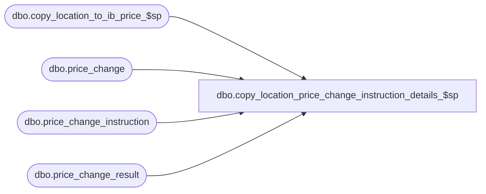

# dbo.copy_location_price_change_instruction_details_$sp

**Database:** me_01  
**Server:** bedrockdb02  

## Architecture Diagram



## Table Dependencies

| Referenced Table |
|---|
| dbo.copy_location_to_ib_price_$sp |
| dbo.price_change |
| dbo.price_change_instruction |
| dbo.price_change_result |

## Stored Procedure Code

```sql
-----------------------------------------------------------------------------------------------------------------------------
--	Main Query: Create Procedure
-----------------------------------------------------------------------------------------------------------------------------

CREATE PROCEDURE dbo.copy_location_price_change_instruction_details_$sp

	 @Like_Location_ID AS SMALLINT
	,@New_Location_ID AS SMALLINT
	,@Price_Change_ID AS DECIMAL (12, 0)

AS

--	Object GUID: 0DCB2CD3-6910-4F42-8788-E324A6D98FF8

SET TRANSACTION ISOLATION LEVEL READ UNCOMMITTED
SET NOCOUNT ON


-----------------------------------------------------------------------------------------------------------------------------
--	Declarations / Sets: Declare And Set Variables
-----------------------------------------------------------------------------------------------------------------------------

DECLARE
	 @Error_Line AS INT
	,@Error_Message AS NVARCHAR (4000)
	,@Error_Number AS INT
	,@Error_Procedure AS NVARCHAR (128)
	,@Error_Severity AS INT
	,@Error_State AS INT

IF OBJECT_ID (N'tempdb.dbo.#temp_price_change_instruction', N'U') IS NOT NULL
BEGIN

	DROP TABLE dbo.#temp_price_change_instruction

END

CREATE TABLE dbo.#temp_price_change_instruction
	(
		price_change_id DECIMAL(12, 0) NOT NULL
		,like_price_change_instruction_id DECIMAL(12, 0) NOT NULL
		,new_price_change_instruction_id DECIMAL(12, 0) NOT NULL
		,name NVARCHAR(200) NULL
		,merch_instruction_type SMALLINT NOT NULL
		,merch_hierarchy_group_id INT NULL
		,style_id DECIMAL(12, 0) NULL
		,style_color_id DECIMAL(13, 0) NULL
		,sku_id DECIMAL(13, 0) NULL
		,location_instruction_type SMALLINT NOT NULL
		,location_id SMALLINT NULL
		,jurisdiction_id SMALLINT NULL
		,calculation_method SMALLINT NOT NULL
		,calculation_value DECIMAL(14, 2) NOT NULL
		,base_calculation_on SMALLINT NULL
		,price_status_id SMALLINT NOT NULL
	)

BEGIN TRY

	IF EXISTS (SELECT 1 FROM price_change_instruction WHERE price_change_id = @Price_Change_ID AND location_id = @Like_Location_ID)
	BEGIN

		DECLARE @Max_Price_Change_Instruction_Id AS DECIMAL (12, 0) = (SELECT MAX(price_change_instruction_id) FROM dbo.price_change_instruction WHERE price_change_id = @Price_Change_ID)

		INSERT INTO dbo.#temp_price_change_instruction
			(
				price_change_id
				,like_price_change_instruction_id
				,new_price_change_instruction_id
				,name
				,merch_instruction_type
				,merch_hierarchy_group_id
				,style_id
				,style_color_id
				,sku_id
				,location_instruction_type
				,location_id
				,jurisdiction_id
				,calculation_method
				,calculation_value
				,base_calculation_on
				,price_status_id
			)
		SELECT
			price_change_id
			,price_change_instruction_id AS like_price_change_instruction_id
			,@Max_Price_Change_Instruction_Id + ROW_NUMBER() OVER (ORDER BY price_change_id,price_change_instruction_id) AS new_price_change_instruction_id
			,name
			,merch_instruction_type
			,merch_hierarchy_group_id
			,style_id
			,style_color_id
			,sku_id
			,location_instruction_type
			,@New_Location_ID AS location_id
			,jurisdiction_id
			,calculation_method
			,calculation_value
			,base_calculation_on
			,price_status_id
		FROM
			dbo.price_change_instruction
		WHERE
			price_change_id = @Price_Change_ID
			AND location_id = @Like_Location_ID

		INSERT INTO dbo.price_change_instruction
			(
				price_change_id
				,price_change_instruction_id
				,name
				,merch_instruction_type
				,merch_hierarchy_group_id
				,style_id
				,style_color_id
				,sku_id
				,location_instruction_type
				,location_id
				,jurisdiction_id
				,calculation_method
				,calculation_value
				,base_calculation_on
				,price_status_id
			)
		SELECT
			price_change_id
			,new_price_change_instruction_id
			,name
			,merch_instruction_type
			,merch_hierarchy_group_id
			,style_id
			,style_color_id
			,sku_id
			,location_instruction_type
			,location_id
			,jurisdiction_id
			,calculation_method
			,calculation_value
			,base_calculation_on
			,price_status_id
		FROM
			dbo.#temp_price_change_instruction

		INSERT INTO dbo.price_change_result
			(
				result_id
				,price_change_instruction_id
				,style_id
				,color_id
				,sku_id
				,jurisdiction_id
				,location_id
				,on_order_units
				,total_on_hand_units
				,original_retail_price
				,current_retail_price
				,selling_retail_price
				,calculation_method
				,base_calculation_on
				,calculation_value
				,price_status_id
				,current_valuation_retail_price
				,valuation_retail_price
				,is_pseudo_instruction
				,final_exception_level
				,alternate_exception_level
				,original_valuation_retail_price
				,old_exception_level
			)
		SELECT
			PCD.result_id
			,TPCI.new_price_change_instruction_id
			,PCD.style_id
			,PCD.color_id
			,PCD.sku_id
			,PCD.jurisdiction_id
			,TPCI.location_id
			,0 AS on_order_units
			,0 AS total_on_hand_units
			,PCD.original_retail_price
			,PCD.current_retail_price
			,PCD.selling_retail_price
			,PCD.calculation_method
			,PCD.base_calculation_on
			,PCD.calculation_value
			,PCD.price_status_id
			,PCD.current_valuation_retail_price
			,PCD.valuation_retail_price
			,PCD.is_pseudo_instruction
			,PCD.final_exception_level
			,PCD.alternate_exception_level
			,PCD.original_valuation_retail_price
			,PCD.old_exception_level
		FROM
			dbo.price_change_result PCD
		INNER JOIN dbo.price_change PC ON PCD.result_id = PC.result_id
		INNER JOIN dbo.#temp_price_change_instruction TPCI ON PC.price_change_id = TPCI.price_change_id
																					AND PCD.price_change_instruction_id = TPCI.like_price_change_instruction_id

		EXEC dbo.copy_location_to_ib_price_$sp

			 @Like_Location_ID = @Like_Location_ID
			,@New_Location_ID = @New_Location_ID
			,@Price_Change_ID = @Price_Change_ID

	END
	ELSE
	BEGIN

		INSERT INTO dbo.price_change_result
			(
				result_id
				,price_change_instruction_id
				,style_id
				,color_id
				,sku_id
				,jurisdiction_id
				,location_id
				,on_order_units
				,total_on_hand_units
				,original_retail_price
				,current_retail_price
				,selling_retail_price
				,calculation_method
				,base_calculation_on
				,calculation_value
				,price_status_id
				,current_valuation_retail_price
				,valuation_retail_price
				,is_pseudo_instruction
				,final_exception_level
				,alternate_exception_level
				,original_valuation_retail_price
				,old_exception_level
			)
		SELECT
			PCD.result_id
			,PCD.price_change_instruction_id
			,PCD.style_id
			,PCD.color_id
			,PCD.sku_id
			,PCD.jurisdiction_id
			,@New_Location_ID AS location_id
			,0 AS on_order_units
			,0 AS total_on_hand_units
			,PCD.original_retail_price
			,PCD.current_retail_price
			,PCD.selling_retail_price
			,PCD.calculation_method
			,PCD.base_calculation_on
			,PCD.calculation_value
			,PCD.price_status_id
			,PCD.current_valuation_retail_price
			,PCD.valuation_retail_price
			,PCD.is_pseudo_instruction
			,PCD.final_exception_level
			,PCD.alternate_exception_level
			,PCD.original_valuation_retail_price
			,PCD.old_exception_level
		FROM
			dbo.price_change_result PCD
		INNER JOIN dbo.price_change PC ON PCD.result_id = PC.result_id
		WHERE
			PC.price_change_id = @Price_Change_ID
			AND PCD.location_id = @Like_Location_ID

	END

	UPDATE dbo.price_change SET updatestamp = updatestamp + 1 WHERE price_change_id = @Price_Change_ID

END TRY
BEGIN CATCH

	SET @Error_Line = ERROR_LINE ()
	SET @Error_Message = N'Msg %d, Level %d, State %d, Procedure %s, Line %d' + NCHAR (13) + NCHAR (10) + ERROR_MESSAGE ()
	SET @Error_Number = ERROR_NUMBER ()
	SET @Error_Procedure = ERROR_PROCEDURE ()
	SET @Error_Severity = ERROR_SEVERITY ()
	SET @Error_State = ERROR_STATE ()


	RAISERROR

		(
			 @Error_Message
			,@Error_Severity
			,@Error_State
			,@Error_Number -- Original Error Number
			,@Error_Severity -- Original Error Severity
			,@Error_State -- Original Error State
			,@Error_Procedure -- Original Error Procedure Name
			,@Error_Line -- Original Error Line Number
		)

END CATCH
```

