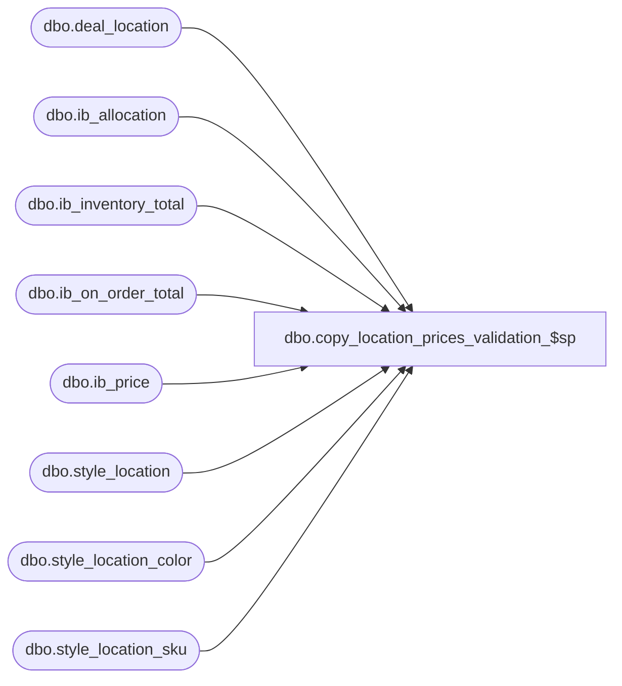

# dbo.copy_location_prices_validation_$sp

**Database:** me_01  
**Server:** bedrockdb02  

## Architecture Diagram



## Table Dependencies

| Referenced Table |
|---|
| dbo.deal_location |
| dbo.ib_allocation |
| dbo.ib_inventory_total |
| dbo.ib_on_order_total |
| dbo.ib_price |
| dbo.style_location |
| dbo.style_location_color |
| dbo.style_location_sku |

## Stored Procedure Code

```sql
-----------------------------------------------------------------------------------------------------------------------------
--	Main Query: Create Procedure
-----------------------------------------------------------------------------------------------------------------------------

CREATE PROCEDURE [dbo].[copy_location_prices_validation_$sp]

	 @Location_ID AS SMALLINT
	,@Display_Output AS BIT = 0
	,@Is_Valid AS BIT OUTPUT

AS

SET TRANSACTION ISOLATION LEVEL READ UNCOMMITTED
SET NOCOUNT ON

IF
	(
		EXISTS (SELECT * FROM dbo.ib_allocation IBA WHERE IBA.location_id = @Location_ID)
		OR EXISTS (SELECT * FROM dbo.ib_inventory_total IBIT WHERE IBIT.location_id = @Location_ID)
		OR EXISTS (SELECT * FROM dbo.ib_on_order_total IBOOT WHERE IBOOT.location_id = @Location_ID)
		OR EXISTS (SELECT * FROM dbo.ib_price IBP WHERE IBP.location_id = @Location_ID)
		OR EXISTS (SELECT * FROM dbo.style_location SL WHERE SL.location_id = @Location_ID)
		OR EXISTS (SELECT * FROM dbo.style_location_color SLC WHERE SLC.location_id = @Location_ID)
		OR EXISTS (SELECT * FROM dbo.style_location_sku SLS WHERE SLS.location_id = @Location_ID)
		OR EXISTS (SELECT * FROM dbo.deal_location DL WHERE DL.location_id = @Location_ID)
	)

BEGIN

	SET @Is_Valid = 0

END
ELSE BEGIN

	SET @Is_Valid = 1

END


IF @Display_Output = 1
BEGIN

	SELECT
		@Is_Valid AS is_valid

END
```

