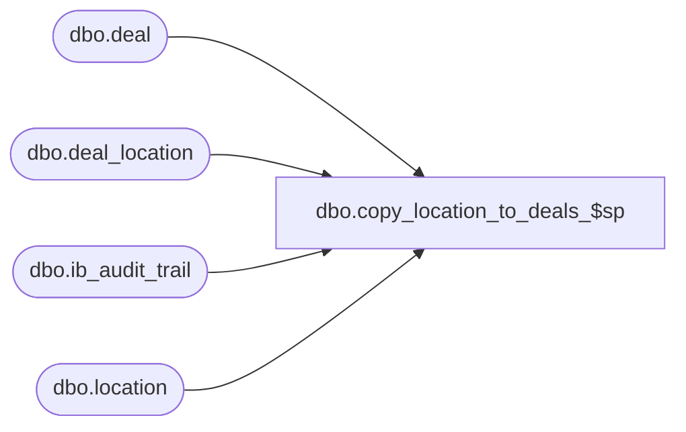

# dbo.copy_location_to_deals_$sp

**Database:** me_01  
**Server:** bedrockdb02  

## Architecture Diagram



## Table Dependencies

| Referenced Table |
|---|
| dbo.deal |
| dbo.deal_location |
| dbo.ib_audit_trail |
| dbo.location |

## Stored Procedure Code

```sql
----------------------------------------------------------------------------------------------------------------------------
--	Main Query: Create Procedure
-----------------------------------------------------------------------------------------------------------------------------

CREATE PROCEDURE [dbo].[copy_location_to_deals_$sp]

	 @Like_Location_ID AS SMALLINT
	,@New_Location_ID AS SMALLINT
	,@Employee_First_Name AS NVARCHAR (30)
	,@Employee_Last_Name AS NVARCHAR (30)
	,@Regenerate_Flag AS BIT OUTPUT

AS

SET TRANSACTION ISOLATION LEVEL READ UNCOMMITTED
SET NOCOUNT ON

-----------------------------------------------------------------------------------------------------------------------------
--	Declarations / Sets: Declare And Set Variables
-----------------------------------------------------------------------------------------------------------------------------

DECLARE
	 @Error_Line AS INT
	,@Error_Message AS NVARCHAR (4000)
	,@Error_Number AS INT
	,@Error_Procedure AS NVARCHAR (128)
	,@Error_Severity AS INT
	,@Error_State AS INT
	,@Deal_ID AS INT
	,@Deal_Last_Item_ID AS DECIMAL(12,0)
	,@New_Deal_Location_ID as INT
	,@Date_Now AS SMALLDATETIME
	,@Document_Status AS SMALLINT

SET @Date_Now = CONVERT (SMALLDATETIME, CONVERT (VARCHAR (8), GETDATE (), 112))

DECLARE @Affected_Deals AS TABLE
(
	deal_id INT
)

BEGIN TRY

	BEGIN TRANSACTION

		-- deal status must be one of the following:
		--		preliminary = 1, submitted = 2, issued = 3
		INSERT INTO @Affected_Deals
		(
			deal_id
		)
		SELECT
			DISTINCT D.deal_id
		FROM
			deal D
		INNER JOIN deal_location DL ON D.deal_id = DL.deal_id
		INNER JOIN location L ON L.location_id = @New_Location_ID AND ((L.register_type_id IN (2,6) AND L.generate_plu_file_flag = 1) OR L.generate_thin_plu_file_flag = 1)
		WHERE
			D.document_status < 4
			AND DL.location_id = @Like_Location_ID

		-- get the id of the first deal document to process
		SET @Deal_ID = (SELECT TOP (1) tvAD.deal_id FROM @Affected_Deals tvAD ORDER BY tvAD.deal_id)

		WHILE @Deal_ID IS NOT NULL
		BEGIN
			-- first, determine the deal_location_id for the record to insert
			-- to do so, retrieve the last_item_id value from the deal table and add 1 to the value.
			-- new deal_location_id =  deal_id * 10000 + last_item_id
			SET @Deal_Last_Item_ID = (SELECT last_item_id FROM deal WHERE deal_id = @Deal_ID) +1
			SET @New_deal_location_ID = (@Deal_ID * 10000) + @Deal_Last_Item_ID

			-- now insert the record in the deal_location_table
			INSERT INTO dbo.deal_location
			(
				deal_location_id
				,deal_id
				,location_id
				,printed_status
			)
			VALUES
			(
				@New_Deal_Location_ID
				,@Deal_ID
				,@New_Location_ID
				,0
			)

			-- update the last_item_id value from deal table
			UPDATE dbo.deal
			SET last_item_id = @Deal_Last_Item_ID
			WHERE deal_id = @Deal_ID

			-- updating the core replication queue is done in the parent stored procedure.
			-- copy_like_location_prices_$sp

			IF (@Regenerate_Flag = 0)
			BEGIN

				SELECT @Document_Status = document_status FROM deal WHERE deal_id = @Deal_ID

				IF (@Document_Status = 3)
				BEGIN

					SET @Regenerate_Flag = 1

				END

			END

			-- update the audit trail modification log
			INSERT INTO dbo.ib_audit_trail
			(
				entry_date
				,[application]
				,activity
				,application_type_id
				,application_type
				,application_identifier
				,application_level
				,application_key
				,[action]
				,field_affected
				,old_value
				,new_value
				,[status]
				,employee_last_name
				,employee_first_name
			)
			SELECT
				@Date_Now AS entry_date
				,N'EDM' AS [application]
				,NULL AS activity
				,NULL AS application_type_id
				,N'Add Location to Deal' AS application_type
				,D.deal_no AS application_identifier
				,(SELECT L.location_code FROM dbo.location L WHERE L.location_id = @New_Location_ID) AS application_level
				,(SELECT L.location_code FROM dbo.location L WHERE L.location_id = @Like_Location_ID) AS application_key
				,N'Modify' AS [action]
				,N'' AS field_affected
				,N'' AS old_value
				,N'' AS new_value
				,NULL AS [status]
				,@Employee_Last_Name AS employee_last_name
				,@Employee_First_Name AS employee_first_name
			FROM
				dbo.deal D
			WHERE
				D.deal_id = @Deal_ID

			-- get the id of the next deal document to process
			SET @Deal_ID = (SELECT TOP (1) tvAD.deal_id FROM @Affected_Deals tvAD WHERE tvAD.deal_id > @Deal_ID ORDER BY tvAD.deal_id)

		END

	COMMIT TRANSACTION

END TRY

BEGIN CATCH

	IF @@TRANCOUNT > 0
	BEGIN
		ROLLBACK TRANSACTION
	END

	SET @Error_Line = ERROR_LINE ()
	SET @Error_Message = N'Msg %d, Level %d, State %d, Procedure %s, Line %d' + NCHAR (13) + NCHAR (10) + ERROR_MESSAGE ()
	SET @Error_Number = ERROR_NUMBER ()
	SET @Error_Procedure = ERROR_PROCEDURE ()
	SET @Error_Severity = ERROR_SEVERITY ()
	SET @Error_State = ERROR_STATE ()

	RAISERROR
	(
		@Error_Message
		,@Error_Severity
		,@Error_State
		,@Error_Number -- Original Error Number
		,@Error_Severity -- Original Error Severity
		,@Error_State -- Original Error State
		,@Error_Procedure -- Original Error Procedure Name
		,@Error_Line -- Original Error Line Number
	)

END CATCH
```

