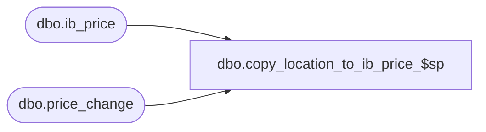

# dbo.copy_location_to_ib_price_$sp

**Database:** me_01  
**Server:** bedrockdb02  

## Architecture Diagram



## Table Dependencies

| Referenced Table |
|---|
| dbo.ib_price |
| dbo.price_change |

## Stored Procedure Code

```sql
-----------------------------------------------------------------------------------------------------------------------------
--	Main Query: Create Procedure
-----------------------------------------------------------------------------------------------------------------------------

CREATE PROCEDURE dbo.copy_location_to_ib_price_$sp

	 @Like_Location_ID AS SMALLINT
	,@New_Location_ID AS SMALLINT
	,@Price_Change_ID AS DECIMAL (12, 0)

AS

--	Object GUID: 0DCB2CD3-6910-4F42-8788-E324A6D98FF8

SET TRANSACTION ISOLATION LEVEL READ UNCOMMITTED
SET NOCOUNT ON


-----------------------------------------------------------------------------------------------------------------------------
--	Declarations / Sets: Declare And Set Variables
-----------------------------------------------------------------------------------------------------------------------------

DECLARE
	 @Error_Line AS INT
	,@Error_Message AS NVARCHAR (4000)
	,@Error_Number AS INT
	,@Error_Procedure AS NVARCHAR (128)
	,@Error_Severity AS INT
	,@Error_State AS INT
	,@Price_Change_No AS NVARCHAR(20)


BEGIN TRY

	SELECT @Price_Change_No = price_change_no FROM price_change WHERE price_change_id = @Price_Change_ID

	INSERT INTO dbo.ib_price

		(
			 style_id
			,color_id
			,location_id
			,jurisdiction_id
			,pricing_group_id
			,temp_price_flag
			,[start_date]
			,end_date
			,valuation_retail_price
			,selling_retail_price
			,price_status_id
			,document_number
			,cancel_promo_flag
			,effective_date
			,price_change_type
			,insert_guid
			,style_color_id
			,sku_id
		)

	SELECT
		 style_id
		,color_id
		,@New_Location_ID AS location_id
		,jurisdiction_id
		,pricing_group_id
		,temp_price_flag
		,[start_date]
		,end_date
		,valuation_retail_price
		,selling_retail_price
		,price_status_id
		,document_number
		,cancel_promo_flag
		,effective_date
		,price_change_type
		,insert_guid
		,style_color_id
		,sku_id
	FROM
		dbo.ib_price
	WHERE
		location_id = @Like_Location_ID
		AND document_number = @Price_Change_No
	ORDER BY
		ib_price_id

END TRY
BEGIN CATCH

	SET @Error_Line = ERROR_LINE ()
	SET @Error_Message = N'Msg %d, Level %d, State %d, Procedure %s, Line %d' + NCHAR (13) + NCHAR (10) + ERROR_MESSAGE ()
	SET @Error_Number = ERROR_NUMBER ()
	SET @Error_Procedure = ERROR_PROCEDURE ()
	SET @Error_Severity = ERROR_SEVERITY ()
	SET @Error_State = ERROR_STATE ()


	RAISERROR

		(
			 @Error_Message
			,@Error_Severity
			,@Error_State
			,@Error_Number -- Original Error Number
			,@Error_Severity -- Original Error Severity
			,@Error_State -- Original Error State
			,@Error_Procedure -- Original Error Procedure Name
			,@Error_Line -- Original Error Line Number
		)

END CATCH
```

