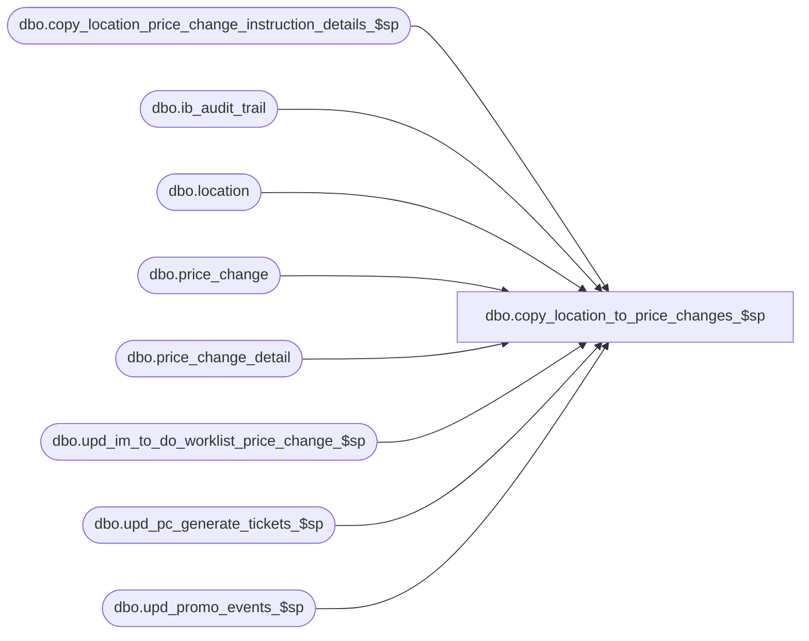

# dbo.copy_location_to_price_changes_$sp

**Database:** me_01  
**Server:** bedrockdb02  

## Architecture Diagram



## Table Dependencies

| Referenced Table |
|---|
| dbo.copy_location_price_change_instruction_details_$sp |
| dbo.ib_audit_trail |
| dbo.location |
| dbo.price_change |
| dbo.price_change_detail |
| dbo.upd_im_to_do_worklist_price_change_$sp |
| dbo.upd_pc_generate_tickets_$sp |
| dbo.upd_promo_events_$sp |

## Stored Procedure Code

```sql
----------------------------------------------------------------------------------------------------------------------------
--	Main Query: Create Procedure
-----------------------------------------------------------------------------------------------------------------------------

CREATE PROCEDURE dbo.copy_location_to_price_changes_$sp

	 @Like_Location_ID AS SMALLINT
	,@New_Location_ID AS SMALLINT
	,@Employee_First_Name AS NVARCHAR (30)
	,@Employee_Last_Name AS NVARCHAR (30)
	,@Copy_Promo_Price_Changes AS BIT
	,@Regenerate_Flag AS BIT OUTPUT

AS

--	Object GUID: 0DCB2CD3-6910-4F42-8788-E324A6D98FF8

SET TRANSACTION ISOLATION LEVEL READ UNCOMMITTED
SET NOCOUNT ON


-----------------------------------------------------------------------------------------------------------------------------
--	Declarations / Sets: Declare And Set Variables
-----------------------------------------------------------------------------------------------------------------------------

DECLARE
	 @Error_Line AS INT
	,@Error_Message AS NVARCHAR (4000)
	,@Error_Number AS INT
	,@Error_Procedure AS NVARCHAR (128)
	,@Error_Severity AS INT
	,@Error_State AS INT
	,@Price_Change_ID AS DECIMAL(12, 0)
	,@Date_Now AS SMALLDATETIME
	,@Document_Status AS SMALLINT

SET @Date_Now = CONVERT (SMALLDATETIME, CONVERT (VARCHAR (8), GETDATE (), 112))

DECLARE @Affected_Price_Changes AS TABLE
	(
		price_change_id DECIMAL (12, 0)
	)

BEGIN TRY

	INSERT INTO @Affected_Price_Changes
		(
			price_change_id
		)
	SELECT
		DISTINCT PC.price_change_id
	FROM
		price_change PC
	INNER JOIN price_change_detail PCD ON PCD.price_change_id = PC.price_change_id
	WHERE
		(
			(@Copy_Promo_Price_Changes = 0 AND PC.price_change_duration = 0 AND PC.price_change_status <= 3)
			OR
			(@Copy_Promo_Price_Changes = 1 AND PC.price_change_status <= 4)
		)
		AND PCD.location_id = @Like_Location_ID

	SET @Price_Change_ID = (SELECT TOP (1) tvAPC.price_change_id FROM @Affected_Price_Changes tvAPC ORDER BY tvAPC.price_change_id)

	WHILE @Price_Change_ID IS NOT NULL
	BEGIN

		BEGIN TRANSACTION

			EXEC dbo.copy_location_price_change_instruction_details_$sp

				 @Like_Location_ID = @Like_Location_ID
				,@New_Location_ID = @New_Location_ID
				,@Price_Change_ID = @Price_Change_ID

			EXEC dbo.upd_promo_events_$sp

				@Price_Change_ID = @Price_Change_ID
				,@Location_ID = @New_Location_ID

			EXEC dbo.upd_im_to_do_worklist_price_change_$sp

				@Price_Change_ID = @Price_Change_ID
				,@Location_ID = @New_Location_ID

			IF EXISTS
				(
					SELECT *
					FROM
						price_change PC
					WHERE
						PC.price_change_id = @Price_Change_ID
						AND PC.generate_tickets IN (1,3)
				)
			BEGIN

				EXEC dbo.upd_pc_generate_tickets_$sp

					@Price_Change_ID = @Price_Change_ID
					,@Location_ID = @New_Location_ID

			END

			IF (@Regenerate_Flag = 0)
			BEGIN

				SELECT @Document_Status = price_change_status FROM dbo.price_change WHERE price_change_id = @Price_Change_ID

				IF (@Document_Status >= 3)
				BEGIN

					SET @Regenerate_Flag = 1

				END

			END

			INSERT INTO dbo.ib_audit_trail

				(
					 entry_date
					,[application]
					,activity
					,application_type_id
					,application_type
					,application_identifier
					,application_level
					,application_key
					,[action]
					,field_affected
					,old_value
					,new_value
					,[status]
					,employee_last_name
					,employee_first_name
				)

			SELECT
				 @Date_Now AS entry_date
				,N'EDM' AS [application]
				,NULL AS activity
				,NULL AS application_type_id
				,CASE WHEN PC.price_change_duration = 0 THEN N'Add Location to Permanent Price Change' ELSE N'Add Location to Promotional Price Change' END AS application_type
				,PC.price_change_no AS application_identifier
				,(SELECT L.location_code FROM dbo.location L WHERE L.location_id = @New_Location_ID) AS application_level
				,(SELECT L.location_code FROM dbo.location L WHERE L.location_id = @Like_Location_ID) AS application_key
				,N'Modify' AS [action]
				,N'' AS field_affected
				,N'' AS old_value
				,N'' AS new_value
				,NULL AS [status]
				,@Employee_Last_Name AS employee_last_name
				,@Employee_First_Name AS employee_first_name
			FROM
				dbo.price_change PC
			WHERE
				price_change_id = @Price_Change_ID

		COMMIT TRANSACTION

		SET @Price_Change_ID = (SELECT TOP (1) tvAPC.price_change_id FROM @Affected_Price_Changes tvAPC WHERE tvAPC.price_change_id > @Price_Change_ID ORDER BY tvAPC.price_change_id)

	END


END TRY
BEGIN CATCH

	IF @@TRANCOUNT > 0
	BEGIN

		ROLLBACK TRANSACTION

	END

	SET @Error_Line = ERROR_LINE ()
	SET @Error_Message = N'Msg %d, Level %d, State %d, Procedure %s, Line %d' + NCHAR (13) + NCHAR (10) + ERROR_MESSAGE ()
	SET @Error_Number = ERROR_NUMBER ()
	SET @Error_Procedure = ERROR_PROCEDURE ()
	SET @Error_Severity = ERROR_SEVERITY ()
	SET @Error_State = ERROR_STATE ()


	RAISERROR

		(
			 @Error_Message
			,@Error_Severity
			,@Error_State
			,@Error_Number -- Original Error Number
			,@Error_Severity -- Original Error Severity
			,@Error_State -- Original Error State
			,@Error_Procedure -- Original Error Procedure Name
			,@Error_Line -- Original Error Line Number
		)

END CATCH
```

