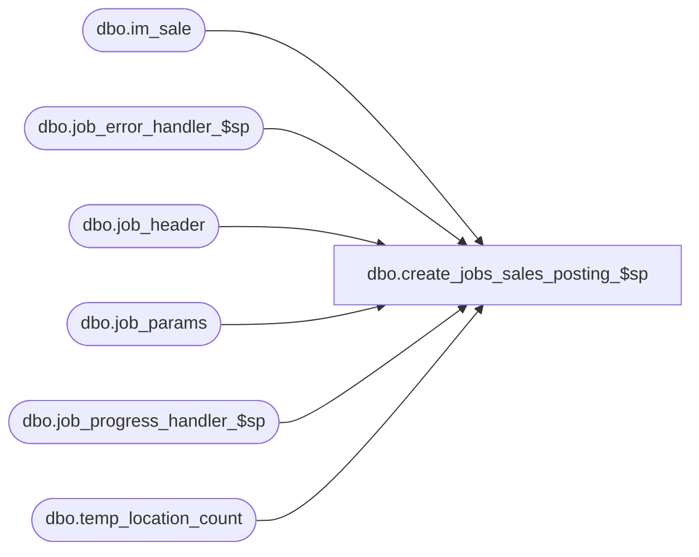

# dbo.create_jobs_sales_posting_$sp

**Database:** me_01  
**Server:** bedrockdb02  

## Architecture Diagram



## Table Dependencies

| Referenced Table |
|---|
| dbo.im_sale |
| dbo.job_error_handler_$sp |
| dbo.job_header |
| dbo.job_params |
| dbo.job_progress_handler_$sp |
| dbo.temp_location_count |

## Stored Procedure Code

```sql
CREATE PROCEDURE [dbo].[create_jobs_sales_posting_$sp]
	(@is_called_from_SA BIT,
	@last_im_sale_processed DECIMAL(22,0))
AS

/*
	Version		: 1.05
	Created		: 2007/04/24
	Created by	: Pierrette Lemay
	Description	: This procedure copy transactions from mew_sales_export to im_sale.
				  Create new jobs in the job_header table.
	History		: 1.01 Updated for Multi-Currency project.
				  1.02 (April 2010) New table was added in the truncate section: temp_modified_transactions 
					this new table is used for processing of transactions that were modified through the SA GUI.
				  1.03 (Dec 01, 2010) Modification to support Markup Discount Defect#123090.
				  Jan 21, 2011) Modification to support Markup Discount in layaway pick up,  Defect#123090 extra changes
				  1.04 May 10, 2011 Use import_batch_process to delete the rows posted in im_sale.
				  1.05 July 2011 - Enhancement to post MU discount transactions with opposite sign to MD discount
				  
				  2.0 Since the Sales Posting supports transaction coming from flat file, this procedure contains
					  only the part that creates the jobs in job_header table.  
					  This procedure is either called from populate_im_sale_from_file_$sp OR populate_im_sale_from_SA_$sp.
					  
				  2.1 Add a new parameter @last_im_sale_processed passed from the either populate_im_sale_from_file_$sp
					  or from populate_im_sale_from_SA_$sp
				
				  2.2  Modifications done for fixed average cost. (May 8, 2012)
*/

BEGIN
	DECLARE @line_id SMALLINT, @job_type INT, @job_id SMALLINT, @c_true BIT, @c_false BIT, @table_name	NVARCHAR(30), 
		@operation_name NVARCHAR(30), @error_msg NVARCHAR(2000), @proc_name NVARCHAR(30), @sql_err_num DECIMAL(38,0), 
		@batch_start SMALLINT, @batch_end SMALLINT, @job_count SMALLINT, @max_im_sale_number DECIMAL(24,0), @done BIT,
		@job_batch_size INT, @range_batch_size INT, @range_start DECIMAL(24,0), @range_end DECIMAL(24,0),
		@location_id SMALLINT, @loc_count INT, @batch_counter INT, @debug_flag BIT, @crs_loc_flag BIT;

	SELECT   @job_type		 = 1
			, @job_id		 = -1
			, @proc_name	 = N'create_jobs_sales_posting_$sp'
			, @c_false		 = 0
			, @c_true		 = 1
			, @done			 = 0
			, @crs_loc_flag	 = 0
			, @line_id		 = 10
			, @range_start	 = @last_im_sale_processed + 1;
	
	BEGIN TRY
		-- Get posting parameters
		SELECT  @job_batch_size = job_batch_size
			, @range_batch_size = range_batch_size
			, @debug_flag = debug_flag
		FROM job_params
		WHERE job_type = @job_type;
		
		-- Log progress if job_params.debug_flag is true OR job_header.debug_flag is true
		EXEC job_progress_handler_$sp @job_type, @job_id, @proc_name, @line_id, @debug_flag;

		SET @line_id = 30;
		SELECT @max_im_sale_number = MAX(im_sale_number) FROM im_sale;
		IF (@max_im_sale_number IS NULL) 
			SET @max_im_sale_number = 0;
		
		-- Log progress if job_params.debug_flag is true OR job_header.debug_flag is true
		EXEC job_progress_handler_$sp @job_type, @job_id, @proc_name, @line_id, @debug_flag;
			
		WHILE (@done = @c_false)
		BEGIN
			SET @line_id = 40

			-- End loop condition
			IF @range_start > @max_im_sale_number
				SET @done = @c_true

			-- Adjust @range_batch_size if remaining transactions to process is less than the 
			-- range batch size specified in the job_params table
			IF (@range_start + @range_batch_size > @max_im_sale_number)
				SET @range_batch_size = @max_im_sale_number - @range_start;
				
			IF (@range_batch_size < 0)
				BREAK;

			IF (@is_called_from_SA = @c_true)
				-- Get the actual range end for the batch. Range must include all transactions
				-- of the last Sales Audit IF_ENTRY_NO.
				SELECT @range_end = MAX(im_sale_number) 
				FROM im_sale
				WHERE entry_no = (SELECT entry_no
								  FROM im_sale
								  WHERE im_sale_number = @range_start + @range_batch_size)
				AND  im_sale_number >= @range_start + @range_batch_size;
			ELSE -- In this case entry_no doesn't mean anything 
				SELECT @range_end = MAX(im_sale_number) 
				FROM im_sale
				WHERE transaction_no = (SELECT transaction_no
										FROM im_sale
										WHERE im_sale_number = @range_start + @range_batch_size)
				AND  im_sale_number >= @range_start + @range_batch_size;
				
			IF (@range_end = NULL)
				SET @range_end = 0;
				
			-- Log progress if job_params.debug_flag is true OR job_header.debug_flag is true
			EXEC job_progress_handler_$sp @job_type, @job_id, @proc_name, @line_id, @debug_flag;
		
			-- Make sure we start with an empty table
			SET @line_id = 50 
		    TRUNCATE TABLE temp_location_count;
		    
		    -- Log progress if job_params.debug_flag is true OR job_header.debug_flag is true
			EXEC job_progress_handler_$sp @job_type, @job_id, @proc_name, @line_id, @debug_flag;
		
			SELECT @line_id = 60, @batch_counter = 0
			
			-- get location batches from im_sale using batch_size and populate temp_location_batch
			DECLARE crs_location_count CURSOR FOR
			SELECT location_id
					, COUNT(*) loc_count
			FROM im_sale
			WHERE im_sale_number BETWEEN @range_start AND @range_end
			GROUP BY location_id
			ORDER BY location_id;

			OPEN crs_location_count;
			SET @crs_loc_flag = 1;

			BEGIN TRAN
			FETCH NEXT FROM crs_location_count INTO @location_id, @loc_count

			WHILE @@FETCH_STATUS = 0
			BEGIN
				IF @batch_counter = 0
					SET @batch_start = @location_id;

				SELECT @batch_counter = @batch_counter + @loc_count,
					   @batch_end = @location_id;

				IF (@batch_counter > @job_batch_size)
				BEGIN
					INSERT INTO temp_location_count
						(range_start 
						, range_end 
						, batch_start
						, batch_end 
						, batch_count)
					VALUES ( @range_start
						, @range_end
						, @batch_start
						, @batch_end
						, @batch_counter);
						
					SET @batch_counter = 0;
				END 

				FETCH NEXT FROM crs_location_count INTO @location_id, @loc_count
			END
			-- Last loop if n_batch_count is not zero
			IF (@batch_counter <> 0) 
				INSERT INTO temp_location_count
						(range_start 
						, range_end 
						, batch_start
						, batch_end 
						, batch_count)
				VALUES ( @range_start
						, @range_end
						, @batch_start
						, @batch_end
						, @batch_counter);	 
						
			COMMIT TRAN
			
			CLOSE crs_location_count;
			DEALLOCATE crs_location_count;
			SET @crs_loc_flag = 0;
			
			-- Log progress if job_params.debug_flag is true OR job_header.debug_flag is true
			EXEC job_progress_handler_$sp @job_type, @job_id, @proc_name, @line_id, @debug_flag;

			-- insert records into job_header
			SET @line_id = 70
			SELECT @job_count = COUNT(*) FROM temp_location_count;

			IF (@job_count > 0) 
			BEGIN
				BEGIN TRAN

				INSERT INTO job_header
					( job_type
					, range_start
					, range_end
					, batch_start
					, batch_end
					, completed_flag
					, debug_flag )
				 SELECT @job_type
					, range_start 
					, range_end 
					, batch_start
					, batch_end
					, @c_false
					, @c_false 
				FROM temp_location_count
				ORDER BY range_start, batch_end;
				
				COMMIT TRAN
			END
			-- Log progress if job_params.debug_flag is true OR job_header.debug_flag is true
			EXEC job_progress_handler_$sp @job_type, @job_id, @proc_name, @line_id, @debug_flag;

			SET @line_id = 80;
			
			-- Retrieve range start number from job_header
			SELECT @range_start = range_end + 1
			FROM   job_header,
				   ( SELECT MAX(job_id) job_id FROM job_header
					  WHERE job_header.job_type = @job_type ) T
			WHERE  job_header.job_id = T.job_id;
			
			-- Log progress if job_params.debug_flag is true OR job_header.debug_flag is true
			EXEC job_progress_handler_$sp @job_type, @job_id, @proc_name, @line_id, @debug_flag;
		END -- WHILE
		
	END TRY

	BEGIN CATCH
		-- Test if the transaction is uncommittable.
		IF (@@TRANCOUNT > 0)
			ROLLBACK TRANSACTION


		IF (@crs_loc_flag = 1)
		BEGIN
			CLOSE crs_location_count
			DEALLOCATE crs_location_count
		END
		
		IF @line_id = 10	
			SELECT  @table_name			=N'job_params'
					, @operation_name	=N'SELECT'
					, @error_msg		= ERROR_MESSAGE()
					, @sql_err_num		= ERROR_NUMBER();
		ELSE IF @line_id = 20
			SELECT  @table_name			=N'temp_sale_master'
					, @operation_name	=N'TRUNCATE TABLE'
					, @error_msg		= ERROR_MESSAGE()
					, @sql_err_num		= ERROR_NUMBER();
		ELSE IF @line_id = 30
			SELECT  @table_name			=N'im_sale'
					, @operation_name	=N'SELECT'
					, @sql_err_num		= ERROR_NUMBER()
					, @error_msg		= ERROR_MESSAGE();
		ELSE IF @line_id = 40
			SELECT  @table_name			=N'im_sale'
					, @operation_name	=N'SELECT'
					, @sql_err_num		= ERROR_NUMBER()
					, @error_msg		= ERROR_MESSAGE();
		ELSE IF @line_id = 50
			SELECT  @table_name			=N'temp_location_count'
					, @operation_name	=N'TRUNCATE TABLE'
					, @sql_err_num		= ERROR_NUMBER()
					, @error_msg		= ERROR_MESSAGE();
		ELSE IF @line_id = 60
			SELECT  @table_name			=N'temp_location_count'
					, @operation_name	=N'INSERT'
					, @sql_err_num		= ERROR_NUMBER()
					, @error_msg		= ERROR_MESSAGE();
		ELSE IF @line_id = 70
			SELECT  @table_name			=N'job_header'
					, @operation_name	=N'INSERT'
					, @sql_err_num		= ERROR_NUMBER()
					, @error_msg		= ERROR_MESSAGE();
		ELSE IF @line_id = 80
			SELECT  @table_name			=N'job_header'
					, @operation_name	=N'SELECT'
					, @sql_err_num		= ERROR_NUMBER()
					, @error_msg		= ERROR_MESSAGE();	

		EXEC job_error_handler_$sp
					@job_type 
					, @job_id 
					, @proc_name 
					, @line_id 
					, @sql_err_num 
					, @table_name 
					, @operation_name 
					, @error_msg 
					, @c_true
	END CATCH
END
```

