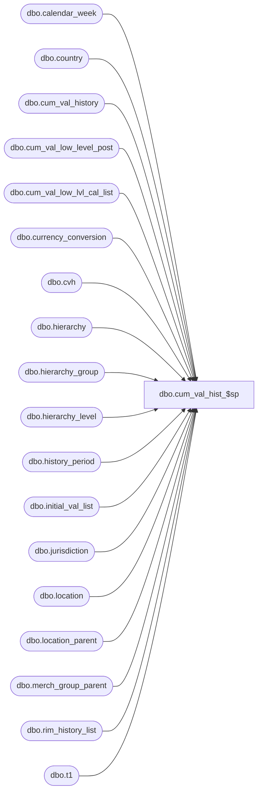

# dbo.cum_val_hist_$sp

**Database:** me_01  
**Server:** bedrockdb02  

## Architecture Diagram



## Table Dependencies

| Referenced Table |
|---|
| dbo.calendar_week |
| dbo.country |
| dbo.cum_val_history |
| dbo.cum_val_low_level_post |
| dbo.cum_val_low_lvl_cal_list |
| dbo.currency_conversion |
| dbo.cvh |
| dbo.hierarchy |
| dbo.hierarchy_group |
| dbo.hierarchy_level |
| dbo.history_period |
| dbo.initial_val_list |
| dbo.jurisdiction |
| dbo.location |
| dbo.location_parent |
| dbo.merch_group_parent |
| dbo.rim_history_list |
| dbo.t1 |

## Stored Procedure Code

```sql
CREATE proc [dbo].[cum_val_hist_$sp]
(@MerchLevelId int,
@MerchNodeId int,
@LocLevelId int,
@FromDate DATETIME,
@ToDate DATETIME)
AS BEGIN
-- 3/11/2015 95099 - cumulative values are posting incorrectly sporadically
-- oct 5 2015 142378- Incorrect posting to Cum Values table - SL (RIM)
DECLARE @highestLocLevelId int

SELECT @highestLocLevelId = hierarchy_level_id
FROM   hierarchy_level hl
INNER  JOIN hierarchy h
   ON  hl.hierarchy_id = h.hierarchy_id
   AND h.hierarchy_type = 2
   AND h.alternate_flag = 0
   AND hl.parent_level_id IS NULL

CREATE TABLE #_cum_val_history1
   (merch_hierarchy_group_id    int not null,
    calendar_period_id          decimal(12, 0) not null,
    location_hierarchy_group_id int not null,
    cum_val_cost                decimal(14, 2) not null,
    cum_val_retail              decimal(14, 2) not null,
    cum_val_cost_local          decimal(14, 2) null,
    cum_val_retail_local        decimal(14, 2) null,
    jurisdiction_id             smallint not null)

ALTER TABLE #_cum_val_history1 ADD PRIMARY KEY CLUSTERED
(merch_hierarchy_group_id, calendar_period_id, location_hierarchy_group_id, jurisdiction_id)

CREATE TABLE #_cum_val_history2
   (merch_hierarchy_group_id    int not null,
    calendar_period_id          decimal(12, 0) not null,
    location_hierarchy_group_id int not null,
    cum_val_cost                decimal(14, 2) not null,
    cum_val_retail              decimal(14, 2) not null,
    cum_val_cost_local          decimal(14, 2) null,
    cum_val_retail_local        decimal(14, 2) null,
    country_id                  decimal(12, 0) not null)

ALTER TABLE #_cum_val_history2 ADD PRIMARY KEY CLUSTERED
(merch_hierarchy_group_id, calendar_period_id, location_hierarchy_group_id, country_id)

CREATE TABLE #_cal_period_end
   (calendar_period_id decimal(12, 0) not null,
    end_date smalldatetime not null)
ALTER TABLE #_cal_period_end ADD PRIMARY KEY CLUSTERED (calendar_period_id)


/* 1 post history in cum_val_low_level_post whose keys already exist in cum_val_history */

IF @highestLocLevelId = @LocLevelId
/* SL00074.4	If the accumulation location level = Enterprise (i.e. highest level in the location hierarchy) */
   BEGIN
	--modified, specific populate of history1 for enterprise level, only populate what should be updated
	INSERT INTO #_cum_val_history1
		  (merch_hierarchy_group_id, calendar_period_id, location_hierarchy_group_id, jurisdiction_id,
		   cum_val_cost, cum_val_cost_local, cum_val_retail, cum_val_retail_local)
	SELECT DISTINCT @MerchNodeId, a.calendar_period_id, c.parent_hierarchy_group_id, e.jurisdiction_id, 0, 0, 0, 0
	FROM   cum_val_low_level_post a
	INNER  JOIN merch_group_parent d
	   ON  a.merch_hierarchy_group_id = d.hierarchy_group_id
	   AND d.hierarchy_level_id = @MerchLevelId
	   AND d.parent_hierarchy_group_id = @MerchNodeId
	INNER  JOIN location_parent c
	   ON  c.location_id = a.location_id
	   AND c.hierarchy_level_id = @LocLevelId
	   AND a.calendar_period_id IN
		  (SELECT DISTINCT calendar_period_id
		   FROM   history_period
		   WHERE  start_date >= @FromDate AND end_date <= @ToDate
		   )
	INNER  JOIN location l
	   ON  a.location_id = l.location_id
	   AND c.location_id = l.location_id
	INNER  JOIN cum_val_history e
	   ON  e.merch_hierarchy_group_id = d.parent_hierarchy_group_id
	   AND e.location_hierarchy_group_id = c.parent_hierarchy_group_id
	   AND e.calendar_period_id = a.calendar_period_id

	   AND e.initial_val_flag = 0
	   AND e.merch_hierarchy_group_id = @MerchNodeId
	GROUP BY a.calendar_period_id,  c.parent_hierarchy_group_id, e.jurisdiction_id


      /* SL00074.4.2	The system will only sum the valuation retail and home cost from IB
        (local cost and selling retail from IB will not be summed as they can cross currencies) */
      --modified to sum all locations, jurisdictions
     INSERT INTO #_cum_val_history2
            (merch_hierarchy_group_id, calendar_period_id, location_hierarchy_group_id, country_id,
             cum_val_cost, cum_val_retail)
      SELECT @MerchNodeId, calendar_period_id, hg.hierarchy_group_id, 0,
             SUM(a.cost), SUM(a.retail)
      FROM   cum_val_low_level_post a
		INNER  JOIN merch_group_parent d
		   ON  a.merch_hierarchy_group_id = d.hierarchy_group_id
		   AND d.hierarchy_level_id = @MerchLevelId
		   AND d.parent_hierarchy_group_id = @MerchNodeId
		INNER JOIN hierarchy_group hg
			ON hg.hierarchy_level_id = @LocLevelId
      GROUP BY merch_hierarchy_group_id, calendar_period_id, hg.hierarchy_group_id

      INSERT INTO #_cal_period_end
            (calendar_period_id, end_date)
      SELECT  a.calendar_period_id, MAX(w.calendar_week_end_date)
      FROM   #_cum_val_history1 a
      INNER  JOIN calendar_week w
         ON  a.calendar_period_id = w.calendar_period_id
      GROUP  BY a.calendar_period_id

      /*
        SL00074.4.3	The cumulative values in the home currency will be the same across all jurisdictions.
        SL00074.4.4	Set the cumulative local cost value to the cumulative home cost / domestic equivalent rate of the jurisdiction currency
        SL00074.4.5	Set the cumulative selling retail value to the cumulative valuation retail / domestic equivalent rate of the jurisdiction currency
        SL00074.4.6	The domestic equivalent rate of type `Purchasing' for the jurisdiction currency will be used when updating the cumulative cost value.
        SL00074.4.7	The domestic equivalent rate of type `Pricing' for the jurisdiction currency will be used when updating the cumulative retail value.
        SL00074.4.8	The domestic equivalent rate that falls in the effective from/to date for the transaction date will be used.
      */
      UPDATE t1
      SET    t1.cum_val_cost = t2.cum_val_cost,
             t1.cum_val_retail = t2.cum_val_retail,
             t1.cum_val_cost_local = t2.cum_val_cost / cc1.exchange_rate,
             t1.cum_val_retail_local = t2.cum_val_retail / cc2.exchange_rate
      FROM   #_cum_val_history1 t1
      INNER  JOIN #_cum_val_history2 t2
         ON  t1.merch_hierarchy_group_id = t2.merch_hierarchy_group_id
         AND t1.calendar_period_id = t2.calendar_period_id
         AND t1.location_hierarchy_group_id = t2.location_hierarchy_group_id
      INNER  JOIN #_cal_period_end pe
         ON  t1.calendar_period_id = pe.calendar_period_id
      INNER  JOIN jurisdiction j
         ON  t1.jurisdiction_id = j.jurisdiction_id
      INNER  JOIN country c
         ON  j.country_id = c.country_id
      LEFT OUTER  JOIN currency_conversion cc1
         ON  c.currency_id = cc1.to_currency_id
         AND cc1.currency_conversion_type = 1
         AND cc1.effective_from_date <= pe.end_date
         AND (cc1.effective_to_date >= pe.end_date OR cc1.effective_to_date IS NULL)
      LEFT OUTER  JOIN currency_conversion cc2
         ON  c.currency_id = cc2.to_currency_id
         AND cc2.currency_conversion_type = 2
         AND cc2.effective_from_date <= pe.end_date
         AND (cc2.effective_to_date >= pe.end_date OR cc2.effective_to_date IS NULL)
   END
ELSE
   /* SL00074.5	If the accumulation location level is a hierarchy group that is not Enterprise (nor location) */
   BEGIN

   INSERT INTO #_cum_val_history1
		  (merch_hierarchy_group_id, calendar_period_id, location_hierarchy_group_id, jurisdiction_id,
		   cum_val_cost, cum_val_cost_local, cum_val_retail, cum_val_retail_local)
	SELECT @MerchNodeId, a.calendar_period_id, c.parent_hierarchy_group_id, l.jurisdiction_id,
		   SUM(a.cost), SUM(a.cost_local), SUM(a.retail), SUM(a.retail_local)
	FROM   cum_val_low_level_post a
	INNER  JOIN merch_group_parent d
	   ON  a.merch_hierarchy_group_id = d.hierarchy_group_id
	   AND d.hierarchy_level_id = @MerchLevelId
	   AND d.parent_hierarchy_group_id = @MerchNodeId
	INNER  JOIN location_parent c
	   ON  c.location_id = a.location_id
	   AND c.hierarchy_level_id = @LocLevelId
	   AND a.calendar_period_id IN
		  (SELECT DISTINCT calendar_period_id
		   FROM   history_period
		   WHERE  start_date >= @FromDate AND end_date <= @ToDate)
	INNER  JOIN location l
	   ON  a.location_id = l.location_id
	   AND c.location_id = l.location_id
	INNER  JOIN cum_val_history e
	   ON  e.merch_hierarchy_group_id = d.parent_hierarchy_group_id
	   AND e.location_hierarchy_group_id = c.parent_hierarchy_group_id
	   AND e.calendar_period_id = a.calendar_period_id
	   AND l.jurisdiction_id = e.jurisdiction_id
	   AND e.initial_val_flag = 0
	   AND e.merch_hierarchy_group_id = @MerchNodeId
	GROUP BY a.calendar_period_id,  c.parent_hierarchy_group_id, l.jurisdiction_id

      /*
       SL00074.5.1	An entry to the cumulative history table will be added for each jurisdiction that is in the available status and is of type `sales' or `sales and sourcing'
       SL00074.5.2	For each jurisdiction, the system will accumulate the IB transactions from only the locations that belong to that jurisdiction AND from the locations that belong to the location group (as defined by the accumulation location level).
       SL00074.5.3	If multiple jurisdiction exist for the same country (i.e. same currency), then the cumulative values will be a sum of all locations that belong to those jurisdictions since the currency is the same
                    (the system must still respect accumulating IB data within the location group as defined by the accumulation location level). In this case the cumulative values will be the same across jurisdictions that have the same currency.
      */
      INSERT INTO #_cum_val_history2
            (merch_hierarchy_group_id, calendar_period_id, location_hierarchy_group_id, country_id,
             cum_val_cost, cum_val_retail, cum_val_cost_local, cum_val_retail_local)
      SELECT t1.merch_hierarchy_group_id, t1.calendar_period_id, t1.location_hierarchy_group_id, j.country_id,
             SUM(t1.cum_val_cost), SUM(t1.cum_val_retail), SUM(t1.cum_val_cost_local), SUM(t1.cum_val_retail_local)
      FROM   #_cum_val_history1 t1
      INNER  JOIN jurisdiction j
         ON  t1.jurisdiction_id = j.jurisdiction_id
      GROUP  BY t1.merch_hierarchy_group_id, t1.calendar_period_id, t1.location_hierarchy_group_id, j.country_id

      UPDATE t1
      SET    t1.cum_val_cost = t2.cum_val_cost,
             t1.cum_val_retail = t2.cum_val_retail,
             t1.cum_val_cost_local = t2.cum_val_cost_local,
             t1.cum_val_retail_local = t2.cum_val_retail_local
      FROM   #_cum_val_history1 t1
      INNER  JOIN #_cum_val_history2 t2
         ON  t1.merch_hierarchy_group_id = t2.merch_hierarchy_group_id
         AND t1.calendar_period_id = t2.calendar_period_id
         AND t1.location_hierarchy_group_id = t2.location_hierarchy_group_id
      INNER  JOIN jurisdiction j
         ON  t1.jurisdiction_id = j.jurisdiction_id
         AND j.country_id = t2.country_id
   END

UPDATE cvh
SET    cvh.cum_val_cost = cvh.cum_val_cost + t1.cum_val_cost,
       cvh.cum_val_retail = cvh.cum_val_retail + t1.cum_val_retail,
       cvh.cum_val_cost_local = cvh.cum_val_cost_local + t1.cum_val_cost_local,
       cvh.cum_val_retail_local = cvh.cum_val_retail_local + t1.cum_val_retail_local
FROM   cum_val_history cvh
INNER  JOIN #_cum_val_history1 t1
   ON  cvh.merch_hierarchy_group_id = t1.merch_hierarchy_group_id
   AND cvh.calendar_period_id = t1.calendar_period_id
   AND cvh.location_hierarchy_group_id = t1.location_hierarchy_group_id
   AND cvh.jurisdiction_id = t1.jurisdiction_id
   AND cvh.initial_val_flag = 0
   AND cvh.merch_hierarchy_group_id = @MerchNodeId

TRUNCATE TABLE #_cum_val_history1
TRUNCATE TABLE #_cal_period_end

/* 2 post history in cum_val_low_level_post whose keys do not exist in cum_val_history */


IF @highestLocLevelId = @LocLevelId
/* SL00074.4	If the accumulation location level = Enterprise (i.e. highest level in the location hierarchy) */
   BEGIN
   --specific for enterprise level, only pick what needs to be insterted, values will be populated from history2
INSERT INTO #_cum_val_history1
      (merch_hierarchy_group_id, calendar_period_id, location_hierarchy_group_id, jurisdiction_id,
       cum_val_cost, cum_val_cost_local, cum_val_retail, cum_val_retail_local)
		SELECT DISTINCT @MerchNodeId, a.calendar_period_id, hg.hierarchy_group_id, j.jurisdiction_id,0,0,0,0
		FROM   cum_val_low_level_post a
		INNER  JOIN merch_group_parent d
		   ON  a.merch_hierarchy_group_id = d.hierarchy_group_id
		   AND d.hierarchy_level_id = @MerchLevelId
		   AND d.parent_hierarchy_group_id = @MerchNodeId
		   AND a.calendar_period_id IN
			  (SELECT DISTINCT calendar_period_id
			   FROM   history_period
			   WHERE  start_date >= @FromDate AND end_date <= @ToDate
			   )
		INNER  JOIN jurisdiction j
			ON 1 = 1 -- take all jurisdicitons
		INNER JOIN hierarchy_group hg
			ON hg.hierarchy_level_id = @LocLevelId
		WHERE  NOT EXISTS
			  (SELECT 1
			   FROM   cum_val_history e
			   WHERE  e.merch_hierarchy_group_id = d.parent_hierarchy_group_id
			   AND    e.location_hierarchy_group_id = hg.hierarchy_group_id
			   AND    e.calendar_period_id = a.calendar_period_id
			   AND    j.jurisdiction_id = e.jurisdiction_id
			   AND    e.initial_val_flag = 0
			   AND    e.merch_hierarchy_group_id = @MerchNodeId)

      /* SL00074.4.2	The system will only sum the valuation retail and home cost from IB
        (local cost and selling retail from IB will not be summed as they can cross currencies) */

      INSERT INTO #_cal_period_end
            (calendar_period_id, end_date)
      SELECT  a.calendar_period_id, MAX(w.calendar_week_end_date)
      FROM   #_cum_val_history1 a
      INNER  JOIN calendar_week w
         ON  a.calendar_period_id = w.calendar_period_id
      GROUP  BY a.calendar_period_id

      /*
        SL00074.4.3	The cumulative values in the home currency will be the same across all jurisdictions.
        SL00074.4.4	Set the cumulative local cost value to the cumulative home cost / domestic equivalent rate of the jurisdiction currency
        SL00074.4.5	Set the cumulative selling retail value to the cumulative valuation retail / domestic equivalent rate of the jurisdiction currency
        SL00074.4.6	The domestic equivalent rate of type `Purchasing' for the jurisdiction currency will be used when updating the cumulative cost value.
        SL00074.4.7	The domestic equivalent rate of type `Pricing' for the jurisdiction currency will be used when updating the cumulative retail value.
        SL00074.4.8	The domestic equivalent rate that falls in the effective from/to date for the transaction date will be used.
      */
      UPDATE t1
      SET    t1.cum_val_cost = t2.cum_val_cost,
             t1.cum_val_retail = t2.cum_val_retail,
             t1.cum_val_cost_local = t2.cum_val_cost / cc1.exchange_rate,
             t1.cum_val_retail_local = t2.cum_val_retail / cc2.exchange_rate
      FROM   #_cum_val_history1 t1
      INNER  JOIN #_cum_val_history2 t2
         ON  t1.merch_hierarchy_group_id = t2.merch_hierarchy_group_id
         AND t1.calendar_period_id = t2.calendar_period_id
         AND t1.location_hierarchy_group_id = t2.location_hierarchy_group_id
      INNER  JOIN #_cal_period_end pe
         ON  t1.calendar_period_id = pe.calendar_period_id
      INNER  JOIN jurisdiction j
         ON  t1.jurisdiction_id = j.jurisdiction_id
      INNER  JOIN country c
         ON  j.country_id = c.country_id
      LEFT OUTER JOIN currency_conversion cc1
         ON  c.currency_id = cc1.to_currency_id
         AND cc1.currency_conversion_type = 1
         AND cc1.effective_from_date <= pe.end_date
         AND (cc1.effective_to_date >= pe.end_date OR cc1.effective_to_date IS NULL)
      LEFT OUTER JOIN currency_conversion cc2
         ON  c.currency_id = cc2.to_currency_id
         AND cc2.currency_conversion_type = 2
         AND cc2.effective_from_date <= pe.end_date
         AND (cc2.effective_to_date >= pe.end_date OR cc2.effective_to_date IS NULL)
   END
ELSE
   /* SL00074.5	If the accumulation location level is a hierarchy group that is not Enterprise (nor location) */
   BEGIN
      /*
       SL00074.5.1	An entry to the cumulative history table will be added for each jurisdiction that is in the available status and is of type `sales' or `sales and sourcing'
       SL00074.5.2	For each jurisdiction, the system will accumulate the IB transactions from only the locations that belong to that jurisdiction AND from the locations that belong to the location group (as defined by the accumulation location level).
       SL00074.5.3	If multiple jurisdiction exist for the same country (i.e. same currency), then the cumulative values will be a sum of all locations that belong to those jurisdictions since the currency is the same
                    (the system must still respect accumulating IB data within the location group as defined by the accumulation location level). In this case the cumulative values will be the same across jurisdictions that have the same currency.
      */
	  TRUNCATE TABLE #_cum_val_history2

	  INSERT INTO #_cum_val_history1
      (merch_hierarchy_group_id, calendar_period_id, location_hierarchy_group_id, jurisdiction_id,
       cum_val_cost, cum_val_cost_local, cum_val_retail, cum_val_retail_local)
		SELECT @MerchNodeId, a.calendar_period_id, c.parent_hierarchy_group_id, l.jurisdiction_id,
			   SUM(a.cost), SUM(a.cost_local), SUM(a.retail), SUM(a.retail_local)
		FROM   cum_val_low_level_post a
		INNER  JOIN merch_group_parent d
		   ON  a.merch_hierarchy_group_id = d.hierarchy_group_id
		   AND d.hierarchy_level_id = @MerchLevelId
		   AND d.parent_hierarchy_group_id = @MerchNodeId
		INNER  JOIN location_parent c
		   ON  c.location_id = a.location_id
		   AND c.hierarchy_level_id = @LocLevelId
		   AND a.calendar_period_id IN
			  (SELECT DISTINCT calendar_period_id
			   FROM   history_period
			   WHERE  start_date >= @FromDate AND end_date <= @ToDate)
		INNER  JOIN location l
		   ON  a.location_id = l.location_id
		   AND c.location_id = l.location_id
		WHERE  NOT EXISTS
			  (SELECT 1
			   FROM   cum_val_history e
			   WHERE  e.merch_hierarchy_group_id = d.parent_hierarchy_group_id
			   AND    e.location_hierarchy_group_id = c.parent_hierarchy_group_id
			   AND    e.calendar_period_id = a.calendar_period_id
			   AND    l.jurisdiction_id = e.jurisdiction_id
			   AND    e.initial_val_flag = 0
			   AND    e.merch_hierarchy_group_id = @MerchNodeId)
		GROUP  BY a.calendar_period_id,  c.parent_hierarchy_group_id, l.jurisdiction_id


      INSERT INTO #_cum_val_history2
            (merch_hierarchy_group_id, calendar_period_id, location_hierarchy_group_id, country_id,
             cum_val_cost, cum_val_retail, cum_val_cost_local, cum_val_retail_local)
      SELECT t1.merch_hierarchy_group_id, t1.calendar_period_id, t1.location_hierarchy_group_id, j.country_id,
             SUM(t1.cum_val_cost), SUM(t1.cum_val_retail), SUM(t1.cum_val_cost_local), SUM(t1.cum_val_retail_local)
      FROM   #_cum_val_history1 t1
      INNER  JOIN jurisdiction j
         ON  t1.jurisdiction_id = j.jurisdiction_id
      GROUP  BY t1.merch_hierarchy_group_id, t1.calendar_period_id, t1.location_hierarchy_group_id, j.country_id

      UPDATE t1
      SET    t1.cum_val_cost = t2.cum_val_cost,
             t1.cum_val_retail = t2.cum_val_retail,
             t1.cum_val_cost_local = t2.cum_val_cost_local,
             t1.cum_val_retail_local = t2.cum_val_retail_local
      FROM   #_cum_val_history1 t1
      INNER  JOIN #_cum_val_history2 t2
         ON  t1.merch_hierarchy_group_id = t2.merch_hierarchy_group_id
         AND t1.calendar_period_id = t2.calendar_period_id
         AND t1.location_hierarchy_group_id = t2.location_hierarchy_group_id
      INNER  JOIN jurisdiction j
         ON  t1.jurisdiction_id = j.jurisdiction_id
         AND j.country_id = t2.country_id
   END

INSERT INTO cum_val_history
      (merch_hierarchy_group_id, calendar_period_id, location_hierarchy_group_id, jurisdiction_id,
       cum_val_cost, cum_val_retail, cum_val_cost_local, cum_val_retail_local)
SELECT merch_hierarchy_group_id, calendar_period_id, location_hierarchy_group_id, jurisdiction_id,
       cum_val_cost, cum_val_retail, cum_val_cost_local, cum_val_retail_local
FROM   #_cum_val_history1

INSERT INTO rim_history_list
(merch_hierarchy_group_id, location_id, history_period_id)
SELECT distinct a.hierarchy_group_id, b.location_id, c.history_period_id
FROM merch_group_parent a, location_parent b,
history_period c, cum_val_low_lvl_cal_list d
WHERE a.parent_hierarchy_group_id = @MerchNodeId
AND a.hierarchy_level_id = @MerchLevelId
AND b.hierarchy_level_id = @LocLevelId
AND c.calendar_period_id = d.calendar_period_id
AND c.start_date >= @FromDate AND c.end_date <= @ToDate ;

insert into initial_val_list (merch_hierarchy_group_id, calendar_period_id)
select distinct a.hierarchy_group_id, b.calendar_period_id
from merch_group_parent a, history_period b
where a.parent_hierarchy_group_id = @MerchNodeId
AND a.hierarchy_level_id = @MerchLevelId
AND start_date >= @FromDate AND end_date <= @ToDate;

DELETE FROM cum_val_low_level_post
WHERE merch_hierarchy_group_id in (
SELECT hierarchy_group_id from merch_group_parent
WHERE parent_hierarchy_group_id = @MerchNodeId
AND hierarchy_level_id = @MerchLevelId)
AND calendar_period_id in (
SELECT calendar_period_id FROM history_period
WHERE start_date >= @FromDate AND end_date <= @ToDate);


DROP TABLE #_cum_val_history1
DROP TABLE #_cum_val_history2
DROP TABLE #_cal_period_end

END;
```

