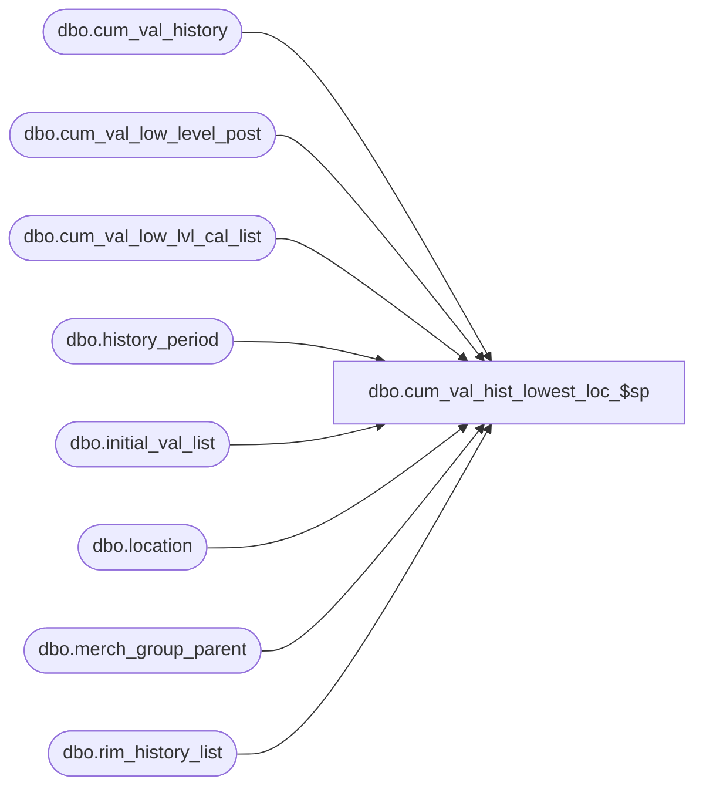

# dbo.cum_val_hist_lowest_loc_$sp

**Database:** me_01  
**Server:** bedrockdb02  

## Architecture Diagram



## Table Dependencies

| Referenced Table |
|---|
| dbo.cum_val_history |
| dbo.cum_val_low_level_post |
| dbo.cum_val_low_lvl_cal_list |
| dbo.history_period |
| dbo.initial_val_list |
| dbo.location |
| dbo.merch_group_parent |
| dbo.rim_history_list |

## Stored Procedure Code

```sql
CREATE proc [dbo].[cum_val_hist_lowest_loc_$sp] 
(@MerchLevelId decimal(12,0), 
@MerchNodeId decimal(12,0), 
@FromDate DATETIME, 
@ToDate DATETIME)
AS BEGIN

/* Is Merch Lowest Level ?*/
IF EXISTS (SELECT distinct hierarchy_group_id  FROM merch_group_parent WHERE hierarchy_group_id=@MerchNodeId
 AND  hierarchy_group_id  NOT IN(SELECT distinct parent_hierarchy_group_id FROM merch_group_parent))
BEGIN
/*Yes*/
UPDATE cum_val_history SET cum_val_cost = 
(SELECT e.cum_val_cost + SUM(a.cost)
FROM cum_val_low_level_post a
WHERE a.merch_hierarchy_group_id =@MerchNodeId
AND a.calendar_period_id in (select distinct calendar_period_id
FROM history_period 
WHERE start_date >= @FromDate
AND end_date <= @ToDate)
AND e.location_hierarchy_group_id = a.location_id
AND e.merch_hierarchy_group_id = @MerchNodeId
AND e.calendar_period_id = a.calendar_period_id
GROUP BY a.calendar_period_id,  a.location_id)
FROM cum_val_history e
WHERE e.merch_hierarchy_group_id = @MerchNodeId
AND e.initial_val_flag = 0 
AND EXISTS (SELECT * FROM 
cum_val_low_level_post a 
WHERE a.merch_hierarchy_group_id =@MerchNodeId
AND a.calendar_period_id in (select distinct calendar_period_id
FROM history_period 
WHERE start_date >= @FromDate AND end_date <= @ToDate)
AND e.location_hierarchy_group_id = a.location_id
AND e.merch_hierarchy_group_id = @MerchNodeId
AND e.calendar_period_id = a.calendar_period_id);
								
UPDATE cum_val_history SET cum_val_cost_local = 
(SELECT e.cum_val_cost_local + SUM(a.cost_local)
FROM cum_val_low_level_post a
WHERE a.merch_hierarchy_group_id =@MerchNodeId
AND a.calendar_period_id in (select distinct calendar_period_id
FROM history_period 
WHERE start_date >= @FromDate
AND end_date <= @ToDate)
AND e.location_hierarchy_group_id = a.location_id
AND e.merch_hierarchy_group_id = @MerchNodeId
AND e.calendar_period_id = a.calendar_period_id
GROUP BY a.calendar_period_id,  a.location_id)
FROM cum_val_history e
WHERE e.merch_hierarchy_group_id = @MerchNodeId
AND e.initial_val_flag = 0 
AND EXISTS (SELECT * FROM 
cum_val_low_level_post a 
WHERE a.merch_hierarchy_group_id =@MerchNodeId
AND a.calendar_period_id in (select distinct calendar_period_id
FROM history_period 
WHERE start_date >= @FromDate AND end_date <= @ToDate)
AND e.location_hierarchy_group_id = a.location_id
AND e.merch_hierarchy_group_id = @MerchNodeId
AND e.calendar_period_id = a.calendar_period_id);
								
UPDATE cum_val_history SET cum_val_retail = 
(SELECT e.cum_val_retail + SUM(a.retail)
FROM cum_val_low_level_post a
WHERE a.merch_hierarchy_group_id =@MerchNodeId
AND a.calendar_period_id in (select distinct calendar_period_id
FROM history_period 
WHERE start_date >= @FromDate
AND end_date <= @ToDate)
AND e.location_hierarchy_group_id = a.location_id
AND e.merch_hierarchy_group_id = @MerchNodeId
AND e.calendar_period_id = a.calendar_period_id
GROUP BY a.calendar_period_id,  a.location_id)
FROM cum_val_history e
WHERE e.merch_hierarchy_group_id = @MerchNodeId
AND e.initial_val_flag = 0 
AND EXISTS (SELECT * FROM 
cum_val_low_level_post a 
WHERE a.merch_hierarchy_group_id =@MerchNodeId
AND a.calendar_period_id in (select distinct calendar_period_id
FROM history_period 
WHERE start_date >= @FromDate AND end_date <= @ToDate)
AND e.location_hierarchy_group_id = a.location_id
AND e.merch_hierarchy_group_id = @MerchNodeId
AND e.calendar_period_id = a.calendar_period_id);
								
UPDATE cum_val_history SET cum_val_retail_local = 
(SELECT e.cum_val_retail_local + SUM(a.retail_local)
FROM cum_val_low_level_post a
WHERE a.merch_hierarchy_group_id =@MerchNodeId
AND a.calendar_period_id in (select distinct calendar_period_id
FROM history_period 
WHERE start_date >= @FromDate
AND end_date <= @ToDate)
AND e.location_hierarchy_group_id = a.location_id
AND e.merch_hierarchy_group_id = @MerchNodeId
AND e.calendar_period_id = a.calendar_period_id
GROUP BY a.calendar_period_id,  a.location_id)
FROM cum_val_history e
WHERE e.merch_hierarchy_group_id = @MerchNodeId
AND e.initial_val_flag = 0 
AND EXISTS (SELECT * FROM 
cum_val_low_level_post a 
WHERE a.merch_hierarchy_group_id =@MerchNodeId
AND a.calendar_period_id in (select distinct calendar_period_id
FROM history_period 
WHERE start_date >= @FromDate AND end_date <= @ToDate)
AND e.location_hierarchy_group_id = a.location_id
AND e.merch_hierarchy_group_id = @MerchNodeId
AND e.calendar_period_id = a.calendar_period_id);
								
INSERT INTO cum_val_history 
(cum_val_cost, cum_val_retail, cum_val_cost_local, cum_val_retail_local, calendar_period_id, 
merch_hierarchy_group_id, location_hierarchy_group_id, jurisdiction_id)
SELECT SUM(a.cost), SUM(a.retail), SUM(a.cost_local), SUM(a.retail_local), a.calendar_period_id, 
a.merch_hierarchy_group_id, a.location_id, l.jurisdiction_id
FROM cum_val_low_level_post a, location l
WHERE  a.merch_hierarchy_group_id = @MerchNodeId
AND a.calendar_period_id in (select distinct calendar_period_id
FROM history_period 
WHERE start_date >= @FromDate AND end_date <= @ToDate) 
AND  a.location_id = l.location_id
AND NOT EXISTS (SELECT e.calendar_period_id, e.merch_hierarchy_group_id, 
e.location_hierarchy_group_id
FROM cum_val_history e
WHERE e.calendar_period_id = a.calendar_period_id
AND e.merch_hierarchy_group_id = @MerchNodeId
AND e.location_hierarchy_group_id = a.location_id
AND e.jurisdiction_id = l.jurisdiction_id
AND e.initial_val_flag = 0)
GROUP BY a.calendar_period_id, a.merch_hierarchy_group_id, a.location_id, l.jurisdiction_id;

INSERT INTO rim_history_list 
(merch_hierarchy_group_id, location_id, history_period_id)
SELECT distinct @MerchNodeId, 
b.location_hierarchy_group_id, c.history_period_id
FROM merch_group_parent a, cum_val_history b, 
history_period c, cum_val_low_lvl_cal_list d
WHERE b.merch_hierarchy_group_id = @MerchNodeId
AND b.calendar_period_id = c.calendar_period_id 
AND c.calendar_period_id = d.calendar_period_id
AND c.start_date >= @FromDate AND c.end_date <= @ToDate; 
								
insert into initial_val_list (merch_hierarchy_group_id, calendar_period_id)
select distinct a.hierarchy_group_id, b.calendar_period_id 
from merch_group_parent a, history_period b 
where a.hierarchy_group_id = @MerchNodeId
AND start_date >= @FromDate AND end_date <= @ToDate;

DELETE FROM cum_val_low_level_post 
WHERE merch_hierarchy_group_id  = @MerchNodeId
AND calendar_period_id in (
SELECT calendar_period_id FROM history_period
WHERE start_date >= @FromDate AND end_date <= @ToDate);

END
ELSE

BEGIN
/*Not lowest Merch Level*/
UPDATE cum_val_history SET cum_val_cost = 
(SELECT e.cum_val_cost + SUM(a.cost)
FROM cum_val_low_level_post a, merch_group_parent d
WHERE d.hierarchy_level_id = @MerchLevelId
AND d.parent_hierarchy_group_id = @MerchNodeId
AND a.merch_hierarchy_group_id = d.hierarchy_group_id 
AND a.calendar_period_id in (select distinct calendar_period_id
FROM history_period 
WHERE start_date >= @FromDate
AND end_date <= @ToDate)
AND e.location_hierarchy_group_id = a.location_id
AND e.merch_hierarchy_group_id = @MerchNodeId
AND e.calendar_period_id = a.calendar_period_id
GROUP BY a.calendar_period_id, d.parent_hierarchy_group_id, a.location_id)
FROM cum_val_history e
WHERE e.merch_hierarchy_group_id = @MerchNodeId
AND e.initial_val_flag = 0 
AND EXISTS (SELECT * FROM 
cum_val_low_level_post a, merch_group_parent d
WHERE d.hierarchy_level_id = @MerchLevelId
AND d.parent_hierarchy_group_id = @MerchNodeId
AND a.merch_hierarchy_group_id = d.hierarchy_group_id 
AND a.calendar_period_id in (select distinct calendar_period_id
FROM history_period 
WHERE start_date >= @FromDate AND end_date <= @ToDate)
AND e.location_hierarchy_group_id = a.location_id
AND e.merch_hierarchy_group_id = @MerchNodeId
AND e.calendar_period_id = a.calendar_period_id);
								
UPDATE cum_val_history SET cum_val_cost_local = 
(SELECT e.cum_val_cost_local + SUM(a.cost_local)
FROM cum_val_low_level_post a, merch_group_parent d
WHERE d.hierarchy_level_id = @MerchLevelId
AND d.parent_hierarchy_group_id = @MerchNodeId
AND a.merch_hierarchy_group_id = d.hierarchy_group_id 
AND a.calendar_period_id in (select distinct calendar_period_id
FROM history_period 
WHERE start_date >= @FromDate
AND end_date <= @ToDate)
AND e.location_hierarchy_group_id = a.location_id
AND e.merch_hierarchy_group_id = @MerchNodeId
AND e.calendar_period_id = a.calendar_period_id
GROUP BY a.calendar_period_id, d.parent_hierarchy_group_id, a.location_id)
FROM cum_val_history e
WHERE e.merch_hierarchy_group_id = @MerchNodeId
AND e.initial_val_flag = 0 
AND EXISTS (SELECT * FROM 
cum_val_low_level_post a, merch_group_parent d
WHERE d.hierarchy_level_id = @MerchLevelId
AND d.parent_hierarchy_group_id = @MerchNodeId
AND a.merch_hierarchy_group_id = d.hierarchy_group_id 
AND a.calendar_period_id in (select distinct calendar_period_id
FROM history_period 
WHERE start_date >= @FromDate AND end_date <= @ToDate)
AND e.location_hierarchy_group_id = a.location_id
AND e.merch_hierarchy_group_id = @MerchNodeId
AND e.calendar_period_id = a.calendar_period_id);
								
UPDATE cum_val_history SET cum_val_retail = 
(SELECT e.cum_val_retail + SUM(a.retail)
FROM cum_val_low_level_post a, merch_group_parent d
WHERE d.hierarchy_level_id = @MerchLevelId
AND d.parent_hierarchy_group_id = @MerchNodeId
AND a.merch_hierarchy_group_id = d.hierarchy_group_id 
AND a.calendar_period_id in (select distinct calendar_period_id
FROM history_period 
WHERE start_date >= @FromDate
AND end_date <= @ToDate)
AND e.location_hierarchy_group_id = a.location_id
AND e.merch_hierarchy_group_id = @MerchNodeId
AND e.calendar_period_id = a.calendar_period_id
GROUP BY a.calendar_period_id, d.parent_hierarchy_group_id, a.location_id)
FROM cum_val_history e
WHERE e.merch_hierarchy_group_id = @MerchNodeId
AND e.initial_val_flag = 0 
AND EXISTS (SELECT * FROM 
cum_val_low_level_post a, merch_group_parent d
WHERE d.hierarchy_level_id = @MerchLevelId
AND d.parent_hierarchy_group_id = @MerchNodeId
AND a.merch_hierarchy_group_id = d.hierarchy_group_id 
AND a.calendar_period_id in (select distinct calendar_period_id
FROM history_period 
WHERE start_date >= @FromDate AND end_date <= @ToDate)
AND e.location_hierarchy_group_id = a.location_id
AND e.merch_hierarchy_group_id = @MerchNodeId
AND e.calendar_period_id = a.calendar_period_id);
								
UPDATE cum_val_history SET cum_val_retail_local = 
(SELECT e.cum_val_retail_local + SUM(a.retail_local)
FROM cum_val_low_level_post a, merch_group_parent d
WHERE d.hierarchy_level_id = @MerchLevelId
AND d.parent_hierarchy_group_id = @MerchNodeId
AND a.merch_hierarchy_group_id = d.hierarchy_group_id 
AND a.calendar_period_id in (select distinct calendar_period_id
FROM history_period 
WHERE start_date >= @FromDate
AND end_date <= @ToDate)
AND e.location_hierarchy_group_id = a.location_id
AND e.merch_hierarchy_group_id = @MerchNodeId
AND e.calendar_period_id = a.calendar_period_id
GROUP BY a.calendar_period_id, d.parent_hierarchy_group_id, a.location_id)
FROM cum_val_history e
WHERE e.merch_hierarchy_group_id = @MerchNodeId
AND e.initial_val_flag = 0 
AND EXISTS (SELECT * FROM 
cum_val_low_level_post a, merch_group_parent d
WHERE d.hierarchy_level_id = @MerchLevelId
AND d.parent_hierarchy_group_id = @MerchNodeId
AND a.merch_hierarchy_group_id = d.hierarchy_group_id 
AND a.calendar_period_id in (select distinct calendar_period_id
FROM history_period 
WHERE start_date >= @FromDate AND end_date <= @ToDate)
AND e.location_hierarchy_group_id = a.location_id
AND e.merch_hierarchy_group_id = @MerchNodeId
AND e.calendar_period_id = a.calendar_period_id);
								
INSERT INTO cum_val_history 
(cum_val_cost, cum_val_retail, cum_val_cost_local, cum_val_retail_local, calendar_period_id, 
merch_hierarchy_group_id, location_hierarchy_group_id, jurisdiction_id)
(SELECT SUM(a.cost), SUM(a.retail), SUM(a.cost_local), SUM(a.retail_local), a.calendar_period_id, 
d.parent_hierarchy_group_id, a.location_id, l.jurisdiction_id
FROM cum_val_low_level_post a, merch_group_parent d, location l
WHERE d.parent_hierarchy_group_id = @MerchNodeId
AND d.hierarchy_level_id = @MerchLevelId
AND a.merch_hierarchy_group_id = d.hierarchy_group_id 
AND a.calendar_period_id in (select distinct calendar_period_id
FROM history_period 
WHERE start_date >= @FromDate AND end_date <= @ToDate)
AND a.location_id = l.location_id 
AND NOT EXISTS (SELECT e.calendar_period_id, e.merch_hierarchy_group_id, 
e.location_hierarchy_group_id
FROM cum_val_history e
WHERE e.calendar_period_id = a.calendar_period_id
AND e.merch_hierarchy_group_id = @MerchNodeId
AND e.location_hierarchy_group_id = a.location_id
AND e.jurisdiction_id = l.jurisdiction_id
AND e.initial_val_flag = 0)
GROUP BY a.calendar_period_id, d.parent_hierarchy_group_id, a.location_id, l.jurisdiction_id)
UNION
(SELECT SUM(a.cost), SUM(a.retail), SUM(a.cost_local), SUM(a.retail_local), a.calendar_period_id, 
a.merch_hierarchy_group_id, a.location_id, l.jurisdiction_id
FROM cum_val_low_level_post a, location l
WHERE  a.merch_hierarchy_group_id = @MerchNodeId
AND  a.merch_hierarchy_group_id IN (SELECT merch_hierarchy_group_id FROM merch_group_parent 
WHERE merch_hierarchy_group_id  NOT IN(SELECT parent_hierarchy_group_id FROM merch_group_parent) )
AND a.calendar_period_id in (select distinct calendar_period_id
FROM history_period 
WHERE start_date >= @FromDate AND end_date <= @ToDate) 
AND a.location_id = l.location_id
AND NOT EXISTS (SELECT e.calendar_period_id, e.merch_hierarchy_group_id, 
e.location_hierarchy_group_id
FROM cum_val_history e
WHERE e.calendar_period_id = a.calendar_period_id
AND e.merch_hierarchy_group_id = @MerchNodeId
AND e.location_hierarchy_group_id = a.location_id
AND e.jurisdiction_id = l.jurisdiction_id
AND e.initial_val_flag = 0)
GROUP BY a.calendar_period_id, a.merch_hierarchy_group_id, a.location_id, l.jurisdiction_id);

INSERT INTO rim_history_list 
(merch_hierarchy_group_id, location_id, history_period_id)
SELECT distinct a.hierarchy_group_id, 
b.location_hierarchy_group_id, c.history_period_id
FROM merch_group_parent a, cum_val_history b, 
history_period c, cum_val_low_lvl_cal_list d
WHERE a.parent_hierarchy_group_id = @MerchNodeId
AND a.hierarchy_level_id = @MerchLevelId
AND b.merch_hierarchy_group_id = @MerchNodeId
AND b.calendar_period_id = c.calendar_period_id 
AND c.calendar_period_id = d.calendar_period_id
AND c.start_date >= @FromDate AND c.end_date <= @ToDate; 
								
insert into initial_val_list (merch_hierarchy_group_id, calendar_period_id)
select distinct a.hierarchy_group_id, b.calendar_period_id 
from merch_group_parent a, history_period b 
where a.parent_hierarchy_group_id = @MerchNodeId
AND a.hierarchy_level_id = @MerchLevelId
AND start_date >= @FromDate AND end_date <= @ToDate;

DELETE FROM cum_val_low_level_post 
WHERE merch_hierarchy_group_id in (
SELECT hierarchy_group_id from merch_group_parent 
WHERE parent_hierarchy_group_id = @MerchNodeId) 
AND calendar_period_id in (
SELECT calendar_period_id FROM history_period
WHERE start_date >= @FromDate AND end_date <= @ToDate);

END

END;
```

