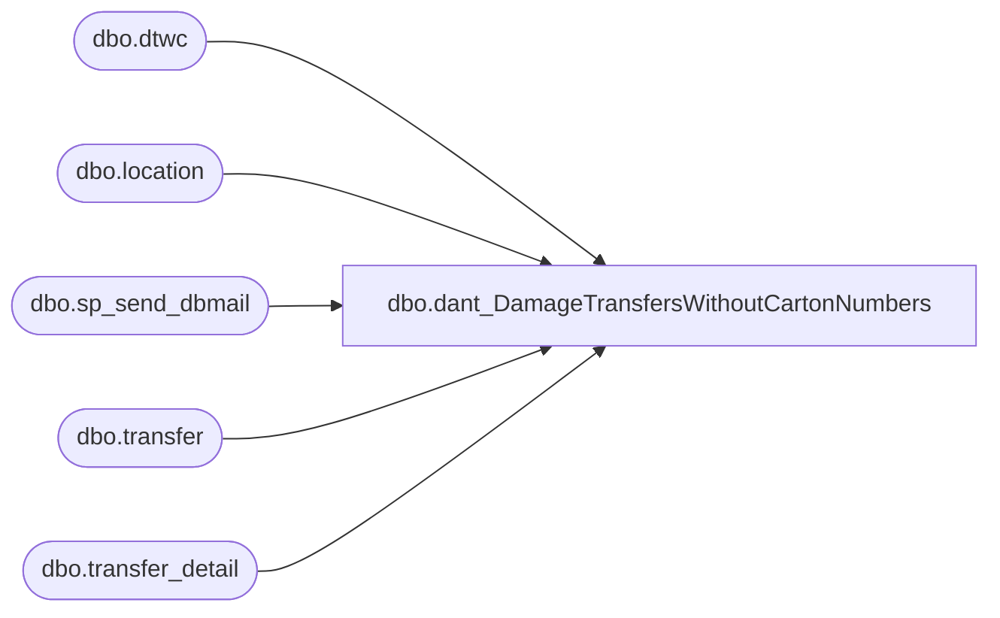

# dbo.dant_DamageTransfersWithoutCartonNumbers

**Database:** me_01  
**Server:** bedrockdb02  

## Architecture Diagram



## Table Dependencies

| Referenced Table |
|---|
| dbo.dtwc |
| dbo.location |
| dbo.sp_send_dbmail |
| dbo.transfer |
| dbo.transfer_detail |

## Stored Procedure Code

```sql
CREATE proc [dbo].[dant_DamageTransfersWithoutCartonNumbers]
as
set nocount on

if		(select count(t.document_no)
		from transfer t (nolock)
		join transfer_detail td (nolock) on t.transfer_id = td.transfer_id
		join location l (nolock) on t.from_location_id = l.location_id
		join location tl (nolock) on t.to_location_id = tl.location_id
		where	td.carton_no is null
		and		tl.location_code in ('2904', '9904')
		and		t.document_status = 3) > 0

BEGIN

----------------------------------------------------------------------------------------------------------------------------------------------------------------------------------------
----drop and create work table dtwc
IF (Object_ID('me_01..dtwc') IS NOT NULL) DROP TABLE dtwc

create table dtwc
(DOCUMENT_NBR varchar(10),
CREATE_DATE varchar(10),--smalldatetime,
FROM_LOCATION varchar(4),
TO_LOCATION varchar(4),
QTY int)
----------------------------------------------------------------------------------------------------------------------------------------------------------------------------------------
----------------------------------------------------------------------------------------------------------------------------------------------------------------------------------------
----capture data, insert into work table dtwc
insert dtwc
select	t.document_no DOCUMENT_NBR,
		convert(varchar, t.create_date, 101) CREATE_DATE,
		l.location_code FROM_LOCATION,
		tl.location_code TO_LOCATION,
		count(*) QTY
from	transfer t (nolock)
		join transfer_detail td (nolock) on t.transfer_id = td.transfer_id
		join location l (nolock) on t.from_location_id = l.location_id
		join location tl (nolock) on t.to_location_id = tl.location_id
where	td.carton_no is null
and		tl.location_code in ('2904', '9904')
and		t.document_status = 3
group by t.document_no, t.create_date,l.location_code,tl.location_code
order by t.create_date, t.document_no
----------------------------------------------------------------------------------------------------------------------------------------------------------------------------------------

----------------------------------------------------------------------------------------------------------------------------------------------------------------------------------------
----generate csv file with timestamp
declare @file varchar(1000) 
select @file = 'sqlcmd -Sbedrockdb02 -dme_01 -s"," -Q"select * from dtwc" -o"\\kermode\FileRepository\MERCHANDISING\DamageTransfersWithoutCartons\DamageTransfersWithoutCartons%date:~10%%date:~4,2%%date:~7,2%.csv" -w1000'
exec master..xp_cmdshell @file
----------------------------------------------------------------------------------------------------------------------------------------------------------------------------------------

-------------------------------------------------------------------------------------------------------------------
----email file
--get filename (since I can't use a wildcard and I have a datestamp on the file)
IF (Object_ID('tempdb..#filename') IS NOT NULL) DROP TABLE #filename
create table #filename(output varchar(52))
insert #filename
EXEC master..xp_cmdshell "dir \\kermode\FileRepository\MERCHANDISING\DamageTransfersWithoutCartons /b"
delete from #filename where output not like '%.csv' or output is null
declare @filename varchar(52)
select @filename = output from #filename
---------------------------------------------------------------------------------
declare @recipients varchar(52),
		@copy_recipients varchar(52),
		@body varchar(1000),
		@subject varchar(52),
		@file_attachments varchar(200)

set @recipients = 'samarar@buildabear.com'
set @body = 'The attached CSV file contains data related to damaged transfers without carton numbers.'
			+ char(10) + char(13) +
			+ char(10) + char(13) +
			'This process is managed via the following SQL Agent job: '
			+ char(10) + char(13) +
			'bedrockdb02.Report----DamageTransfersWithoutCartonNumbers'
			+ char(10) + char(13) +
			+ char(10) + char(13) +
			'Questions or issues related to this process should be directed to EntSysSupport@buildabear.com.'
			
set @subject = 'Damage Transfers Without Carton Numbers'
set @file_attachments = '\\kermode\FileRepository\MERCHANDISING\DamageTransfersWithoutCartons\' + @filename

EXEC bedrockdb02.msdb.dbo.sp_send_dbmail
	@recipients = @recipients,
	--@copy_recipients = @copy_recipients,
	@body = @body,
	@subject = @subject,
	@file_attachments = @file_attachments,
	@profile_name = 'MerchAdmin'

-----------------------------------------------------------------------------------------------------------------
----move file to done folder
EXEC master..xp_cmdshell 'move \\kermode\FileRepository\MERCHANDISING\DamageTransfersWithoutCartons\*.csv \\kermode\FileRepository\MERCHANDISING\DamageTransfersWithoutCartons\done'
-----------------------------------------------------------------------------------------------------------------

END

ELSE
BEGIN

declare @recipients_ varchar(52),
		@copy_recipients_ varchar(52),
		@body_ varchar(1000),
		@subject_ varchar(52)
		
set @recipients_ = 'samarar@buildabear.com'
set @body_ = 'There are currently no damage transfers without carton numbers.'
			+ char(10) + char(13) +
			+ char(10) + char(13) +
			'This process is managed via the following SQL Agent job: '
			+ char(10) + char(13) +
			'bedrockdb02.Report----DamageTransfersWithoutCartonNumbers'
			+ char(10) + char(13) +
			+ char(10) + char(13) +
			'Questions or issues related to this process should be directed to EntSysSupport@buildabear.com.'
			
set @subject_ = 'Damage Transfers Without Carton Numbers'

EXEC bedrockdb02.msdb.dbo.sp_send_dbmail
	@recipients = @recipients_,
	--@copy_recipients = @copy_recipients_,
	@body = @body_,
	@subject = @subject_,
	@profile_name = 'MerchAdmin'

END
```

