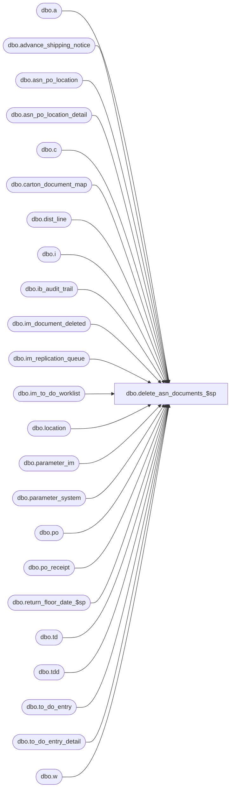

# dbo.delete_asn_documents_$sp

**Database:** me_01  
**Server:** bedrockdb02  

## Architecture Diagram



## Table Dependencies

| Referenced Table |
|---|
| dbo.a |
| dbo.advance_shipping_notice |
| dbo.asn_po_location |
| dbo.asn_po_location_detail |
| dbo.c |
| dbo.carton_document_map |
| dbo.dist_line |
| dbo.i |
| dbo.ib_audit_trail |
| dbo.im_document_deleted |
| dbo.im_replication_queue |
| dbo.im_to_do_worklist |
| dbo.location |
| dbo.parameter_im |
| dbo.parameter_system |
| dbo.po |
| dbo.po_receipt |
| dbo.return_floor_date_$sp |
| dbo.td |
| dbo.tdd |
| dbo.to_do_entry |
| dbo.to_do_entry_detail |
| dbo.w |

## Stored Procedure Code

```sql
CREATE PROCEDURE [dbo].[delete_asn_documents_$sp]
AS

/*
Proc name:  delete_asn_documents_$sp
Desc: This procedure delete advance_shipping_notice documents based on parameters stored in table parameter_im.
	  The delete should also comply with some business rules listed below.
History: Creation March 03, 2011
*/
BEGIN
	DECLARE @sql_err_num DECIMAL(38,0), @error_msg NVARCHAR(2000), @cleanup_weeks SMALLINT, @floor_date SMALLDATETIME, @counter INT,
		@done BIT, @batch_size INT, @min_asn_id DECIMAL(12,0), @max_asn_id DECIMAL(12,0);

	-- Make sure this table doesn't exists at the beginning of the process
	IF NOT object_id(N'tempdb..#temp_asn') IS NULL
		DROP TABLE #temp_asn;

	BEGIN TRY
		SELECT @cleanup_weeks = asn_cleanup_weeks FROM parameter_im;

		EXEC return_floor_date_$sp @cleanup_weeks, @floor_date OUTPUT;

		SELECT @done = 0, @batch_size = 500000,
			@min_asn_id = MIN(advance_shipping_notice_id),
			@max_asn_id = MAX(advance_shipping_notice_id)
		FROM advance_shipping_notice
		WHERE create_date < @floor_date;

		-- Business Rule IMASN078, IMASN080:  Delete all ASNs where create date is at least x weeks ago,
		-- and ASN is not referenced on a PO Receipt or linked to a Distribution

		-- If there is a lot of rows to insert then we should do it in multiple INSERTs
		WHILE (@min_asn_id < @max_asn_id)
		BEGIN
			BEGIN TRAN

			INSERT INTO im_document_deleted
				(im_document_id, im_document_no, document_type, document_status)
			SELECT advance_shipping_notice_id, document_no, 8, -- document_type for ASN is 8
				0 AS document_status
			FROM advance_shipping_notice asn
			WHERE advance_shipping_notice_id BETWEEN @min_asn_id AND @min_asn_id + @batch_size
			AND create_date < @floor_date
			AND NOT EXISTS (SELECT 1 FROM po_receipt p WHERE p.advance_shipping_notice_id = asn.advance_shipping_notice_id)
			AND NOT EXISTS (SELECT 1 FROM dist_line d WHERE d.advance_shipping_notice_id = asn.advance_shipping_notice_id)
			ORDER BY advance_shipping_notice_id;

			COMMIT TRAN

			SET @min_asn_id = @min_asn_id + @batch_size;
		END;

		UPDATE STATISTICS im_document_deleted;

		SELECT @counter = COUNT(*), @done = 0, @max_asn_id = 0 FROM im_document_deleted WHERE document_type = 8;

		IF (@counter > 10000)
		BEGIN
			WHILE (@done = 0)
			BEGIN
				-- We cannot do the delete in one big batch
				SELECT TOP 10000 im_document_id, im_document_no, document_type, document_status
				INTO #temp_asn
				FROM im_document_deleted
				WHERE document_type = 8
				AND im_document_id > @max_asn_id
				ORDER BY im_document_id;

				IF (@@ROWCOUNT > 0)
					SELECT @max_asn_id = MAX(im_document_id) FROM #temp_asn;
				ELSE
					SET @done = 1;

				IF (@done = 0)
				BEGIN
					BEGIN TRAN

					-- Publish the documents that we are about to delete
					INSERT INTO im_replication_queue
						(entity_code, replication_action, entity_id, other_entity_id, other_entity_key, changed_units, replication_data)
					SELECT N'21', N'LD', pl.asn_po_location_id, t.im_document_id, t.im_document_no, 0, CONVERT(NCHAR(9), po.po_no) + l.location_code
					FROM #temp_asn t, asn_po_location pl, po, location l
					WHERE t.im_document_id = pl.advance_shipping_notice_id
					AND pl.po_id = po.po_id
					AND pl.location_id = l.location_id
					ORDER BY t.im_document_id, pl.asn_po_location_id;

					INSERT INTO im_replication_queue
						(entity_code, replication_action, entity_id, other_entity_id, other_entity_key, changed_units, replication_data)
					SELECT 20, N'D', im_document_id, 0, im_document_no, 0, N'N/A'
					FROM #temp_asn;

					DELETE i
					FROM ib_audit_trail i, #temp_asn t
					WHERE i.application = N'IM'
					AND i.application_type = N'ASN'
					AND i.application_identifier = t.im_document_no;

					INSERT INTO ib_audit_trail
						(entry_date, application, activity, application_type, application_type_id, application_identifier, application_level,
						application_key, action, field_affected, old_value, new_value, status, employee_last_name, employee_first_name)
					SELECT GETDATE(), N'IM', N'Delete', N'ASN', NULL, im_document_no, NULL, NULL, N'Delete', NULL, NULL, NULL, N'N/A',
						N'Batch Delete', N'Pipeline Segment 3004'
					FROM #temp_asn;

					DELETE c
					FROM carton_document_map c, #temp_asn t
					WHERE c.document_type = 3
					AND c.document_id = t.im_document_id;

					-- IMASN076, IMASN080 - Remove any related entries in the IM to-do Worklist
					IF ( (SELECT COUNT(*) FROM parameter_system WHERE installed_imweb_flag = 1) = 1)
					BEGIN
						DELETE w
						FROM #temp_asn t, im_to_do_worklist w
						WHERE t.im_document_id = w.document_id
						AND w.document_type = 3;
					END

					-- IMASN076, IMASN080 - Remove any related entries in the A&R to-do Worklist
					DELETE tdd
					FROM #temp_asn t, asn_po_location pl, to_do_entry td, to_do_entry_detail tdd
					WHERE t.im_document_id = pl.advance_shipping_notice_id
					AND pl.asn_po_location_id = td.asn_po_location_id
					AND td.to_do_entry_id = tdd.to_do_entry_id;

					DELETE td
					FROM #temp_asn t, asn_po_location pl, to_do_entry td
					WHERE t.im_document_id = pl.advance_shipping_notice_id
					AND pl.asn_po_location_id = td.asn_po_location_id;

					DELETE a
					FROM #temp_asn t, asn_po_location_detail a
					WHERE t.im_document_id = a.advance_shipping_notice_id;

					DELETE a
					FROM #temp_asn t, asn_po_location a
					WHERE t.im_document_id = a.advance_shipping_notice_id;

					DELETE a
					FROM #temp_asn t, advance_shipping_notice a
					WHERE t.im_document_id = a.advance_shipping_notice_id;

					/* Write XML message to the message queue
					-- Determine if any of the locations in the POLocations container of the ASN
					-- have their warehouse system flag set to true.  If any of the locations have this flag set
					-- to true publish the event.

					IF EXISTS (SELECT 1 FROM #temp_asn t, asn_po_location al, location l
								WHERE t.im_document_id = al.advance_shipping_notice_id
								AND al.location_id = l.location_id
								AND l.warehouse_system_flag = 1)
					BEGIN
						-- WriteMessage
						INSERT INTO extension_queue
							(type, entity_id, method_id, entity_name)
						SELECT 1, t.im_document_id, N'BD4B6141-9B23-441a-85E2-32FC9A71F409', t.document_no
						FROM #temp_asn t
						WHERE EXISTS (SELECT 1 FROM temp_asn_po_location al WITH(NOLOCK), location l WITH(NOLOCK)
									WHERE al.advance_shipping_notice_id = t.im_document_id
									AND al.ship_to_location_id = l.location_id
									AND l.warehouse_system_flag = 1)
						ORDER BY t.im_document_id;
					END; */

					COMMIT TRAN

				END;
				IF object_id(N'tempdb..#temp_asn') IS NOT NULL
					DROP TABLE #temp_asn;
			END;
		END
		ELSE
		BEGIN
			-- There is a small number of documents to delete then do it in one batch.
			BEGIN TRAN

			-- Publish the documents that we are about to delete
			INSERT INTO im_replication_queue
				(entity_code, replication_action, entity_id, other_entity_id, other_entity_key, changed_units, replication_data)
			SELECT N'21', N'LD', pl.asn_po_location_id, d.im_document_id, d.im_document_no, 0, CONVERT(NCHAR(9), po.po_no) + l.location_code
			FROM im_document_deleted d, asn_po_location pl, po, location l
			WHERE d.document_type = 8
			AND d.im_document_id = pl.advance_shipping_notice_id
			AND pl.po_id = po.po_id
			AND pl.location_id = l.location_id
			ORDER BY d.im_document_id, pl.asn_po_location_id;

			INSERT INTO im_replication_queue
				(entity_code, replication_action, entity_id, other_entity_id, other_entity_key, changed_units, replication_data)
			SELECT 20, N'D', im_document_id, 0, im_document_no, 0, N'N/A'
			FROM im_document_deleted d
			WHERE d.document_type = 8;

			DELETE i
			FROM ib_audit_trail i, im_document_deleted d
			WHERE i.application = N'IM'
			AND i.application_type = N'ASN'
			AND d.document_type = 8
			AND i.application_identifier = d.im_document_no;

			INSERT INTO ib_audit_trail
				(entry_date, application, activity, application_type, application_type_id, application_identifier, application_level,
				application_key, action, field_affected, old_value, new_value, status, employee_last_name, employee_first_name)
			SELECT GETDATE(), N'IM', N'Delete', N'ASN', NULL, im_document_no, NULL, NULL, N'Delete', NULL, NULL, NULL, N'N/A', N'Batch Delete', N'Pipeline Segment 3004'
			FROM im_document_deleted
			WHERE document_type = 8;

			DELETE c
			FROM carton_document_map c, im_document_deleted d
			WHERE d.document_type = 8
			and c.document_type = 3
			AND c.document_id = d.im_document_id;

			-- IMASN076, IMASN080 - Remove any related entries in the IM to-do Worklist
			DELETE t
			FROM im_to_do_worklist t, parameter_system s, im_document_deleted d
			WHERE s.installed_imweb_flag = 1
			AND d.document_type = 8
			AND t.document_id = d.im_document_id;

			-- IMASN076, IMASN080 - Remove any related entries in the A&R to-do Worklist
			DELETE td
			FROM im_document_deleted d, asn_po_location pl, to_do_entry td, to_do_entry_detail tdd
			WHERE d.document_type = 8
			AND d.im_document_id = pl.advance_shipping_notice_id
			AND pl.asn_po_location_id = td.asn_po_location_id
			AND td.to_do_entry_id = tdd.to_do_entry_id;

			DELETE td
			FROM im_document_deleted d, asn_po_location pl, to_do_entry td
			WHERE d.document_type = 8
			AND d.im_document_id = pl.advance_shipping_notice_id
			AND pl.asn_po_location_id = td.asn_po_location_id;

			DELETE a
			FROM im_document_deleted d, asn_po_location_detail a
			WHERE d.document_type = 8
			AND d.im_document_id = a.advance_shipping_notice_id;

			DELETE a
			FROM im_document_deleted d, asn_po_location a
			WHERE d.document_type = 8
			AND d.im_document_id = a.advance_shipping_notice_id;

			DELETE a
			FROM im_document_deleted d, advance_shipping_notice a
			WHERE d.document_type = 8
			AND d.im_document_id = a.advance_shipping_notice_id;

			/* Write XML message to the message queue
			-- Determine if any of the locations in the POLocations container of the ASN
			-- have their warehouse system flag set to true.  If any of the locations have this flag set
			-- to true publish the event.

			IF EXISTS (SELECT 1 FROM im_document_deleted d, asn_po_location al, location l
						WHERE d.document_type = 8
						AND d.im_document_id = al.advance_shipping_notice_id
						AND al.location_id = l.location_id
						AND l.warehouse_system_flag = 1)
			BEGIN
				-- WriteMessage
				INSERT INTO extension_queue
					(type, entity_id, method_id, entity_name)
				SELECT 1, d.im_document_id, 'BD4B6141-9B23-441a-85E2-32FC9A71F409', d.im_document_no
				FROM im_document_deleted d
				WHERE d.document_type = 8
				AND EXISTS (SELECT 1 FROM temp_asn_po_location al WITH(NOLOCK), location l WITH(NOLOCK)
							WHERE al.advance_shipping_notice_id = d.im_document_id
							AND al.ship_to_location_id = l.location_id
							AND l.warehouse_system_flag = 1)
				ORDER BY d.im_document_id;
			END; */

			COMMIT TRAN
		END;

	END TRY

	BEGIN CATCH
		SELECT @error_msg = ERROR_MESSAGE(),
		       @sql_err_num = ERROR_NUMBER();

		IF @@TRANCOUNT <> 0
			ROLLBACK TRANSACTION

		SET @error_msg = N'Error in procedure delete_asn_documents_$sp: ' + CAST(ERROR_NUMBER() AS NVARCHAR) + N' ' + ERROR_MESSAGE()
		RAISERROR (@error_msg, -- Message text.
               16, -- Severity.
               1) -- State.
	END CATCH
END
```

