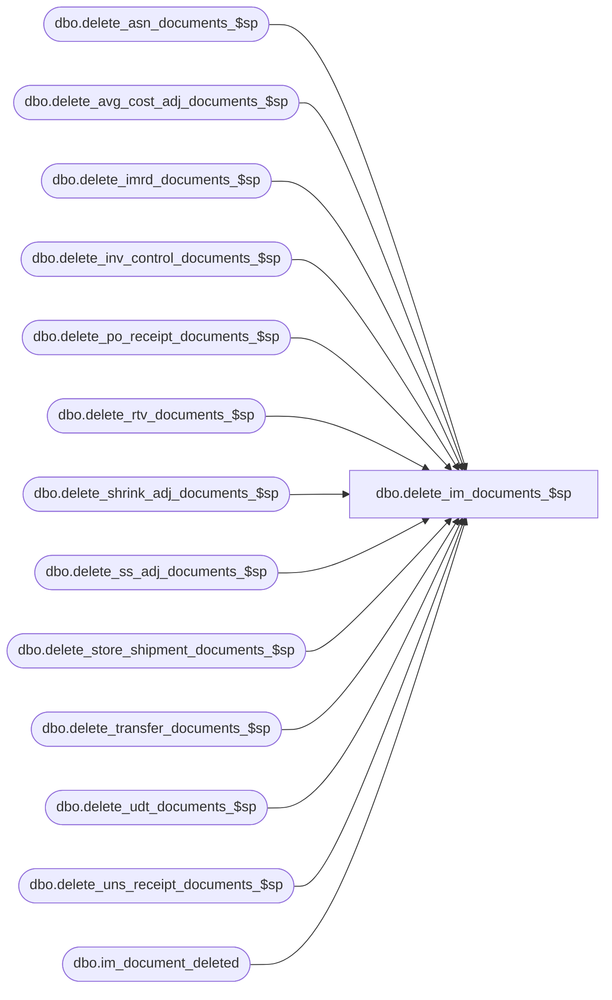

# dbo.delete_im_documents_$sp

**Database:** me_01  
**Server:** bedrockdb02  

## Architecture Diagram



## Table Dependencies

| Referenced Table |
|---|
| dbo.delete_asn_documents_$sp |
| dbo.delete_avg_cost_adj_documents_$sp |
| dbo.delete_imrd_documents_$sp |
| dbo.delete_inv_control_documents_$sp |
| dbo.delete_po_receipt_documents_$sp |
| dbo.delete_rtv_documents_$sp |
| dbo.delete_shrink_adj_documents_$sp |
| dbo.delete_ss_adj_documents_$sp |
| dbo.delete_store_shipment_documents_$sp |
| dbo.delete_transfer_documents_$sp |
| dbo.delete_udt_documents_$sp |
| dbo.delete_uns_receipt_documents_$sp |
| dbo.im_document_deleted |

## Stored Procedure Code

```sql
CREATE PROCEDURE [dbo].[delete_im_documents_$sp]
AS 

/* 
Proc name:  delete_im_documents_$sp
Desc: This procedure delete im documents based on parameters stored in table parameter_im.
	  The delete should also comply with some business rules.
History: Creation March 03, 2011
*/
BEGIN
	DECLARE @sql_err_num DECIMAL(38,0), @error_msg NVARCHAR(2000), @line_id TINYINT, @proc_error NVARCHAR(125)

	BEGIN TRY
		-- Make sure we start fresh: data concerning documents that will be deleted part of this current execution
		-- will be accumulated in this table with different types and use when the report will be written.
		TRUNCATE TABLE im_document_deleted;
		
		SET @line_id = 10;	
		-- Call the procedure that will delete PO Receipt documents (document_type = 1)
		EXEC delete_po_receipt_documents_$sp;
		
		SET @line_id = 20;
		-- Call the procedure that will delete ASN documents (document_type = 8)
		EXEC delete_asn_documents_$sp;
		
		SET @line_id = 30;
		-- Call the procedure that will delete Unsolicited Receipt documents (document_type = 11)
		EXEC delete_uns_receipt_documents_$sp;
		
		SET @line_id = 40;
		-- Call the procedure that will delete Transfer documents (document_type = 5)
		EXEC delete_transfer_documents_$sp;
		
		SET @line_id = 50;
		-- Call the procedure that will delete Return To Vendor documents (document_type = 10)
		EXEC delete_rtv_documents_$sp;
		
		SET @line_id = 60;
		-- Call the procedure that will delete Inventory Movement Request documents (document_type = 12)
		EXEC delete_imrd_documents_$sp
		
		SET @line_id = 70;
		-- Call the procedure that will delete User Defined Adjustment documents (document_type = 13)
		EXEC delete_udt_documents_$sp
		
		SET @line_id = 80;
		-- Call the procedure that will delete Shrink Adjustment documents (document_type = 14)
		EXEC delete_shrink_adj_documents_$sp
		
		SET @line_id = 90;
		-- Call the procedure that will delete Stock Status Adjustment documents (document_type = 15)
		EXEC delete_ss_adj_documents_$sp
		
		SET @line_id = 100;
		-- Call the procedure that will delete Inventory Control documents (document_type = 19)
		EXEC delete_inv_control_documents_$sp;
		
		SET @line_id = 110;
		-- Call the procedure that will delete Average Cost Adjustment documents (document_type = 21)
		EXEC delete_avg_cost_adj_documents_$sp;
		
		SET @line_id = 120;
		-- Call the procedure that will delete Store Shipment documents (document_type = 4)
		EXEC delete_store_shipment_documents_$sp

	END TRY

	BEGIN CATCH
		SELECT @error_msg = ERROR_MESSAGE(),
		       @sql_err_num = ERROR_NUMBER();
		       
		IF @@TRANCOUNT <> 0
			ROLLBACK TRANSACTION
			
		IF (@line_id = 10)
			SET @proc_error = N'delete_po_receipt_documents_$sp.'
		ELSE IF (@line_id = 20)
			SET @proc_error = N'delete_asn_documents_$sp.'
		ELSE IF (@line_id = 30)
			SET @proc_error = N'delete_uns_receipt_documents_$sp.'
		ELSE IF (@line_id = 40)
			SET @proc_error = N'delete_transfer_documents_$sp.'
		ELSE IF (@line_id = 50)
			SET @proc_error = N'delete_rtv_documents_$sp.'
		ELSE IF (@line_id = 60)
			SET @proc_error = N'delete_imrd_documents_$sp.'
		ELSE IF (@line_id = 70)
			SET @proc_error = N'delete_udt_documents_$sp.'
		ELSE IF (@line_id = 80)
			SET @proc_error = N'delete_shrink_adj_documents_$sp.'	
		ELSE IF (@line_id = 90)
			SET @proc_error = N'delete_ss_adj_documents_$sp.'
		ELSE IF (@line_id = 100)
			SET @proc_error = N'delete_inv_control_documents_$sp.'
		ELSE IF (@line_id = 110)
			SET @proc_error = N'delete_avg_cost_adj_documents_$sp.'
		ELSE IF (@line_id = 120)
			SET @proc_error = N'delete_store_shipment_documents$sp.'
			
		SET @error_msg = N'Procedure delete_im_documents_$sp completes with the following error: ' + CAST(@sql_err_num AS NVARCHAR(50)) + N' ' + @error_msg +
			N' This error actually happened in procedure: ' + @proc_error
		RAISERROR (@error_msg, -- Message text.
               16, -- Severity.
            1) -- State.
	END CATCH
END
```

