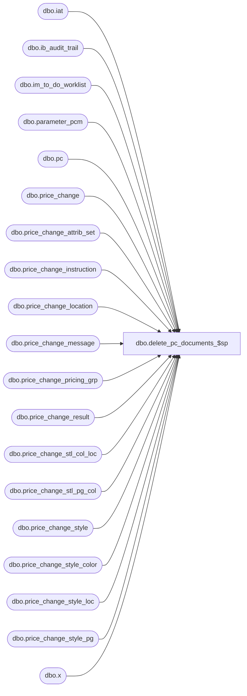

# dbo.delete_pc_documents_$sp

**Database:** me_01  
**Server:** bedrockdb02  

## Architecture Diagram



## Table Dependencies

| Referenced Table |
|---|
| dbo.iat |
| dbo.ib_audit_trail |
| dbo.im_to_do_worklist |
| dbo.parameter_pcm |
| dbo.pc |
| dbo.price_change |
| dbo.price_change_attrib_set |
| dbo.price_change_instruction |
| dbo.price_change_location |
| dbo.price_change_message |
| dbo.price_change_pricing_grp |
| dbo.price_change_result |
| dbo.price_change_stl_col_loc |
| dbo.price_change_stl_pg_col |
| dbo.price_change_style |
| dbo.price_change_style_color |
| dbo.price_change_style_loc |
| dbo.price_change_style_pg |
| dbo.x |

## Stored Procedure Code

```sql
-----------------------------------------------------------------------------------------------------------------------------
--	Stored Procedure Details: Listing Of Standard Details Related To The Stored Procedure
-----------------------------------------------------------------------------------------------------------------------------

--	Purpose: Delete All Qualifying Price Change (PC) Documents
--	Create Date (MM/DD/YYYY): 10/22/2013
--	Developer: Sean Smith (sean.smith@epicor.com)
--	Defect: 1-4BPH3V
--	Additional Notes: N/A


-----------------------------------------------------------------------------------------------------------------------------
--	Modification History: Listing Of All Modifications Since Original Implementation
-----------------------------------------------------------------------------------------------------------------------------

--	Description: Added check to see if the price change documents are from the new schema or not since the tables to
--				 delete information from are different in this case.
--	Date (MM/DD/YYYY): 03/17/2015
--	Developer: Annie Deland
--  Feature 27137 - Pricing Rewrite (Phase 1) - UC040 - Delete Price Change
--	Additional Notes: this stored procedure is called from the PIPELINE segment.
--					  Deletion from the UI is handled by a different piece of code.


-----------------------------------------------------------------------------------------------------------------------------
--	Main Query: Create Procedure
--
--	Five new parameter values are now passed in; they all related to information to add to the audit trail table.
-----------------------------------------------------------------------------------------------------------------------------

CREATE PROCEDURE [dbo].[delete_pc_documents_$sp]

	 @ib_appl_name AS NVARCHAR(20)
	,@ib_appl_type AS NVARCHAR(80)
	,@ib_action AS NVARCHAR(40)
	,@ib_empl_first_name as NVARCHAR(60)
	,@ib_empl_last_name as NVARCHAR(60)
	,@batch_size AS INT = 3500
	,@rety_attempts_maximum AS INT = 3
	,@waitfor_delay AS CHAR (8) = '00:00:05'

AS


SET NOCOUNT ON


-----------------------------------------------------------------------------------------------------------------------------
--	Declarations / Sets: Declare And Set Variables
-----------------------------------------------------------------------------------------------------------------------------

DECLARE @cancel_date AS SMALLDATETIME
DECLARE @complete_date AS SMALLDATETIME
DECLARE @current_batch_size AS INT
DECLARE @current_date AS SMALLDATETIME
DECLARE @error_message AS NVARCHAR (2047)
DECLARE @retry_attempts_current AS INT


SET @current_batch_size = @batch_size
SET @current_date = GETDATE ()
SET @retry_attempts_current = 0


SELECT
	 @cancel_date = @current_date - pp.auto_del_cancel_pc_after_days
	,@complete_date = @current_date - pp.auto_del_comp_pc_after_days
FROM
	dbo.parameter_pcm pp


-----------------------------------------------------------------------------------------------------------------------------
--	Error Trapping: Check If Temp Table(s) Already Exist(s) And Drop If Applicable
-----------------------------------------------------------------------------------------------------------------------------

IF OBJECT_ID (N'tempdb.dbo.#temp_delete_pc_documents', N'U') IS NOT NULL
BEGIN

	DROP TABLE dbo.#temp_delete_pc_documents

END


-----------------------------------------------------------------------------------------------------------------------------
--	Temp Table: Create Empty Shell For Temp Table
-----------------------------------------------------------------------------------------------------------------------------

SELECT TOP (0)
	 pc.price_change_id
	,pc.price_change_no
	,pc.schema_version
	,pc.result_id
INTO
	dbo.#temp_delete_pc_documents
FROM
	dbo.price_change pc


-----------------------------------------------------------------------------------------------------------------------------
--	Table Update: Delete Rows From Primary Price Change Table
-----------------------------------------------------------------------------------------------------------------------------

WHILE @current_batch_size = @batch_size
BEGIN

	BEGIN TRY

		BEGIN TRANSACTION

			DELETE TOP (@batch_size)
				pc
			OUTPUT
				 DELETED.price_change_id
				,DELETED.price_change_no
				,DELETED.schema_version
				,DELETED.result_id
			INTO
				dbo.#temp_delete_pc_documents

					(
						 price_change_id
						,price_change_no
						,schema_version
						,result_id
					)

			FROM
				dbo.price_change pc
			WHERE
				(
					(
						pc.price_change_status = 5 -- Cancelled
						AND pc.status_date <= @cancel_date
					)
					OR
					(
						pc.price_change_status = 6 -- Completed
						AND pc.status_date <= @complete_date
					)
				)


			SET @current_batch_size = @@ROWCOUNT


-----------------------------------------------------------------------------------------------------------------------------
--	Table Update: Delete Rows From Related Price Change Tables (Conditional)
--
--  If the schema version is set the 0, we have to delete the information in the following tables:
--			price_change_location
--			price_change_pricing_grp
--			price_change_style
--			price_change_style_loc
--			price_change_style_color
--			price_change_stl_col_loc
--			price_change_style_pg
--			price_change_stl_pg_col
--
--  If the schema version is set to 1, we delete information from these tables:
--			price_change_instruction
--			price_change_result
--
--  Common tables between the two schema version:
--			price_change_attrib_set
--			price_change_message
--			im_to_do_worklist
--
-----------------------------------------------------------------------------------------------------------------------------

			IF @current_batch_size <> 0
			BEGIN

-----------------------------------------------------------------------------------------------------------------------------
--	schema_version = 0
-----------------------------------------------------------------------------------------------------------------------------

				IF EXISTS (SELECT * FROM dbo.#temp_delete_pc_documents tdpd WHERE tdpd.schema_version = 0)
				BEGIN

						DELETE
							x
						FROM
							dbo.price_change_location x
						WHERE
							EXISTS

								(
									SELECT
										*
									FROM
										dbo.#temp_delete_pc_documents tdpd
									WHERE
										tdpd.price_change_id = x.price_change_id
								)


						DELETE
							x
						FROM
							dbo.price_change_pricing_grp x
						WHERE
							EXISTS

								(
									SELECT
										*
									FROM
										dbo.#temp_delete_pc_documents tdpd
									WHERE
										tdpd.price_change_id = x.price_change_id
								)


						DELETE
							x
						FROM
							dbo.price_change_style x
						WHERE
							EXISTS

								(
									SELECT
										*
									FROM
										dbo.#temp_delete_pc_documents tdpd
									WHERE
										tdpd.price_change_id = x.price_change_id
								)


						DELETE
							x
						FROM
							dbo.price_change_style_loc x
						WHERE
							EXISTS

								(
									SELECT
										*
									FROM
										dbo.#temp_delete_pc_documents tdpd
									WHERE
										tdpd.price_change_id = x.price_change_id
								)


						DELETE
							x
						FROM
							dbo.price_change_style_color x
						WHERE
							EXISTS

								(
									SELECT
										*
									FROM
										dbo.#temp_delete_pc_documents tdpd
									WHERE
										tdpd.price_change_id = x.price_change_id
								)


						DELETE
							x
						FROM
							dbo.price_change_stl_col_loc x
						WHERE
							EXISTS

								(
									SELECT
										*
									FROM
										dbo.#temp_delete_pc_documents tdpd
									WHERE
										tdpd.price_change_id = x.price_change_id
								)


						DELETE
							x
						FROM
							dbo.price_change_style_pg x
						WHERE
							EXISTS

								(
									SELECT
										*
									FROM
										dbo.#temp_delete_pc_documents tdpd
									WHERE
										tdpd.price_change_id = x.price_change_id
								)


						DELETE
							x
						FROM
							dbo.price_change_stl_pg_col x
						WHERE
							EXISTS

								(
									SELECT
										*
									FROM
										dbo.#temp_delete_pc_documents tdpd
									WHERE
										tdpd.price_change_id = x.price_change_id
								)
				END


-----------------------------------------------------------------------------------------------------------------------------
--	schema_version = 1
-----------------------------------------------------------------------------------------------------------------------------

				IF EXISTS (SELECT * FROM dbo.#temp_delete_pc_documents tdpd WHERE tdpd.schema_version = 1)
				BEGIN

						DELETE
							x
						FROM
							dbo.price_change_instruction x
						WHERE
							EXISTS

								(
									SELECT
										*
									FROM
										dbo.#temp_delete_pc_documents tdpd
									WHERE
										tdpd.price_change_id = x.price_change_id
								)


						DELETE
							x
						FROM
							dbo.price_change_result x
						WHERE
							EXISTS

								(
									SELECT
										*
									FROM
										dbo.#temp_delete_pc_documents tdpd
									WHERE
										tdpd.result_id = x.result_id
								)
				END

-----------------------------------------------------------------------------------------------------------------------------
--	common tables
-----------------------------------------------------------------------------------------------------------------------------

				DELETE
					x
				FROM
					dbo.price_change_attrib_set x
				WHERE
					EXISTS

						(
							SELECT
								*
							FROM
								dbo.#temp_delete_pc_documents tdpd
							WHERE
								tdpd.price_change_id = x.price_change_id
						)


				DELETE
					x
				FROM
					dbo.price_change_message x
				WHERE
					EXISTS

						(
							SELECT
								*
							FROM
								dbo.#temp_delete_pc_documents tdpd
							WHERE
								tdpd.price_change_id = x.price_change_id
						)


				DELETE
					x
				FROM
					dbo.im_to_do_worklist x
				WHERE
					x.document_type = 33
					AND EXISTS

						(
							SELECT
								*
							FROM
								dbo.#temp_delete_pc_documents tdpd
							WHERE
								tdpd.price_change_id = x.document_id
						)


-----------------------------------------------------------------------------------------------------------------------------
--	Table Update: Remove Old Entry From "ib_audit_trail" And Add New Entry (Conditional)
--
--  Previously the values for the application and application_type were hard-coded in the stored procedure
--	therefore we still want to check for these values when deleting the audit trail entries.
--	This is why you see the following statement in the WHERE clause
--
--				(iat.[application] = 'PCM' AND iat.application_type = 'PC')
--
-----------------------------------------------------------------------------------------------------------------------------

				DELETE
					iat
				FROM
					dbo.ib_audit_trail iat
				WHERE
					(
						(iat.[application] = 'PCM' AND iat.application_type = 'PC')
                        OR (iat.[application] = @ib_appl_name AND iat.application_type = @ib_appl_type)
                    )
					AND EXISTS

						(
							SELECT
								*
							FROM
								dbo.#temp_delete_pc_documents tdpd
							WHERE
								tdpd.price_change_no = iat.application_identifier
						)


				INSERT INTO dbo.ib_audit_trail

					(
						 entry_date
						,[application]
						,activity
						,application_type
						,application_type_id
						,application_identifier
						,application_level
						,application_key
						,[action]
						,field_affected
						,old_value
						,new_value
						,[status]
						,employee_last_name
						,employee_first_name
					)

				SELECT
					 GETDATE () AS entry_date
					,@ib_appl_name AS [application]
					,NULL AS activity
					,@ib_appl_type AS application_type
					,NULL AS application_type_id
					,tdpd.price_change_no AS application_identifier
					,NULL AS application_level
					,NULL AS application_key
					,@ib_action AS [action]
					,NULL AS field_affected
					,NULL AS old_value
					,NULL AS new_value
					,NULL AS [status]
					,@ib_empl_last_name AS employee_last_name
					,@ib_empl_first_name AS employee_first_name
				FROM
					dbo.#temp_delete_pc_documents tdpd


				IF @current_batch_size = @batch_size
				BEGIN

					TRUNCATE TABLE dbo.#temp_delete_pc_documents

				END

			END

		COMMIT TRANSACTION

	END TRY


-----------------------------------------------------------------------------------------------------------------------------
--	Error Trapping: Increment Current Retry Counter And Error Out If Maximum Retry Count Is Exceeded
-----------------------------------------------------------------------------------------------------------------------------

	BEGIN CATCH

		IF @@TRANCOUNT > 0
		BEGIN

			ROLLBACK TRANSACTION

		END


		SET @retry_attempts_current = @retry_attempts_current + 1


		IF @retry_attempts_current > @rety_attempts_maximum
		BEGIN

			SET @error_message =

				(
					  N'Error in procedure: ' + COALESCE (ERROR_PROCEDURE (), N'UNKNOWN') + N'.'
					+ N' Error Number: ' + CONVERT (NVARCHAR (11), ERROR_NUMBER ()) + N'.'
					+ N' Error Severity: ' + CONVERT (NVARCHAR (11), ERROR_SEVERITY ()) + N'.'
					+ N' Error State: ' + CONVERT (NVARCHAR (11), ERROR_STATE ()) + N'.'
					+ N' Error Line: ' + CONVERT (NVARCHAR (11), ERROR_LINE ()) + N'.'
				)


			RAISERROR

				(
					 @error_message -- Message String Variable
					,16 -- Severity
					,1 -- State
				)

		--	WITH LOG -- Logs the error in the error log and the application log for the instance of the Microsoft SQL Server Database Engine


			RETURN

		END


		WAITFOR DELAY @waitfor_delay


		SET @current_batch_size = @batch_size

	END CATCH

END


IF OBJECT_ID (N'tempdb.dbo.#temp_delete_pc_documents', N'U') IS NOT NULL
BEGIN

	DROP TABLE dbo.#temp_delete_pc_documents

END
```

