# dbo.delete_po_receipt_documents_$sp

**Database:** me_01  
**Server:** bedrockdb02  

## Architecture Diagram

```mermaid
flowchart LR
    SP["dbo.delete_po_receipt_documents_$sp"]
    dbo_a(["dbo.a"]) --> SP
    dbo_c(["dbo.c"]) --> SP
    dbo_carton_document_map(["dbo.carton_document_map"]) --> SP
    dbo_d(["dbo.d"]) --> SP
    dbo_da(["dbo.da"]) --> SP
    dbo_dc(["dbo.dc"]) --> SP
    dbo_dd(["dbo.dd"]) --> SP
    dbo_del_distribution(["dbo.del_distribution"]) --> SP
    dbo_dg(["dbo.dg"]) --> SP
    dbo_dist_attribute_set(["dbo.dist_attribute_set"]) --> SP
    dbo_dist_custom_property(["dbo.dist_custom_property"]) --> SP
    dbo_dist_detail(["dbo.dist_detail"]) --> SP
    dbo_dist_detail_pack(["dbo.dist_detail_pack"]) --> SP
    dbo_dist_grp_instruction(["dbo.dist_grp_instruction"]) --> SP
    dbo_dist_line(["dbo.dist_line"]) --> SP
    dbo_dist_line_location(["dbo.dist_line_location"]) --> SP
    dbo_dist_location(["dbo.dist_location"]) --> SP
    dbo_dist_location_grade(["dbo.dist_location_grade"]) --> SP
    dbo_dist_message(["dbo.dist_message"]) --> SP
    dbo_dist_min_max_profile(["dbo.dist_min_max_profile"]) --> SP
    dbo_dist_prior_dist_line(["dbo.dist_prior_dist_line"]) --> SP
    dbo_dist_ranking_grade_loc(["dbo.dist_ranking_grade_loc"]) --> SP
    dbo_dist_sales_merch(["dbo.dist_sales_merch"]) --> SP
    dbo_dist_sales_merch_c(["dbo.dist_sales_merch_c"]) --> SP
    dbo_dist_sales_week(["dbo.dist_sales_week"]) --> SP
    dbo_dist_sell_thru_grade(["dbo.dist_sell_thru_grade"]) --> SP
    dbo_dist_sku_grade_alloc(["dbo.dist_sku_grade_alloc"]) --> SP
    dbo_dist_sku_scale(["dbo.dist_sku_scale"]) --> SP
    dbo_dist_source_sku_qty(["dbo.dist_source_sku_qty"]) --> SP
    dbo_dist_storepack_defn(["dbo.dist_storepack_defn"]) --> SP
    dbo_dist_styl_clr_grd_alloc(["dbo.dist_styl_clr_grd_alloc"]) --> SP
    dbo_dist_style_color_scale(["dbo.dist_style_color_scale"]) --> SP
    dbo_dist_volume_grade(["dbo.dist_volume_grade"]) --> SP
    dbo_distribution(["dbo.distribution"]) --> SP
    dbo_distribution_c(["dbo.distribution_c"]) --> SP
    dbo_dl(["dbo.dl"]) --> SP
    dbo_dm(["dbo.dm"]) --> SP
    dbo_dp(["dbo.dp"]) --> SP
    dbo_dr(["dbo.dr"]) --> SP
    dbo_ds(["dbo.ds"]) --> SP
    dbo_i(["dbo.i"]) --> SP
    dbo_ib_allocation(["dbo.ib_allocation"]) --> SP
    dbo_ib_audit_trail(["dbo.ib_audit_trail"]) --> SP
    dbo_im_attribute(["dbo.im_attribute"]) --> SP
    dbo_im_document_deleted(["dbo.im_document_deleted"]) --> SP
    dbo_im_message(["dbo.im_message"]) --> SP
    dbo_im_processing_code(["dbo.im_processing_code"]) --> SP
    dbo_imat_potential_matches(["dbo.imat_potential_matches"]) --> SP
    dbo_imat_receipt(["dbo.imat_receipt"]) --> SP
    dbo_imat_receipt_adjustment(["dbo.imat_receipt_adjustment"]) --> SP
    dbo_imat_receipt_detail(["dbo.imat_receipt_detail"]) --> SP
    dbo_imat_receipt_detail_adj(["dbo.imat_receipt_detail_adj"]) --> SP
    dbo_imat_receipt_discount(["dbo.imat_receipt_discount"]) --> SP
    dbo_m(["dbo.m"]) --> SP
    dbo_p(["dbo.p"]) --> SP
    dbo_parameter_im(["dbo.parameter_im"]) --> SP
    dbo_pd(["dbo.pd"]) --> SP
    dbo_po(["dbo.po"]) --> SP
    dbo_po_receipt(["dbo.po_receipt"]) --> SP
    dbo_po_receipt_detail(["dbo.po_receipt_detail"]) --> SP
    dbo_r(["dbo.r"]) --> SP
    dbo_rd(["dbo.rd"]) --> SP
    dbo_return_floor_date__sp(["dbo.return_floor_date_$sp"]) --> SP
    dbo_t(["dbo.t"]) --> SP
    dbo_td(["dbo.td"]) --> SP
    dbo_tdd(["dbo.tdd"]) --> SP
    dbo_to_do_entry(["dbo.to_do_entry"]) --> SP
    dbo_to_do_entry_detail(["dbo.to_do_entry_detail"]) --> SP
```



## Table Dependencies

| Referenced Table |
|---|
| dbo.a |
| dbo.c |
| dbo.carton_document_map |
| dbo.d |
| dbo.da |
| dbo.dc |
| dbo.dd |
| dbo.del_distribution |
| dbo.dg |
| dbo.dist_attribute_set |
| dbo.dist_custom_property |
| dbo.dist_detail |
| dbo.dist_detail_pack |
| dbo.dist_grp_instruction |
| dbo.dist_line |
| dbo.dist_line_location |
| dbo.dist_location |
| dbo.dist_location_grade |
| dbo.dist_message |
| dbo.dist_min_max_profile |
| dbo.dist_prior_dist_line |
| dbo.dist_ranking_grade_loc |
| dbo.dist_sales_merch |
| dbo.dist_sales_merch_c |
| dbo.dist_sales_week |
| dbo.dist_sell_thru_grade |
| dbo.dist_sku_grade_alloc |
| dbo.dist_sku_scale |
| dbo.dist_source_sku_qty |
| dbo.dist_storepack_defn |
| dbo.dist_styl_clr_grd_alloc |
| dbo.dist_style_color_scale |
| dbo.dist_volume_grade |
| dbo.distribution |
| dbo.distribution_c |
| dbo.dl |
| dbo.dm |
| dbo.dp |
| dbo.dr |
| dbo.ds |
| dbo.i |
| dbo.ib_allocation |
| dbo.ib_audit_trail |
| dbo.im_attribute |
| dbo.im_document_deleted |
| dbo.im_message |
| dbo.im_processing_code |
| dbo.imat_potential_matches |
| dbo.imat_receipt |
| dbo.imat_receipt_adjustment |
| dbo.imat_receipt_detail |
| dbo.imat_receipt_detail_adj |
| dbo.imat_receipt_discount |
| dbo.m |
| dbo.p |
| dbo.parameter_im |
| dbo.pd |
| dbo.po |
| dbo.po_receipt |
| dbo.po_receipt_detail |
| dbo.r |
| dbo.rd |
| dbo.return_floor_date_$sp |
| dbo.t |
| dbo.td |
| dbo.tdd |
| dbo.to_do_entry |
| dbo.to_do_entry_detail |

## Stored Procedure Code

```sql
CREATE PROCEDURE [dbo].[delete_po_receipt_documents_$sp]
AS 

/* 
Proc name:  delete_po_receipt_documents_$sp
Desc: This procedure delete po_receipt documents based on parameters stored in table parameter_im.
	  The delete should also comply with some business rules listed below.
History: Creation March 03, 2011
*/
BEGIN
	DECLARE @sql_err_num DECIMAL(38,0), @error_msg NVARCHAR(2000), @cleanup_weeks SMALLINT, @floor_date SMALLDATETIME, @batch_size INT,
		@min_po_receipt_id DECIMAL(12,0), @max_po_receipt_id DECIMAL(12,0), @process_in_one_batch BIT, @done BIT, @counter INT;
		
	-- Make sure this table doesn't exists at the beginning of the process
	-- If there is too much documents to delete in one transaction then 
	-- we split documents that need to be deleted in batches of 10000 at a time 
	-- and keep track of the batch in this temporary table.
	IF object_id(N'tempdb..#temp_po_receipt') IS NOT NULL
		DROP TABLE #temp_po_receipt;
		
	IF object_id(N'tempdb..#temp_receipt_dist') IS NOT NULL
		DROP TABLE #temp_receipt_dist;
		
	CREATE TABLE #temp_receipt_dist
		(po_receipt_id DECIMAL(12,0) NOT NULL, 
		distribution_id BIGINT NOT NULL, 
		distribution_number NVARCHAR(20) NOT NULL,
		distribution_status SMALLINT NOT NULL, 
		status_date SMALLDATETIME NOT NULL,
		distribution_source SMALLINT NOT NULL, 
		delete_flag BIT NOT NULL);
		
	SELECT @done = 0, @batch_size = 500000, -- we scan the po_receipt table by batch of 500000 in order to find documents for deletion.
		@min_po_receipt_id = MIN(po_receipt_id),
		@max_po_receipt_id = MAX(po_receipt_id) 
	FROM po_receipt;

	BEGIN TRY
	
		SELECT @cleanup_weeks = po_receipt_cleanup_weeks FROM parameter_im;
		
		EXEC return_floor_date_$sp @cleanup_weeks, @floor_date OUTPUT
		
		-- Batch the following inserts in case there are a large number  of documents to delete
		WHILE (@min_po_receipt_id < @max_po_receipt_id)
		BEGIN
				BEGIN TRAN
				
				-- PO Receipt: Rule #:IM00398.1.1	All PO receipts in cancelled status are automatically deleted by the system, 
				-- while adhering to rules outlined in IM00398.2 and IM00398.3.
				  -- IM00398.2 a PO Receipt that is also linked to any distribution document CANNOT be deleted unless it adheres to below rules:
						-- IM00398.2.1	If the distribution linked to the PO Receipt is for a crossdock PO, 
										-- then the PO receipt can always be deleted (regardless of the distribution status).  
										-- Note, the system must remove the distribution link to the PO Receipt by removing the PO Receipt number from the distribution document.  
						-- IM00398.2.2	If the linked distribution is of status ‘canceled’ or ‘completed’ (for any other type of distribution source), 
										-- then the PO receipt can be deleted. 
										-- IM00398.2.2.1 If the distribution source <> PO Receipt, then once the PO Receipt is deleted, 
														-- the system must remove the distribution link to that PO Receipt by removing the PO Receipt number from the distribution document
										-- IM00398.2.2.1 If the distribution source = PO Receipt, then once the PO Receipt is deleted, 
														-- then the system will delete the actual distribution document.  
				  -- IM00398.3 the delete of im_document_deleted below is taking care of this rule.
				
				-- Start by inserting the potential candidates 
				INSERT INTO im_document_deleted
					(im_document_id, im_document_no, document_type, document_status)
				SELECT po_receipt_id, document_no, 1, -- document_type for po_receipt is 1
					p.document_status
				FROM po_receipt p
				WHERE po_receipt_id BETWEEN @min_po_receipt_id AND @min_po_receipt_id + @batch_size
				AND document_status = 7
				
				-- Rule #: IMPOR098 -  Those PO receipts that have been fully matched at least 'x' weeks ago (set up in IM parameters as Clean Up PO receipts)		
				INSERT INTO im_document_deleted
					(im_document_id, im_document_no, document_type, document_status)
				SELECT p.po_receipt_id, p.document_no, 1, p.document_status
				FROM po_receipt p
				WHERE p.po_receipt_id BETWEEN @min_po_receipt_id AND @min_po_receipt_id + @batch_size  
				AND p.match_status = 5
				AND p.receive_date < @floor_date
				
				-- Insert in another temporary table the po_receipt that are linked to a distribution
				-- if po_receipt is linked distributions.  We can still delete the po receipt if
				-- a.)PO is crossdock	b.)linked distributions have status are cancelled/completed)
				INSERT INTO #temp_receipt_dist
					(po_receipt_id, distribution_id, distribution_number, distribution_status, status_date, 
					distribution_source, delete_flag)
				SELECT DISTINCT i.im_document_id, d.distribution_id, d.distribution_number, d.distribution_status, d.status_date,
					d.document_source,
					CASE WHEN d.distribution_status IN (8, 9, 10) THEN 1 -- linked distributions have status are cancelled/completed)
						ELSE 0
					END delete_flag
				FROM im_document_deleted i, dist_line dl, distribution d
				WHERE i.document_type = 1
				AND i.im_document_id BETWEEN @min_po_receipt_id AND @min_po_receipt_id + @batch_size  
				AND i.im_document_id = dl.po_receipt_id
				AND dl.distribution_id = d.distribution_id;		
			
				UPDATE #temp_receipt_dist
				SET delete_flag = 1
				WHERE distribution_source = 2; -- linked to a crossdock PO
				
				-- Remove from the potential candidates the one that have the delete_flag off
				DELETE t
				FROM im_document_deleted t, #temp_receipt_dist d
				WHERE t.document_type = 1
				AND t.im_document_id BETWEEN @min_po_receipt_id AND @min_po_receipt_id + @batch_size   
				AND t.im_document_id = d.po_receipt_id
				AND d.delete_flag = 0;
							
				-- IM00398.3	If the PO Receipt was created for a Release PO, then the system can only delete 
				-- if the Blanket PO (linked to that Release PO) is  ‘cancelled’ or deleted.
				DELETE t
				FROM im_document_deleted t, po WITH (NOLOCK),
						( SELECT po_receipt_id, blanket_po_number
						FROM im_document_deleted d WITH (NOLOCK), po_receipt r WITH (NOLOCK), po WITH (NOLOCK)
						WHERE d.document_type = 1
						AND d.im_document_id BETWEEN @min_po_receipt_id AND @min_po_receipt_id + @batch_size 
						and d.im_document_id = r.po_receipt_id
						AND r.po_id = po.po_id
						AND po.approval_category = 2) TT
				WHERE t.document_type = 1
				AND t.im_document_id BETWEEN @min_po_receipt_id AND @min_po_receipt_id + @batch_size 
				AND t.im_document_id = TT.po_receipt_id
				AND TT.blanket_po_number = po.po_no
				AND po.po_status NOT IN (5, 6);

				COMMIT TRAN
				
				SET @min_po_receipt_id = @min_po_receipt_id + @batch_size;
		END;
		
		UPDATE STATISTICS im_document_deleted;
		
		DELETE #temp_receipt_dist WHERE delete_flag = 0;
			
		SELECT @counter = COUNT(*), @done = 0, @max_po_receipt_id = 0 FROM im_document_deleted WHERE document_type = 1;
		
		IF (@counter <= 10000)
			SET @process_in_one_batch = 1;
		ELSE
			SET @process_in_one_batch = 0;
			
		WHILE (@done = 0)
		BEGIN
			-- We cannot do the delete in one big batch
			SELECT TOP 10000 im_document_id, im_document_no, document_type, document_status
			INTO #temp_po_receipt
			FROM im_document_deleted
			WHERE document_type = 1
			AND im_document_id > @max_po_receipt_id
			ORDER BY im_document_id;
			
			IF (@@ROWCOUNT > 0)	
				SELECT @max_po_receipt_id = MAX(im_document_id) FROM #temp_po_receipt;
			ELSE
				SET @done = 1;	
				
			IF (@done = 0)
			BEGIN
				BEGIN TRAN
				-- messages
				DELETE m
				FROM #temp_po_receipt t, im_message m
				WHERE m.parent_type = 1
				AND m.parent_id = t.im_document_id;

				-- attributes
				DELETE a
				FROM #temp_po_receipt t, im_attribute a
				WHERE a.parent_type = 1
				AND t.im_document_id = a.parent_id;

				-- processing_codes
				DELETE p
				FROM #temp_po_receipt t, im_processing_code p
				WHERE p.parent_type = 1
				AND t.im_document_id = p.parent_id;

				-- sku & processing_codes
				DELETE p
				FROM #temp_po_receipt t, po_receipt_detail rd, im_processing_code p
				WHERE t.im_document_id = rd.po_receipt_id  
				AND p.parent_type = 3
				AND p.parent_id = rd.po_receipt_detail_id;

				-- carton document map
				DELETE m
				FROM #temp_po_receipt t, carton_document_map m
				WHERE m.document_type = 5
				AND t.im_document_id = m.document_id;
				
				-- ib_audit_trail
				DELETE i
				FROM ib_audit_trail i, #temp_po_receipt t
				WHERE i.application = N'IM' 
				AND i.application_type = N'POReceipt' 
				AND i.application_type_id IS NULL
				AND i.application_identifier = t.im_document_no;
				
				-- IMAT related data
				DELETE i
				FROM #temp_po_receipt t, imat_receipt r, imat_receipt_detail rd, imat_receipt_detail_adj i
				WHERE r.transaction_type = 1 
				AND t.im_document_id = r.receipt_id
				AND r.imat_receipt_id = rd.imat_receipt_id
				AND rd.imat_receipt_detail_id = i.imat_receipt_detail_id;
				
				DELETE a
				FROM #temp_po_receipt t, imat_receipt r, imat_receipt_adjustment a
				WHERE r.transaction_type = 1 
				AND t.im_document_id = r.receipt_id
				AND r.imat_receipt_id = a.imat_receipt_id;

				DELETE rd
				FROM #temp_po_receipt t, imat_receipt r, imat_receipt_discount rd
				WHERE r.transaction_type = 1 
				AND t.im_document_id = r.receipt_id
				AND r.imat_receipt_id = rd.imat_receipt_id;
	            
				DELETE m
				FROM #temp_po_receipt t, imat_receipt r, imat_potential_matches m
				WHERE r.transaction_type = 1 
				AND t.im_document_id = r.receipt_id
				AND r.imat_receipt_id = m.imat_receipt_id;
	            
				DELETE rd
				FROM #temp_po_receipt t, imat_receipt r, imat_receipt_detail rd
				WHERE r.transaction_type = 1 
				AND t.im_document_id = r.receipt_id
				AND r.imat_receipt_id = rd.imat_receipt_id;
	            
				DELETE r
				FROM #temp_po_receipt t, imat_receipt r
				WHERE r.transaction_type = 1 
				AND t.im_document_id = r.receipt_id
				
				-- Start Integration with AR 
				-- A&R06690.1 :	When a PO receipt is cancelled or deleted, the system will remove any To Do Worklist entries that references that PO Receipt.
				-- A&R06690.1.1 :	If an entry exists in the To Do Worklist requesting a new Distribution, and the source is PO Receipt 
							     -- and it is for the PO Receipt that is being cancelled or deleted, then the system will delete the entry.  
				-- A&R06690.1.2 :	If an entry exists in the To Do Worklist requesting Distribution Rework based on PO Receipt quantities, 
								 -- and it is for the PO Receipt that is being cancelled or deleted, then the system will delete the applicable entry.			     				  
				DELETE tdd
				FROM #temp_po_receipt t,  to_do_entry td, to_do_entry_detail tdd
				WHERE t.im_document_id = td.po_receipt_id
				AND td.document_source = 5 -- PO Receipt
				AND td.request_type IN (5, 6, 7) -- Rework Distribution request and new Distribution
				AND td.to_do_entry_id = tdd.to_do_entry_id;
				
				DELETE td
				FROM #temp_po_receipt t, to_do_entry td
				WHERE t.im_document_id = td.po_receipt_id
				AND td.document_source = 5 -- PO Receipt
				AND td.request_type IN (5, 6, 7) -- Rework Distribution request and new Distribution
				
				-- IM00398.2.1	If the distribution linked to the PO Receipt is for a crossdock PO, 
				-- then the PO receipt can always be deleted (regardless of the distribution status).  
				-- Note, the system must remove the distribution link to the PO Receipt by removing the PO Receipt number from the distribution document.  
				
				UPDATE dl
				SET po_receipt_id = NULL
				FROM dist_line dl, #temp_receipt_dist td
				WHERE td.distribution_source  = 2
				AND td.distribution_id = dl.distribution_id 
				AND dl.po_receipt_id IS NOT NULL;
				
				-- If the linked distribution is of status ‘canceled’ or ‘completed’ (for any other type of distribution source), then
				IF EXISTS (SELECT 1 FROM #temp_receipt_dist WHERE distribution_source <> 2 AND distribution_status IN (8, 9))
				BEGIN
					-- IM00398.2.2.1 If the distribution source <> PO Receipt, then once the PO Receipt is deleted, 
					-- the system must remove the distribution link to that PO Receipt by removing the PO Receipt number from the distribution document.			
					UPDATE dl
					SET po_receipt_id = NULL
					FROM dist_line dl, #temp_receipt_dist td
					WHERE td.distribution_source <> 2
					AND td.distribution_status IN (8, 9) -- status ‘canceled’ or ‘completed’
					AND td.distribution_source <> 5 -- distribution source <> PO Receipt
					AND td.distribution_id = dl.distribution_id 
					AND dl.po_receipt_id IS NOT NULL;
					
					IF EXISTS (SELECT 1 FROM #temp_receipt_dist 
								WHERE distribution_source <> 2 
								AND distribution_status IN (8, 9) -- status ‘canceled’ or ‘completed’
								AND distribution_source = 5) -- distribution source = PO Receipt
					BEGIN
						-- IM00398.2.2.1 If the distribution source = PO Receipt, then once the PO Receipt is deleted, 
						-- the system will delete the actual distribution document.  
						DELETE dc
						FROM dist_custom_property dc, #temp_receipt_dist td
						WHERE td.distribution_status IN (8, 9) 
						AND td.distribution_source = 5
						AND td.distribution_id = dc.distribution_id;
						
						DELETE dm
						FROM dist_message dm, #temp_receipt_dist td
						WHERE td.distribution_status IN (8, 9) 
						AND td.distribution_source = 5
						AND td.distribution_id = dm.distribution_id;
						
						DELETE da
						FROM dist_attribute_set da, #temp_receipt_dist td
						WHERE td.distribution_status IN (8, 9)
						AND td.distribution_source = 5 
						AND td.distribution_id = da.distribution_id;
					
						DELETE ds
						FROM dist_sell_thru_grade ds, #temp_receipt_dist td
						WHERE td.distribution_status IN (8, 9)
						AND td.distribution_source = 5 
						AND td.distribution_id = ds.distribution_id;	
						
						DELETE ds
						FROM dist_sell_thru_grade ds, #temp_receipt_dist td
						WHERE td.distribution_status IN (8, 9)
						AND td.distribution_source = 5 
						AND td.distribution_id = ds.distribution_id;
						
						DELETE dg
						FROM dist_grp_instruction dg, #temp_receipt_dist td
						WHERE td.distribution_status IN (8, 9)
						AND td.distribution_source = 5 
						AND td.distribution_id = dg.distribution_id;
						
						DELETE dl
						FROM dist_location dl, #temp_receipt_dist td
						WHERE td.distribution_status IN (8, 9)
						AND td.distribution_source = 5 
						AND td.distribution_id = dl.distribution_id;
						
						DELETE dd
						FROM dist_detail dd, #temp_receipt_dist td
						WHERE td.distribution_status IN (8, 9)
						AND td.distribution_source = 5 
						AND td.distribution_id = dd.distribution_id;
						
						DELETE dp
						FROM dist_detail_pack dp, #temp_receipt_dist td
						WHERE td.distribution_status IN (8, 9)
						AND td.distribution_source = 5 
						AND td.distribution_id = dp.distribution_id;
						
						DELETE dg
						FROM dist_volume_grade dg, #temp_receipt_dist td
						WHERE td.distribution_status IN (8, 9)
						AND td.distribution_source = 5 
						AND td.distribution_id = dg.distribution_id;
						
						DELETE dr
						FROM dist_ranking_grade_loc dr, #temp_receipt_dist td
						WHERE td.distribution_status IN (8, 9)
						AND td.distribution_source = 5 
						AND td.distribution_id = dr.distribution_id;
						
						DELETE dl
						FROM dist_line dl, #temp_receipt_dist td
						WHERE td.distribution_status IN (8, 9)
						AND td.distribution_source = 5 
						AND td.distribution_id = dl.distribution_id;
						
						DELETE dl
						FROM dist_line_location dl, #temp_receipt_dist td
						WHERE td.distribution_status IN (8, 9)
						AND td.distribution_source = 5 
						AND td.distribution_id = dl.distribution_id;
						
						DELETE ds
						FROM dist_sales_merch ds, #temp_receipt_dist td
						WHERE td.distribution_status IN (8, 9)
						AND td.distribution_source = 5 
						AND td.distribution_id = ds.distribution_id;
						
						DELETE ds
						FROM dist_sku_scale ds, #temp_receipt_dist td
						WHERE td.distribution_status IN (8, 9)
						AND td.distribution_source = 5 
						AND td.distribution_id = ds.distribution_id;
						
						DELETE ds
						FROM dist_style_color_scale ds, #temp_receipt_dist td
						WHERE td.distribution_status IN (8, 9)
						AND td.distribution_source = 5 
						AND td.distribution_id = ds.distribution_id;
						
						DELETE dp
						FROM dist_prior_dist_line dp, #temp_receipt_dist td
						WHERE td.distribution_status IN (8, 9)
						AND td.distribution_source = 5 
						AND td.distribution_id = dp.distribution_id;
						
						DELETE dm
						FROM dist_min_max_profile dm, #temp_receipt_dist td
						WHERE td.distribution_status IN (8, 9)
						AND td.distribution_source = 5 
						AND td.distribution_id = dm.distribution_id;
						
						DELETE ds
						FROM dist_sales_week ds, #temp_receipt_dist td
						WHERE td.distribution_status IN (8, 9)
						AND td.distribution_source = 5 
						AND td.distribution_id = ds.distribution_id;
						
						DELETE ds
						FROM dist_source_sku_qty ds, #temp_receipt_dist td
						WHERE td.distribution_status IN (8, 9)
						AND td.distribution_source = 5 
						AND td.distribution_id = ds.distribution_id;
						
						DELETE ds
						FROM dist_storepack_defn ds, #temp_receipt_dist td
						WHERE td.distribution_status IN (8, 9)
						AND td.distribution_source = 5 
						AND td.distribution_id = ds.distribution_id;
						
						DELETE dl
						FROM dist_location_grade dl, #temp_receipt_dist td
						WHERE td.distribution_status IN (8, 9)
						AND td.distribution_source = 5 
						AND td.distribution_id = dl.distribution_id;
						
						DELETE ds
						FROM dist_styl_clr_grd_alloc ds, #temp_receipt_dist td
						WHERE td.distribution_status IN (8, 9)
						AND td.distribution_source = 5 
						AND td.distribution_id = ds.distribution_id;
						
						DELETE ds
						FROM dist_sku_grade_alloc ds, #temp_receipt_dist td
						WHERE td.distribution_status IN (8, 9)
						AND td.distribution_source = 5 
						AND td.distribution_id = ds.distribution_id;
						
						DELETE d
						FROM distribution d, #temp_receipt_dist td
						WHERE td.distribution_status IN (8, 9)
						AND td.distribution_source = 5 
						AND td.distribution_id = d.distribution_id;
						
						DELETE c
						FROM dist_sales_merch_c c, #temp_receipt_dist td
						WHERE td.distribution_status IN (8, 9)
						AND td.distribution_source = 5 
						AND td.distribution_id = c.distribution_id;
						
						DELETE c
						FROM distribution_c c, #temp_receipt_dist td
						WHERE  td.distribution_status IN (8, 9)
						AND td.distribution_source = 5 
						AND td.distribution_id = c.distribution_id;
						
						-- Maintain ib_allocation: prevent defect 1-46G331 - must keep ib allocation long enough for it to be picked up by MA/BI ?
						-- del_distribution holds the distro number, status_date and deleted_date. 
						-- When a distro is deleted if less than 7 days have passed since it was cancelled it is put in this table and ib_allocation is not deleted. 
						-- When distro delete/release job runs it checks this table and deletes the entries for distros where more than 7 days have passed after the status date.
						
						DELETE i 
						FROM #temp_receipt_dist d, ib_allocation i
						WHERE d.distribution_source = 5   
						AND d.distribution_status IN (8, 9)
						AND d.status_date <= DATEADD (dd , -7 , GETDATE())
						AND d.distribution_number = i.allocation_number;
						
						INSERT INTO del_distribution
							(distribution_number, status_date, deleted_date)
						SELECT distribution_number, status_date, GETDATE()
						FROM #temp_receipt_dist
						WHERE distribution_source = 5   
						AND distribution_status IN (8, 9)
						AND status_date > DATEADD (dd , -7 , GETDATE());
				
						-- Also need to add row in the Extension manager for the deleted distribution: on Hold for the moment
						
						-- Also need to DELETE/INSERT into ib_audit_trail to keep track of the distribution deleted
						DELETE i
						FROM ib_audit_trail i, #temp_receipt_dist t
						WHERE t.distribution_status IN (8, 9)
						AND t.distribution_source = 5
						AND i.application = N'A&R' 
						AND i.application_type = N'Distribution' 
						AND i.application_identifier = t.distribution_number;
						
						INSERT INTO ib_audit_trail
						   (entry_date
						   ,application
						   ,activity
						   ,application_type_id
						   ,application_type
						   ,application_identifier
						   ,application_level
						   ,application_key
						   ,action
						   ,field_affected
						   ,old_value
						   ,new_value
						   ,status
						   ,employee_last_name
						   ,employee_first_name)
						SELECT GETDATE()
						   , N'A&R'
						   , N'Delete'
						   , distribution_id
						   , N'Distribution'
						   , distribution_number 
						   , NULL
						   , NULL
						   , N'Delete'
						   , NULL
						   , NULL
						   , NULL
						   , CASE WHEN distribution_status = 8 THEN N'Completed'
								  WHEN distribution_status = 9 THEN N'Cancelled'
							 END status
						   , N'Batch Delete'
						   , N'Pipeline Segment 3004'
						FROM #temp_receipt_dist 
						WHERE distribution_status IN (8, 9) -- status ‘canceled’ or ‘completed’
						AND distribution_source = 5 -- distribution source = PO Receipt
					END
				END
				-- End Integration with AR  **
	    
	            -- DELETING the actual PO Receipt document
				-- po_receipt_detail
				DELETE pd
				FROM #temp_po_receipt t, po_receipt_detail pd
				WHERE t.im_document_id = pd.po_receipt_id;
				
				-- po_receipt
				DELETE p
				FROM #temp_po_receipt t, po_receipt p
				WHERE t.im_document_id = p.po_receipt_id;
						
				-- Now do an INSERT to keep trace of documents deleted
				INSERT INTO ib_audit_trail
					   (entry_date
					   ,application
					   ,activity
					   ,application_type_id
					   ,application_type
					   ,application_identifier
					   ,application_level
					   ,application_key
					   ,action
					   ,field_affected
					   ,old_value
					   ,new_value
					   ,status
					   ,employee_last_name
					   ,employee_first_name)
				 SELECT GETDATE()
					   , N'IM'
					   , N'Delete'
					   , NULL
					   , N'POReceipt'
					   , im_document_no
					   , NULL
					   , NULL
					   , N'Delete'
					   , NULL
					   , NULL
					   , NULL
					   , CASE WHEN document_status = 1 THEN N'Preliminary'
							  WHEN document_status = 2 THEN N'Ready to Send'
							  WHEN document_status = 3 THEN N'Sent'
							  WHEN document_status = 4 THEN N'Received'
							  WHEN document_status = 5 THEN N'Partially Matched'
							  WHEN document_status = 6 THEN N'Fully Matched'
							  WHEN document_status = 7 THEN N'Cancelled'
							  WHEN document_status = 8 THEN N'Requested'
							  WHEN document_status = 9 THEN N'Returned'
							  WHEN document_status = 10 THEN N'Submitted'
							  WHEN document_status = 11 THEN N'Released'
							  WHEN document_status = 12 THEN N'Unmatched'
							  WHEN document_status = 13 THEN N'Counted'
							  WHEN document_status = 14 THEN N'Partially Posted'
							  WHEN document_status = 15 THEN N'Posted'
							  WHEN document_status = 16 THEN N'In Transit'
							  WHEN document_status = 17 THEN N'Partially Returned'
							  ELSE N'Undefined'
						 END status
					   , N'Batch Delete'
					   , N'Pipeline Segment 3004'
					FROM #temp_po_receipt;
					
					/* Messages
					INSERT INTO extension_queue
						(type, entity_id, method_id, entity_name)
					SELECT 5, im_document_id, 'CA8C06A7-98E5-4B31-98F0-38263381367D', im_document_no
					FROM #temp_po_receipt; */
				
				COMMIT TRAN;
				
				IF (@process_in_one_batch = 1)
					SET @done = 1;
			END;
			IF object_id(N'tempdb..#temp_po_receipt') IS NOT NULL
				DROP TABLE #temp_po_receipt;
		END;
		
	END TRY

	BEGIN CATCH
		SELECT @error_msg = ERROR_MESSAGE(),
		       @sql_err_num = ERROR_NUMBER();
		 
		IF @@TRANCOUNT <> 0
			ROLLBACK TRANSACTION
			
		SET @error_msg = N'Error in procedure delete_po_receipt_documents_$sp: ' + CAST(ERROR_NUMBER() AS NVARCHAR) + N' ' + ERROR_MESSAGE()
		RAISERROR (@error_msg, -- Message text.
               16, -- Severity.
               1) -- State.
	END CATCH
END
```

