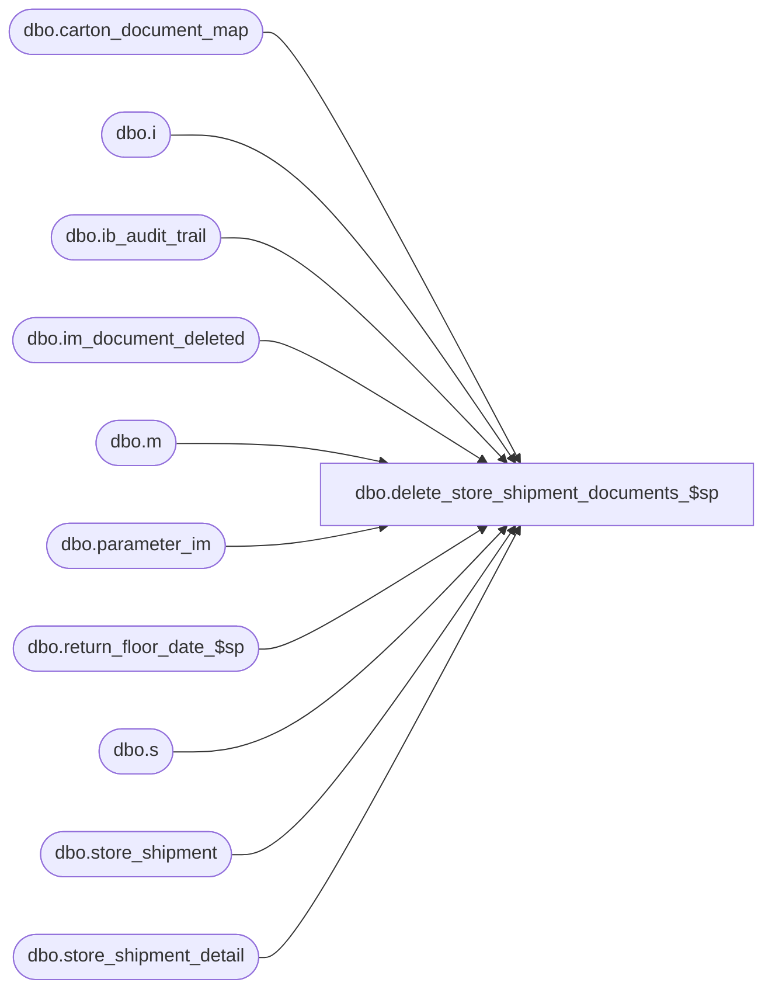

# dbo.delete_store_shipment_documents_$sp

**Database:** me_01  
**Server:** bedrockdb02  

## Architecture Diagram



## Table Dependencies

| Referenced Table |
|---|
| dbo.carton_document_map |
| dbo.i |
| dbo.ib_audit_trail |
| dbo.im_document_deleted |
| dbo.m |
| dbo.parameter_im |
| dbo.return_floor_date_$sp |
| dbo.s |
| dbo.store_shipment |
| dbo.store_shipment_detail |

## Stored Procedure Code

```sql
CREATE PROCEDURE [dbo].[delete_store_shipment_documents_$sp]
AS

/*
Proc name:  delete_store_shipment_documents_$sp
Desc: This procedure is called from delete_im_documents_$sp, it deletes Store_Shipment documents based on parameters stored in table parameter_im.
	  The delete should also comply with some business rules listed below.
History: Creation March 11, 2011
*/
BEGIN
	DECLARE @sql_err_num DECIMAL(38,0), @error_msg NVARCHAR(2000), @cleanup_weeks SMALLINT, @floor_date SMALLDATETIME, @batch_size INT,
		@min_store_shipment_id DECIMAL(12,0), @max_store_shipment_id DECIMAL(12,0), @done BIT, @counter INT;

	-- Make sure this table doesn't exists at the beginning of the process
	IF object_id(N'tempdb..#temp_store_shipment') IS NOT NULL
		DROP TABLE #temp_store_shipment;

	SELECT @done = 0, @batch_size = 500000,
		@min_store_shipment_id = MIN(store_shipment_id),
		@max_store_shipment_id = MAX(store_shipment_id)
	FROM store_shipment;

	BEGIN TRY

		SELECT @cleanup_weeks = store_ship_cleanup_weeks FROM parameter_im;

		EXEC return_floor_date_$sp @cleanup_weeks, @floor_date OUTPUT

		-- Batch the following inserts in case there are a large number  of documents to delete
		WHILE (@min_store_shipment_id <= @max_store_shipment_id)
		BEGIN
				BEGIN TRAN

				-- Rule # IMSSP079 - Delete all Store Shipments with a status of Received and receive date at at least x weeks ago
				INSERT INTO im_document_deleted
					(im_document_id, im_document_no, document_type, document_status)
				SELECT store_shipment_id, document_no, 4, document_status
				FROM store_shipment
				WHERE store_shipment_id BETWEEN @min_store_shipment_id AND @min_store_shipment_id + @batch_size
				AND document_status = 4
				AND discrepancy_posted_flag = 1
				AND receive_date < @floor_date;

				COMMIT TRAN

				SET @min_store_shipment_id = @min_store_shipment_id + @batch_size + 1;
		END;

		UPDATE STATISTICS im_document_deleted;

		SELECT @counter = COUNT(*), @done = 0, @max_store_shipment_id = 0 FROM im_document_deleted WHERE document_type = 4;

		IF (@counter > 10000)
		BEGIN
			WHILE (@done = 0)
			BEGIN
				-- We cannot do the delete in one big batch
				SELECT TOP 10000 im_document_id, im_document_no, document_type, document_status
				INTO #temp_store_shipment
				FROM im_document_deleted
				WHERE document_type = 4
				AND im_document_id > @max_store_shipment_id
				ORDER BY im_document_id;

				IF (@@ROWCOUNT > 0)
					SELECT @max_store_shipment_id = MAX(im_document_id) FROM #temp_store_shipment;
				ELSE
					SET @done = 1;

				IF (@done = 0)
				BEGIN
					BEGIN TRAN

					DELETE m
					FROM #temp_store_shipment t, carton_document_map m
					WHERE t.im_document_id = m.document_id
					AND m.document_type = 2;

					DELETE s
					FROM #temp_store_shipment t, store_shipment_detail s
					WHERE t.im_document_id = s.store_shipment_id;

					DELETE s
					FROM #temp_store_shipment t, store_shipment s
					WHERE t.im_document_id = s.store_shipment_id;

					-- Update Delete Log: ib audit trail
					DELETE i
					FROM #temp_store_shipment t, ib_audit_trail i
					WHERE i.application = N'IM'
					AND i.application_type = N'StoreShipment'
					AND t.im_document_no = i.application_identifier;

					-- Now do an INSERT to keep trace of documents deleted
					INSERT INTO ib_audit_trail
						   (entry_date, application, activity, application_type_id, application_type, application_identifier,
						   application_level, application_key, action, field_affected, old_value, new_value,
						   status, employee_last_name, employee_first_name)
					 SELECT GETDATE(), N'IM', N'Delete', NULL, N'StoreShipment', t.im_document_no, NULL, NULL ,N'Delete', NULL, NULL, NULL,
						     CASE WHEN t.document_status = 1 THEN N'Preliminary'
								  WHEN t.document_status = 2 THEN N'Ready to Send'
								  WHEN t.document_status = 3 THEN N'Sent'
								  WHEN t.document_status = 4 THEN N'Received'
								  WHEN t.document_status = 5 THEN N'Partially Matched'
								  WHEN t.document_status = 6 THEN N'Fully Matched'
								  WHEN t.document_status = 7 THEN N'Cancelled'
								  WHEN t.document_status = 8 THEN N'Requested'
								  WHEN t.document_status = 9 THEN N'Returned'
								  WHEN t.document_status = 10 THEN N'Submitted'
								  WHEN t.document_status = 11 THEN N'Released'
								  WHEN t.document_status = 12 THEN N'Unmatched'
								  WHEN t.document_status = 13 THEN N'Counted'
								  WHEN t.document_status = 14 THEN N'Partially Posted'
								  WHEN t.document_status = 15 THEN N'Posted'
								  WHEN t.document_status = 16 THEN N'In Transit'
								  WHEN t.document_status = 17 THEN N'Partially Returned'
								  ELSE N'Undefined'
							 END status
						   , N'Batch Delete'
						   , N'Pipeline Segment 3004'
					FROM #temp_store_shipment t;

					COMMIT TRAN;
				END;
				IF object_id(N'tempdb..#temp_store_shipment') IS NOT NULL
					DROP TABLE #temp_store_shipment;
			END;
		END;
		ELSE
		BEGIN
			-- Just a small number of documents to delete: do it in one batch
			BEGIN TRAN

			DELETE m
			FROM im_document_deleted d, carton_document_map m
			WHERE d.document_type = 4
			AND d.im_document_id = m.document_id
			AND m.document_type = 2;

			DELETE s
			FROM im_document_deleted d, store_shipment_detail s
			WHERE d.document_type = 4
			AND d.im_document_id = s.store_shipment_id;

			DELETE s
			FROM im_document_deleted d, store_shipment s
			WHERE d.document_type = 4
			AND d.im_document_id = s.store_shipment_id;

			-- Update Delete Log: ib audit trail
			DELETE i
			FROM im_document_deleted d, ib_audit_trail i
			WHERE d.document_type = 4
			AND i.application = N'IM'
			AND i.application_type = N'StoreShipment'
			AND d.im_document_no = i.application_identifier;

			-- Now do an INSERT to keep trace of documents deleted
			INSERT INTO ib_audit_trail
				   (entry_date, application, activity, application_type_id, application_type, application_identifier,
				   application_level, application_key, action, field_affected, old_value, new_value,
				   status, employee_last_name, employee_first_name)
			 SELECT GETDATE(), N'IM', N'Delete', NULL, N'StoreShipment', im_document_no, NULL, NULL ,N'Delete', NULL, NULL, NULL,
				     CASE WHEN document_status = 1 THEN N'Preliminary'
						  WHEN document_status = 2 THEN N'Ready to Send'
						  WHEN document_status = 3 THEN N'Sent'
						  WHEN document_status = 4 THEN N'Received'
						  WHEN document_status = 5 THEN N'Partially Matched'
						  WHEN document_status = 6 THEN N'Fully Matched'
						  WHEN document_status = 7 THEN N'Cancelled'
						  WHEN document_status = 8 THEN N'Requested'
						  WHEN document_status = 9 THEN N'Returned'
						  WHEN document_status = 10 THEN N'Submitted'
						  WHEN document_status = 11 THEN N'Released'
						  WHEN document_status = 12 THEN N'Unmatched'
						  WHEN document_status = 13 THEN N'Counted'
						  WHEN document_status = 14 THEN N'Partially Posted'
						  WHEN document_status = 15 THEN N'Posted'
						  WHEN document_status = 16 THEN N'In Transit'
						  WHEN document_status = 17 THEN N'Partially Returned'
						  ELSE N'Undefined'
					 END status
				   , N'Batch Delete'
				   , N'Pipeline Segment 3004'
			FROM im_document_deleted
			WHERE document_type = 4;

			COMMIT TRAN
		END;
	END TRY

	BEGIN CATCH
		SELECT @error_msg = ERROR_MESSAGE(),
		       @sql_err_num = ERROR_NUMBER();

		IF @@TRANCOUNT <> 0
			ROLLBACK TRANSACTION

		SET @error_msg = N'Error in procedure delete_store_shipment_documents_$sp: ' + CAST(ERROR_NUMBER() AS NVARCHAR) + N' ' + ERROR_MESSAGE()
		RAISERROR (@error_msg, -- Message text.
               16, -- Severity.
               1) -- State.
	END CATCH
END
```

