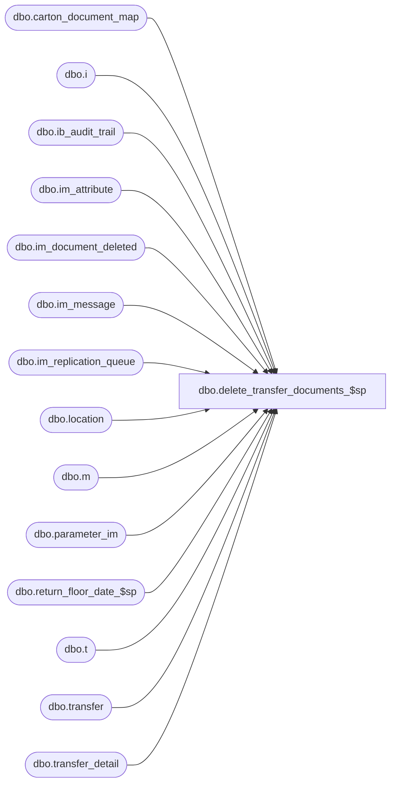

# dbo.delete_transfer_documents_$sp

**Database:** me_01  
**Server:** bedrockdb02  

## Architecture Diagram



## Table Dependencies

| Referenced Table |
|---|
| dbo.carton_document_map |
| dbo.i |
| dbo.ib_audit_trail |
| dbo.im_attribute |
| dbo.im_document_deleted |
| dbo.im_message |
| dbo.im_replication_queue |
| dbo.location |
| dbo.m |
| dbo.parameter_im |
| dbo.return_floor_date_$sp |
| dbo.t |
| dbo.transfer |
| dbo.transfer_detail |

## Stored Procedure Code

```sql
CREATE PROCEDURE [dbo].[delete_transfer_documents_$sp]
AS 

/* 
Proc name:  delete_transfer_documents_$sp
Desc: This procedure delete transfer documents based on parameters stored in table parameter_im.
	  The delete should also comply with some business rules listed below.
History: Creation March 03, 2011
*/
BEGIN
	DECLARE @sql_err_num DECIMAL(38,0), @error_msg NVARCHAR(2000), @cleanup_weeks SMALLINT, @floor_date SMALLDATETIME, @counter INT,
		@done BIT, @batch_size INT, @min_transfer_id DECIMAL(12,0), @max_transfer_id DECIMAL(12,0); 

	-- Make sure this table doesn't exists at the beginning of the process
	IF NOT object_id(N'tempdb..#temp_transfer') IS NULL
		DROP TABLE #temp_transfer;
		
	BEGIN TRY
		SELECT @cleanup_weeks = transfer_cleanup_weeks FROM parameter_im;
		
		EXEC return_floor_date_$sp @cleanup_weeks, @floor_date OUTPUT;
		
		SELECT @done = 0, @batch_size = 500000,
			@min_transfer_id = MIN(transfer_id),
			@max_transfer_id = MAX(transfer_id) 
		FROM transfer;
		
		-- If there is a lot of rows to insert then we should do it in multiple INSERTs
		WHILE (@min_transfer_id < @max_transfer_id)
		BEGIN
			BEGIN TRAN
			
				-- Rule # IMTRA156 - Delete all Cancelled Transfers
				INSERT INTO im_document_deleted
					(im_document_id, im_document_no, document_type, document_status)
				SELECT transfer_id, document_no, 5, -- document_type for transfer = 5 
					document_status
				FROM transfer
				WHERE transfer_id BETWEEN @min_transfer_id AND @min_transfer_id + @batch_size
				AND document_status = 7;
				
				-- Rule # IMTRA157 - Delete all Transfers with a status of Received and received date at least x weeks ago
				INSERT INTO im_document_deleted
					(im_document_id, im_document_no, document_type, document_status)
				SELECT transfer_id, document_no, 5, document_status
				FROM transfer
				WHERE transfer_id BETWEEN @min_transfer_id AND @min_transfer_id + @batch_size 
				AND document_status = 4
				AND receive_date < @floor_date;
				
				COMMIT TRAN	
						
			SET @min_transfer_id = @min_transfer_id + @batch_size;
		END;

		UPDATE STATISTICS im_document_deleted;
				
		SELECT @counter = COUNT(*), @done = 0, @max_transfer_id = 0 FROM im_document_deleted WHERE document_type = 5;
		
		IF (@counter > 10000)
		BEGIN
			WHILE (@done = 0)
				BEGIN
				-- We cannot do the delete in one big batch
				SELECT TOP 10000 im_document_id, im_document_no, document_type, document_status
				INTO #temp_transfer
				FROM im_document_deleted
				WHERE document_type = 5
				AND im_document_id > @max_transfer_id
				ORDER BY im_document_id;
				
				IF (@@ROWCOUNT > 0)	
					SELECT @max_transfer_id = MAX(im_document_id) FROM #temp_transfer;
				ELSE
					SET @done = 1;	
					
				IF (@done = 0)
				BEGIN
					BEGIN TRAN
						
						DELETE i
						FROM im_attribute i, #temp_transfer t
						WHERE i.parent_id = t.im_document_id
						AND i.parent_type = 5;
						
						DELETE i
						FROM im_message i, #temp_transfer t
						WHERE i.parent_id = t.im_document_id
						AND (i.parent_type = 6 OR i.parent_type = 7)
						
						DELETE m
						FROM carton_document_map m, #temp_transfer t
						WHERE m.document_type = 1
						AND m.document_id = t.im_document_id;
						
						-- Update Replication Queue on Transfer Delete
						INSERT INTO im_replication_queue 
							(entity_code, replication_action, entity_id, other_entity_id, other_entity_key, changed_units, replication_data) 
						SELECT 50, N'D', t.transfer_id, 0, N'', 0, 
							t.document_no + NCHAR(9) + l1.location_code + NCHAR(9) + l2.location_code + NCHAR(9) + ISNULL(t.external_doc_no, N'') 
							+ NCHAR(9) + CAST(t.document_source AS NVARCHAR(5))
						FROM #temp_transfer tt, transfer t WITH (NOLOCK), location l1 WITH (NOLOCK), location l2 WITH (NOLOCK)
						WHERE tt.im_document_id = t.transfer_id
						AND t.from_location_id = l1.location_id
						AND t.to_location_id = l2.location_id;
						
						-- Another replication queue update for Off-line stock when a transfer is deleted and its prior status was Ready to Send. 
						INSERT INTO im_replication_queue 
							(entity_code, replication_action, entity_id, other_entity_id, other_entity_key, changed_units, replication_data) 
						SELECT 50, N'DT', t.transfer_id, 0, t.document_no, 0, 
							l1.location_code + NCHAR(9) + l2.location_code
						FROM #temp_transfer tt, transfer t WITH (NOLOCK), location l1 WITH (NOLOCK), location l2 WITH (NOLOCK)
						WHERE tt.im_document_id = t.transfer_id
						AND t.state_no = 2
						AND t.from_location_id = l1.location_id
						AND t.to_location_id = l2.location_id;
										
						DELETE t
						FROM transfer_detail t, #temp_transfer tt
						WHERE t.transfer_id = tt.im_document_id;
					
						DELETE t
						FROM transfer t, #temp_transfer tt
						WHERE t.transfer_id = tt.im_document_id;
						
						-- Update Delete Log: ib audit trail				
						DELETE i
						FROM ib_audit_trail i, #temp_transfer t
						WHERE i.application = N'IM' 
						AND i.application_type = N'Transfer' 
						AND i.application_identifier = t.im_document_no;
						
						-- Now do an INSERT to keep trace of documents deleted
						INSERT INTO ib_audit_trail
							   (entry_date, application, activity, application_type_id, application_type, application_identifier, 
							   application_level, application_key, action, field_affected, old_value, new_value, 
							   status, employee_last_name, employee_first_name)
						 SELECT GETDATE(), N'IM', N'Delete', NULL, N'Transfer', t.im_document_no, NULL, NULL ,N'Delete', NULL, NULL, NULL, 
							     CASE WHEN t.document_status = 1 THEN N'Preliminary'
									  WHEN t.document_status = 2 THEN N'Ready to Send'
									  WHEN t.document_status = 3 THEN N'Sent'
									  WHEN t.document_status = 4 THEN N'Received'
									  WHEN t.document_status = 5 THEN N'Partially Matched'
									  WHEN t.document_status = 6 THEN N'Fully Matched'
									  WHEN t.document_status = 7 THEN N'Cancelled'
									  WHEN t.document_status = 8 THEN N'Requested'
									  WHEN t.document_status = 9 THEN N'Returned'
									  WHEN t.document_status = 10 THEN N'Submitted'
									  WHEN t.document_status = 11 THEN N'Released'
									  WHEN t.document_status = 12 THEN N'Unmatched'
									  WHEN t.document_status = 13 THEN N'Counted'
									  WHEN t.document_status = 14 THEN N'Partially Posted'
									  WHEN t.document_status = 15 THEN N'Posted'
									  WHEN t.document_status = 16 THEN N'In Transit'
									  WHEN t.document_status = 17 THEN N'Partially Returned'
									  ELSE N'Undefined'
								 END status
							   , N'Batch Delete'
							   , N'Pipeline Segment 3004'
						FROM #temp_transfer t;
						
						/*  WriteMessage
						INSERT INTO extension_queue
							(type, entity_id, method_id, entity_name)
						SELECT 1, t.im_document_id, N'BB300CCF-B69B-497a-9165-7297237040D6', t.im_document_no
						FROM #temp_transfer t
						ORDER BY t.im_document_id; */
						
						-- Do we still need to do that: Notify OM ???
						
					COMMIT TRAN

				END;
				IF object_id(N'tempdb..#temp_transfer') IS NOT NULL
					DROP TABLE #temp_transfer;
			END;
		END
		ELSE
		BEGIN		
			-- Do the actual DELETE in one batch
			BEGIN TRAN
			
			DELETE i
			FROM im_document_deleted d, im_attribute i
			WHERE d.document_type = 5
			AND d.im_document_id = i.parent_id
			AND i.parent_type = 5;
			
			DELETE i
			FROM im_document_deleted d, im_message i
			WHERE d.document_type = 5 
			AND d.im_document_id = i.parent_id
			AND (i.parent_type = 6 OR i.parent_type = 7)
			
			DELETE m
			FROM im_document_deleted d, carton_document_map m
			WHERE d.document_type = 5
			AND d.im_document_id = m.document_id
			AND m.document_type = 1;
			
			-- Update Replication Queue on Transfer Delete
			INSERT INTO im_replication_queue 
				(entity_code, replication_action, entity_id, other_entity_id, other_entity_key, changed_units, replication_data) 
			SELECT 50, N'D', t.transfer_id, 0, N'', 0, 
				t.document_no + NCHAR(9) + l1.location_code + NCHAR(9) + l2.location_code + NCHAR(9) + ISNULL(t.external_doc_no, N'') 
				+ NCHAR(9) + CAST(t.document_source AS NVARCHAR(5))
			FROM im_document_deleted d, transfer t WITH (NOLOCK), location l1 WITH (NOLOCK), location l2 WITH (NOLOCK)
			WHERE d.document_type = 5 
			AND d.im_document_id = t.transfer_id
			AND t.from_location_id = l1.location_id
			AND t.to_location_id = l2.location_id;
			
			-- Another replication queue update for Off-line stock when a transfer is deleted and its prior status was Ready to Send. 
			INSERT INTO im_replication_queue 
				(entity_code, replication_action, entity_id, other_entity_id, other_entity_key, changed_units, replication_data) 
			SELECT 50, N'DT', t.transfer_id, 0, t.document_no, 0, 
				l1.location_code + NCHAR(9) + l2.location_code
			FROM im_document_deleted d, transfer t WITH (NOLOCK), location l1 WITH (NOLOCK), location l2 WITH (NOLOCK)
			WHERE d.document_type = 5  
			AND d.im_document_id = t.transfer_id
			AND t.state_no = 2
			AND t.from_location_id = l1.location_id
			AND t.to_location_id = l2.location_id;
							
			DELETE t
			FROM im_document_deleted d, transfer_detail t
			WHERE d.document_type = 5 
			AND d.im_document_id = t.transfer_id;
		
			DELETE t
			FROM im_document_deleted d, transfer t
			WHERE d.document_type = 5 
			AND d.im_document_id = t.transfer_id;
			
			-- Update Delete Log: ib audit trail				
			DELETE i
			FROM im_document_deleted d, ib_audit_trail i
			WHERE d.document_type = 5  
			AND i.application = N'IM' 
			AND i.application_type = N'Transfer' 
			AND i.application_identifier = d.im_document_no;
			
			-- Now do an INSERT to keep trace of documents deleted
			INSERT INTO ib_audit_trail
				   (entry_date, application, activity, application_type_id, application_type, application_identifier, 
				   application_level, application_key, action, field_affected, old_value, new_value, 
				   status, employee_last_name, employee_first_name)
			 SELECT GETDATE(), N'IM', N'Delete', NULL, N'Transfer', d.im_document_no, NULL, NULL ,N'Delete', NULL, NULL, NULL, 
				     CASE WHEN d.document_status = 1 THEN N'Preliminary'
						  WHEN d.document_status = 2 THEN N'Ready to Send'
						  WHEN d.document_status = 3 THEN N'Sent'
						  WHEN d.document_status = 4 THEN N'Received'
						  WHEN d.document_status = 5 THEN N'Partially Matched'
						  WHEN d.document_status = 6 THEN N'Fully Matched'
						  WHEN d.document_status = 7 THEN N'Cancelled'
						  WHEN d.document_status = 8 THEN N'Requested'
						  WHEN d.document_status = 9 THEN N'Returned'
						  WHEN d.document_status = 10 THEN N'Submitted'
						  WHEN d.document_status = 11 THEN N'Released'
						  WHEN d.document_status = 12 THEN N'Unmatched'
						  WHEN d.document_status = 13 THEN N'Counted'
						  WHEN d.document_status = 14 THEN N'Partially Posted'
						  WHEN d.document_status = 15 THEN N'Posted'
						  WHEN d.document_status = 16 THEN N'In Transit'
						  WHEN d.document_status = 17 THEN N'Partially Returned'
						  ELSE N'Undefined'
					 END status
				   , N'Batch Delete'
				   , N'Pipeline Segment 3004'
			FROM im_document_deleted d
			WHERE d.document_type = 5;
			
			/* WriteMessage
			INSERT INTO extension_queue
				(type, entity_id, method_id, entity_name)
			SELECT 1, d.im_document_id, N'BB300CCF-B69B-497a-9165-7297237040D6', d.im_document_no
			FROM im_document_deleted d
			WHERE d.document_type = 5
			ORDER BY d.im_document_id; */
			
			-- Do we still need to do that: Notify OM ???
			
			COMMIT TRAN
		END
		
	END TRY

	BEGIN CATCH
		SELECT @error_msg = ERROR_MESSAGE(),
		       @sql_err_num = ERROR_NUMBER();
		 
		IF @@TRANCOUNT <> 0
			ROLLBACK TRANSACTION
			
		SET @error_msg = N'Error in procedure delete_transfer_documents_$sp: ' + CAST(ERROR_NUMBER() AS NVARCHAR) + N' ' + ERROR_MESSAGE()
		RAISERROR (@error_msg, -- Message text.
               16, -- Severity.
               1) -- State.
	END CATCH
END
```

