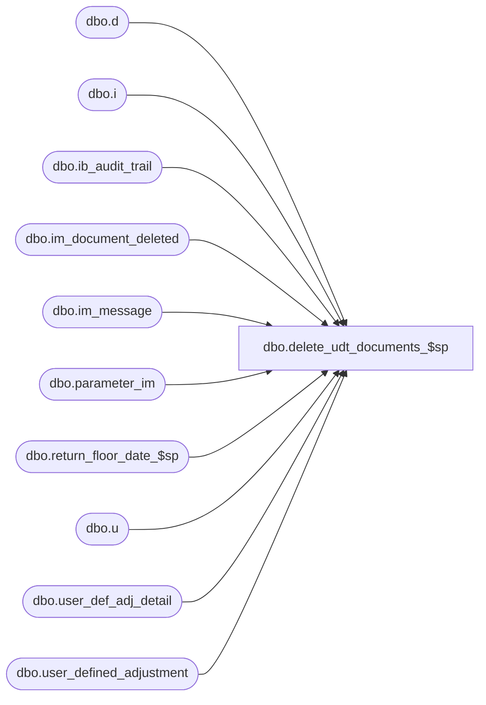

# dbo.delete_udt_documents_$sp

**Database:** me_01  
**Server:** bedrockdb02  

## Architecture Diagram



## Table Dependencies

| Referenced Table |
|---|
| dbo.d |
| dbo.i |
| dbo.ib_audit_trail |
| dbo.im_document_deleted |
| dbo.im_message |
| dbo.parameter_im |
| dbo.return_floor_date_$sp |
| dbo.u |
| dbo.user_def_adj_detail |
| dbo.user_defined_adjustment |

## Stored Procedure Code

```sql
CREATE PROCEDURE [dbo].[delete_udt_documents_$sp]
AS 

/* 
Proc name:  delete_udt_documents_$sp
Desc: This procedure is called from delete_im_documents_$sp and it deletes User Defined Adjustment documents based on parameters stored in table parameter_im.
	  The delete should also comply with some business rules listed below.
History: Creation March 03, 2011
*/
BEGIN
	DECLARE @sql_err_num DECIMAL(38,0), @error_msg NVARCHAR(2000), @cleanup_weeks SMALLINT, @floor_date SMALLDATETIME, @batch_size INT,
		@min_udt_id DECIMAL(12,0), @max_udt_id DECIMAL(12,0), @done BIT, @counter INT;
		
	-- Make sure this table doesn't exists at the beginning of the process
	IF object_id(N'tempdb..#temp_udt') IS NOT NULL
		DROP TABLE #temp_udt;
		
	SELECT @done = 0, @batch_size = 500000,
		@min_udt_id = MIN(user_defined_adjustment_id),
		@max_udt_id = MAX(user_defined_adjustment_id) 
	FROM user_defined_adjustment;

	BEGIN TRY
	
		SELECT @cleanup_weeks = user_def_adj_cleanup_weeks FROM parameter_im;
		
		EXEC return_floor_date_$sp @cleanup_weeks, @floor_date OUTPUT
		
		-- Batch the following inserts in case there are a large number  of documents to delete
		WHILE (@min_udt_id < @max_udt_id)
		BEGIN
				BEGIN TRAN
				
				-- Rule #IMUDT045 - Delete all Cancelled UDTs
				INSERT INTO im_document_deleted
					(im_document_id, im_document_no, document_type, document_status)
				SELECT user_defined_adjustment_id, document_no, 13, -- document_type for UDT is 13
					document_status
				FROM user_defined_adjustment
				WHERE user_defined_adjustment_id BETWEEN @min_udt_id AND @min_udt_id + @batch_size
				AND document_status = 7;
				
				-- Rule # IMUDT046 - Delete all UDTs with a status of Submitted and submitted date at at least x weeks ago
				INSERT INTO im_document_deleted
					(im_document_id, im_document_no, document_type, document_status)
				SELECT user_defined_adjustment_id, document_no, 13, document_status
				FROM user_defined_adjustment
				WHERE user_defined_adjustment_id BETWEEN @min_udt_id AND @min_udt_id + @batch_size
				AND document_status = 10
				AND submit_date < @floor_date;
					
				COMMIT TRAN
				
				SET @min_udt_id = @min_udt_id + @batch_size;
		END;
		
		UPDATE STATISTICS im_document_deleted;
			
		SELECT @counter = COUNT(*), @done = 0, @max_udt_id = 0 FROM im_document_deleted WHERE document_type = 13;
		
		IF (@counter > 10000)
		BEGIN
			WHILE (@done = 0)
			BEGIN
				-- We cannot do the delete in one big batch
				SELECT TOP 10000 im_document_id, im_document_no, document_type, document_status
				INTO #temp_udt
				FROM im_document_deleted
				WHERE document_type = 13
				AND im_document_id > @max_udt_id
				ORDER BY im_document_id;
				
				IF (@@ROWCOUNT > 0)	
					SELECT @max_udt_id = MAX(im_document_id) FROM #temp_udt;
				ELSE
					SET @done = 1;	
					
				IF (@done = 0)
				BEGIN
					BEGIN TRAN
					
					DELETE i
					FROM #temp_udt t, im_message i
					WHERE t.im_document_id = i.parent_id 
					AND i.parent_type = 13
	
					DELETE u
					FROM #temp_udt t, user_defined_adjustment u
					WHERE t.im_document_id = u.user_defined_adjustment_id;
					
					DELETE d
					FROM #temp_udt t, user_def_adj_detail d
					WHERE t.im_document_id = d.user_defined_adjustment_id;
					
					-- Update Delete Log: ib audit trail				
					DELETE i
					FROM #temp_udt t, ib_audit_trail i
					WHERE i.application = N'IM' 
					AND i.application_type = N'UserDefinedAdjustment' 
					AND t.im_document_no = i.application_identifier;
					
					-- Now do an INSERT to keep trace of documents deleted
					INSERT INTO ib_audit_trail
						   (entry_date, application, activity, application_type_id, application_type, application_identifier, 
						   application_level, application_key, action, field_affected, old_value, new_value, 
						   status, employee_last_name, employee_first_name)
					 SELECT GETDATE(), N'IM', N'Delete', NULL, N'UserDefinedAdjustment', t.im_document_no, NULL, NULL ,N'Delete', NULL, NULL, NULL, 
						     CASE WHEN t.document_status = 1 THEN N'Preliminary'
								  WHEN t.document_status = 2 THEN N'Ready to Send'
								  WHEN t.document_status = 3 THEN N'Sent'
								  WHEN t.document_status = 4 THEN N'Received'
								  WHEN t.document_status = 5 THEN N'Partially Matched'
								  WHEN t.document_status = 6 THEN N'Fully Matched'
								  WHEN t.document_status = 7 THEN N'Cancelled'
								  WHEN t.document_status = 8 THEN N'Requested'
								  WHEN t.document_status = 9 THEN N'Returned'
								  WHEN t.document_status = 10 THEN N'Submitted'
								  WHEN t.document_status = 11 THEN N'Released'
								  WHEN t.document_status = 12 THEN N'Unmatched'
								  WHEN t.document_status = 13 THEN N'Counted'
								  WHEN t.document_status = 14 THEN N'Partially Posted'
								  WHEN t.document_status = 15 THEN N'Posted'
								  WHEN t.document_status = 16 THEN N'In Transit'
								  WHEN t.document_status = 17 THEN N'Partially Returned'
								  ELSE N'Undefined'
							 END status
						   , N'Batch Delete'
						   , N'Pipeline Segment 3004'
					FROM #temp_udt t;
					
					/*  WriteMessage
					INSERT INTO extension_queue
						(type, entity_id, method_id, entity_name)
					SELECT 13, t.im_document_id, N'38170F92-DF24-4428-8736-3255DC22EB63', t.im_document_no
					FROM #temp_udt t
					ORDER BY t.im_document_id; */
					
					COMMIT TRAN;
				END;
				IF object_id(N'tempdb..#temp_udt') IS NOT NULL
					DROP TABLE #temp_udt;
			END;
		END;
		ELSE
		BEGIN				
			-- Just a small number of documents to delete: do it in one batch
			BEGIN TRAN
			
			DELETE i
			FROM im_document_deleted d, im_message i
			WHERE d.document_type = 13
			AND d.im_document_id = i.parent_id 
			AND i.parent_type = 13;
			
			DELETE u
			FROM im_document_deleted d, user_defined_adjustment u
			WHERE d.document_type = 13 
			AND d.im_document_id = u.user_defined_adjustment_id;
			
			DELETE u
			FROM im_document_deleted d, user_def_adj_detail u
			WHERE d.document_type = 13 
			AND d.im_document_id = u.user_defined_adjustment_id;
			
			-- Update Delete Log: ib audit trail				
			DELETE i
			FROM im_document_deleted d, ib_audit_trail i
			WHERE d.document_type = 13   
			AND i.application = N'IM' 
			AND i.application_type = N'UserDefinedAdjustment' 
			AND i.application_identifier = d.im_document_no;
			
			-- Now do an INSERT to keep trace of documents deleted
			INSERT INTO ib_audit_trail
				   (entry_date, application, activity, application_type_id, application_type, application_identifier, 
				   application_level, application_key, action, field_affected, old_value, new_value, 
				   status, employee_last_name, employee_first_name)
			 SELECT GETDATE(), N'IM', N'Delete', NULL, N'UserDefinedAdjustment', d.im_document_no, NULL, NULL ,N'Delete', NULL, NULL, NULL, 
				     CASE WHEN d.document_status = 1 THEN N'Preliminary'
						  WHEN d.document_status = 2 THEN N'Ready to Send'
						  WHEN d.document_status = 3 THEN N'Sent'
						  WHEN d.document_status = 4 THEN N'Received'
						  WHEN d.document_status = 5 THEN N'Partially Matched'
						  WHEN d.document_status = 6 THEN N'Fully Matched'
						  WHEN d.document_status = 7 THEN N'Cancelled'
						  WHEN d.document_status = 8 THEN N'Requested'
						  WHEN d.document_status = 9 THEN N'Returned'
						  WHEN d.document_status = 10 THEN N'Submitted'
						  WHEN d.document_status = 11 THEN N'Released'
						  WHEN d.document_status = 12 THEN N'Unmatched'
						  WHEN d.document_status = 13 THEN N'Counted'
						  WHEN d.document_status = 14 THEN N'Partially Posted'
						  WHEN d.document_status = 15 THEN N'Posted'
						  WHEN d.document_status = 16 THEN N'In Transit'
						  WHEN d.document_status = 17 THEN N'Partially Returned'
						  ELSE N'Undefined'
					 END status
				   , N'Batch Delete'
				 , N'Pipeline Segment 3004'
			FROM im_document_deleted d
			WHERE d.document_type = 13;
			
			/*  WriteMessage
			INSERT INTO extension_queue
				(type, entity_id, method_id, entity_name)
			SELECT 13, t.im_document_id, N'38170F92-DF24-4428-8736-3255DC22EB63', t.im_document_no
			FROM #temp_udt t
			ORDER BY t.im_document_id; */
			
			COMMIT TRAN
		END;
	END TRY

	BEGIN CATCH
		SELECT @error_msg = ERROR_MESSAGE(),
		       @sql_err_num = ERROR_NUMBER();
		 
		IF @@TRANCOUNT <> 0
			ROLLBACK TRANSACTION
			
		SET @error_msg = N'Error in procedure delete_udt_documents_$sp: ' + CAST(ERROR_NUMBER() AS NVARCHAR) + N' ' + ERROR_MESSAGE()
		RAISERROR (@error_msg, -- Message text.
               16, -- Severity.
               1) -- State.
	END CATCH
END
```

