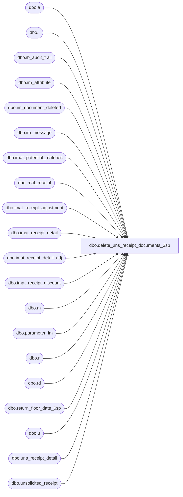

# dbo.delete_uns_receipt_documents_$sp

**Database:** me_01  
**Server:** bedrockdb02  

## Architecture Diagram



## Table Dependencies

| Referenced Table |
|---|
| dbo.a |
| dbo.i |
| dbo.ib_audit_trail |
| dbo.im_attribute |
| dbo.im_document_deleted |
| dbo.im_message |
| dbo.imat_potential_matches |
| dbo.imat_receipt |
| dbo.imat_receipt_adjustment |
| dbo.imat_receipt_detail |
| dbo.imat_receipt_detail_adj |
| dbo.imat_receipt_discount |
| dbo.m |
| dbo.parameter_im |
| dbo.r |
| dbo.rd |
| dbo.return_floor_date_$sp |
| dbo.u |
| dbo.uns_receipt_detail |
| dbo.unsolicited_receipt |

## Stored Procedure Code

```sql
CREATE PROCEDURE [dbo].[delete_uns_receipt_documents_$sp]
AS 

/* 
Proc name:  delete_uns_receipt_documents_$sp
Desc: This procedure is called from delete_im_documents_$sp and it deletes Unsolicited Receipt documents based on parameters stored in table parameter_im.
	  The delete should also comply with some business rules listed below.
History: Creation March 03, 2011
*/
BEGIN
	DECLARE @sql_err_num DECIMAL(38,0), @error_msg NVARCHAR(2000), @cleanup_weeks SMALLINT, @floor_date SMALLDATETIME, @counter INT,
		@done BIT, @batch_size INT, @min_uns_receipt_id DECIMAL(12,0), @max_uns_receipt_id DECIMAL(12,0); 

	-- Make sure this table doesn't exists at the beginning of the process
	IF NOT object_id(N'tempdb..#temp_uns_receipt') IS NULL
		DROP TABLE #temp_uns_receipt;
		
	BEGIN TRY
		SELECT @cleanup_weeks = uns_receipt_cleanup_weeks FROM parameter_im;
		
		EXEC return_floor_date_$sp @cleanup_weeks, @floor_date OUTPUT;
		
		SELECT @done = 0, @batch_size = 500000,
			@min_uns_receipt_id = MIN(unsolicited_receipt_id),
			@max_uns_receipt_id = MAX(unsolicited_receipt_id) 
		FROM unsolicited_receipt;
		
		-- If there is a lot of rows to insert then we should do it in multiple INSERTs
		WHILE (@min_uns_receipt_id < @max_uns_receipt_id)
		BEGIN
			BEGIN TRAN
			
				-- Rule #: IMUNR045 - Delete all Cancelled Unsolicited Receipts
				INSERT INTO im_document_deleted
					(im_document_id, im_document_no, document_type, document_status)
				SELECT unsolicited_receipt_id, document_no, 11, -- document_type for unsolicited receipts is 11
					document_status
				FROM unsolicited_receipt
				WHERE unsolicited_receipt_id BETWEEN @min_uns_receipt_id AND @min_uns_receipt_id + @batch_size
				AND document_status = 7;
				
				-- Rule #: IMUNR046 - Delete Fully Matched Unsolicited Receipts if receive date is at least x weeks ago 
				INSERT INTO im_document_deleted
					(im_document_id, im_document_no, document_type, document_status)
				SELECT unsolicited_receipt_id, document_no, 11, document_status
				FROM unsolicited_receipt
				WHERE unsolicited_receipt_id BETWEEN @min_uns_receipt_id AND @min_uns_receipt_id + @batch_size 
				AND match_status = 5
				AND receive_date < @floor_date;
				
				COMMIT TRAN	
						
			SET @min_uns_receipt_id = @min_uns_receipt_id + @batch_size;
		END;

		UPDATE STATISTICS im_document_deleted;
				
		SELECT @counter = COUNT(*), @done = 0, @max_uns_receipt_id = 0 FROM im_document_deleted WHERE document_type = 11;
		
		IF (@counter > 10000)
		BEGIN
			WHILE (@done = 0)
				BEGIN
				-- We cannot do the delete in one big batch
				SELECT TOP 10000 im_document_id, im_document_no, document_type, document_status
				INTO #temp_uns_receipt
				FROM im_document_deleted
				WHERE document_type = 11
				AND im_document_id > @max_uns_receipt_id
				ORDER BY im_document_id;
				
				IF (@@ROWCOUNT > 0)	
					SELECT @max_uns_receipt_id = MAX(im_document_id) FROM #temp_uns_receipt;
				ELSE
					SET @done = 1;	
					
				IF (@done = 0)
				BEGIN
					BEGIN TRAN
						-- messages
						DELETE m
						FROM im_message m, #temp_uns_receipt t
						WHERE m.parent_type = 11
						AND m.parent_id = t.im_document_id;
						
						-- attributes
						DELETE a
						FROM im_attribute a, #temp_uns_receipt t
						WHERE a.parent_id = 11
						AND a.parent_id = t.im_document_id;
						
						-- IMAT related data
						DELETE i
						FROM #temp_uns_receipt t, imat_receipt r, imat_receipt_detail rd, imat_receipt_detail_adj i
						WHERE r.transaction_type = 2 
						AND t.im_document_id = r.receipt_id
						AND r.imat_receipt_id = rd.imat_receipt_id
						AND rd.imat_receipt_detail_id = i.imat_receipt_detail_id;
						
						DELETE a
						FROM #temp_uns_receipt t, imat_receipt r, imat_receipt_adjustment a
						WHERE r.transaction_type = 2
						AND t.im_document_id = r.receipt_id
						AND r.imat_receipt_id = a.imat_receipt_id;

						DELETE rd
						FROM #temp_uns_receipt t, imat_receipt r, imat_receipt_discount rd
						WHERE r.transaction_type = 2
						AND t.im_document_id = r.receipt_id
						AND r.imat_receipt_id = rd.imat_receipt_id;
			            
						DELETE m
						FROM #temp_uns_receipt t, imat_receipt r, imat_potential_matches m
						WHERE r.transaction_type = 2
						AND t.im_document_id = r.receipt_id
						AND r.imat_receipt_id = m.imat_receipt_id;
			            
						DELETE rd
						FROM #temp_uns_receipt t, imat_receipt r, imat_receipt_detail rd
						WHERE r.transaction_type = 2 
						AND t.im_document_id = r.receipt_id
						AND r.imat_receipt_id = rd.imat_receipt_id;
			            
						DELETE r
						FROM #temp_uns_receipt t, imat_receipt r
						WHERE r.transaction_type = 2
						AND t.im_document_id = r.receipt_id
						
						DELETE u
						FROM uns_receipt_detail u, #temp_uns_receipt t
						WHERE u.unsolicited_receipt_id = t.im_document_id ;
						
						DELETE u
						FROM unsolicited_receipt u, #temp_uns_receipt t
						WHERE u.unsolicited_receipt_id = t.im_document_id;
						
						DELETE i
						FROM ib_audit_trail i, #temp_uns_receipt t
						WHERE i.application = N'IM' 
						AND i.application_type = N'UnsolicitedReceipt' 
						AND i.application_identifier = t.im_document_no;

						-- Now do an INSERT to keep trace of documents deleted
						INSERT INTO ib_audit_trail
							   (entry_date
							   ,application
							   ,activity
							   ,application_type_id
							   ,application_type
							   ,application_identifier
							   ,application_level
							   ,application_key
							   ,action
							   ,field_affected
							   ,old_value
							   ,new_value
							   ,status
							   ,employee_last_name
							   ,employee_first_name)
						 SELECT GETDATE()
							   , N'IM'
							   , N'Delete'
							   , NULL
							   , N'UnsolicitedReceipt'
							   , t.im_document_no
							   , NULL
							   , NULL
							   , N'Delete'
							   , NULL
							   , NULL
							   , NULL
							   , CASE WHEN t.document_status = 1 THEN N'Preliminary'
									  WHEN t.document_status = 2 THEN N'Ready to Send'
									  WHEN t.document_status = 3 THEN N'Sent'
									  WHEN t.document_status = 4 THEN N'Received'
									  WHEN t.document_status = 5 THEN N'Partially Matched'
									  WHEN t.document_status = 6 THEN N'Fully Matched'
									  WHEN t.document_status = 7 THEN N'Cancelled'
									  WHEN t.document_status = 8 THEN N'Requested'
									  WHEN t.document_status = 9 THEN N'Returned'
									  WHEN t.document_status = 10 THEN N'Submitted'
									  WHEN t.document_status = 11 THEN N'Released'
									  WHEN t.document_status = 12 THEN N'Unmatched'
									  WHEN t.document_status = 13 THEN N'Counted'
									  WHEN t.document_status = 14 THEN N'Partially Posted'
									  WHEN t.document_status = 15 THEN N'Posted'
									  WHEN t.document_status = 16 THEN N'In Transit'
									  WHEN t.document_status = 17 THEN N'Partially Returned'
									  ELSE N'Undefined'
								 END status
							   , N'Batch Delete'
							   , N'Pipeline Segment 3004'
						FROM #temp_uns_receipt t;
						
					COMMIT TRAN

				END;
				IF object_id(N'tempdb..#temp_uns_receipt') IS NOT NULL
					DROP TABLE #temp_uns_receipt;
			END;
		END
		ELSE
		BEGIN		
			-- Do the actual DELETE in one batch
			BEGIN TRAN
			
			-- messages
			DELETE m
			FROM im_document_deleted d, im_message m
			WHERE d.document_type = 11
			AND m.parent_type = 11
			AND m.parent_id = d.im_document_id;
			
			-- attributes
			DELETE a
			FROM im_attribute a, im_document_deleted d
			WHERE d.document_type = 11
			AND a.parent_id = 11
			AND d.im_document_id = a.parent_id;
			
			-- IMAT related data
			DELETE i
			FROM im_document_deleted d, imat_receipt r, imat_receipt_detail rd, imat_receipt_detail_adj i
			WHERE d.document_type = 11
			AND d.im_document_id = r.receipt_id
			AND r.transaction_type = 2
			AND r.imat_receipt_id = rd.imat_receipt_id
			AND rd.imat_receipt_detail_id = i.imat_receipt_detail_id;
			
			DELETE a
			FROM im_document_deleted d, imat_receipt r, imat_receipt_adjustment a
			WHERE d.document_type = 11
			AND d.im_document_id = r.receipt_id 
			AND r.transaction_type = 2
			AND r.imat_receipt_id = a.imat_receipt_id;

			DELETE rd
			FROM im_document_deleted d, imat_receipt r, imat_receipt_discount rd
			WHERE d.document_type = 11
			AND d.im_document_id = r.receipt_id 
			AND r.transaction_type = 2
			AND r.imat_receipt_id = rd.imat_receipt_id;
            
			DELETE m
			FROM im_document_deleted d, imat_receipt r, imat_potential_matches m
			WHERE d.document_type = 11
			AND d.im_document_id = r.receipt_id 
			AND r.transaction_type = 2
			AND r.imat_receipt_id = m.imat_receipt_id;
            
			DELETE rd
			FROM im_document_deleted d, imat_receipt r, imat_receipt_detail rd
			WHERE d.document_type = 11
			AND d.im_document_id = r.receipt_id 
			AND r.transaction_type = 2 
			AND r.imat_receipt_id = rd.imat_receipt_id;
            
			DELETE r
			FROM im_document_deleted d, imat_receipt r
			WHERE d.document_type = 11
			AND d.im_document_id = r.receipt_id  
			AND r.transaction_type = 2;
			
			DELETE u
			FROM uns_receipt_detail u, im_document_deleted d
			WHERE d.document_type = 11
			AND d.im_document_id = u.unsolicited_receipt_id;
			
			DELETE u
			FROM unsolicited_receipt u, im_document_deleted d
			WHERE d.document_type = 11
			AND d.im_document_id = u.unsolicited_receipt_id;
			
			DELETE i
			FROM ib_audit_trail i, im_document_deleted d
			WHERE i.application = N'IM' 
			AND i.application_type = N'UnsolicitedReceipt' 
			AND d.document_type = 11
			AND i.application_identifier = d.im_document_no;

			-- Now do an INSERT to keep trace of documents deleted
			INSERT INTO ib_audit_trail
				   (entry_date
				   ,application
				   ,activity
				   ,application_type_id
				   ,application_type
				   ,application_identifier
				   ,application_level
				   ,application_key
				   ,action
				   ,field_affected
				   ,old_value
				   ,new_value
				   ,status
				   ,employee_last_name
				   ,employee_first_name)
			 SELECT GETDATE()
				   , N'IM'
				   , N'Delete'
				   , NULL
				   , N'UnsolicitedReceipt'
				   , d.im_document_no
				   , NULL
				   , NULL
				   , N'Delete'
				   , NULL
				   , NULL
				   , NULL
				   , CASE WHEN d.document_status = 1 THEN N'Preliminary'
						  WHEN d.document_status = 2 THEN N'Ready to Send'
						  WHEN d.document_status = 3 THEN N'Sent'
						  WHEN d.document_status = 4 THEN N'Received'
						  WHEN d.document_status = 5 THEN N'Partially Matched'
						  WHEN d.document_status = 6 THEN N'Fully Matched'
						  WHEN d.document_status = 7 THEN N'Cancelled'
						  WHEN d.document_status = 8 THEN N'Requested'
						  WHEN d.document_status = 9 THEN N'Returned'
						  WHEN d.document_status = 10 THEN N'Submitted'
						  WHEN d.document_status = 11 THEN N'Released'
						  WHEN d.document_status = 12 THEN N'Unmatched'
						  WHEN d.document_status = 13 THEN N'Counted'
						  WHEN d.document_status = 14 THEN N'Partially Posted'
						  WHEN d.document_status = 15 THEN N'Posted'
						  WHEN d.document_status = 16 THEN N'In Transit'
						  WHEN d.document_status = 17 THEN N'Partially Returned'
						  ELSE N'Undefined'
					 END status
				   , N'Batch Delete'
				   , N'Pipeline Segment 3004'
			FROM im_document_deleted d
			WHERE d.document_type = 11;
			
			COMMIT TRAN
		END
		
	END TRY

	BEGIN CATCH
		SELECT @error_msg = ERROR_MESSAGE(),
		       @sql_err_num = ERROR_NUMBER();
		 
		IF @@TRANCOUNT <> 0
			ROLLBACK TRANSACTION
			
		SET @error_msg = N'Error in procedure delete_uns_receipt_documents_$sp: ' + CAST(ERROR_NUMBER() AS NVARCHAR) + N' ' + ERROR_MESSAGE()
		RAISERROR (@error_msg, -- Message text.
              16, -- Severity.
               1) -- State.
	END CATCH
END
```

