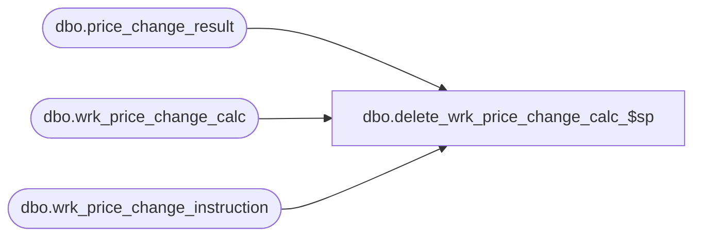

# dbo.delete_wrk_price_change_calc_$sp

**Database:** me_01  
**Server:** bedrockdb02  

## Architecture Diagram



## Table Dependencies

| Referenced Table |
|---|
| dbo.price_change_result |
| dbo.wrk_price_change_calc |
| dbo.wrk_price_change_instruction |

## Stored Procedure Code

```sql
-----------------------------------------------------------------------------------------------------------------------------
--	Main Query: Create Procedure
-----------------------------------------------------------------------------------------------------------------------------

CREATE PROCEDURE dbo.delete_wrk_price_change_calc_$sp

	@Wrk_Price_Change_ID AS DECIMAL (12, 0)

AS

--	Object GUID: 87C0BDCA-68B4-4E49-868E-CE9A393713E2
--	Pricing GUID (General): EFB5A343-8978-4ACF-952C-37862704CBC8

SET TRANSACTION ISOLATION LEVEL READ UNCOMMITTED
SET NOCOUNT ON

-----------------------------------------------------------------------------------------------------------------------------
--	Declarations / Sets: Declare And Set Variables
-----------------------------------------------------------------------------------------------------------------------------
DECLARE @total_rows_deleted AS INT

--If deleting millions of rows, database logging could error and/or take several minutes.
--In comparison, doing small batches takes 9 seconds for 4+ million rows.

SET @total_rows_deleted = 100000

WHILE @total_rows_deleted = 100000
BEGIN

	DELETE TOP (100000) FROM wrk_price_change_instruction
	WHERE
		wrk_price_change_id =  @Wrk_Price_Change_ID

	SET @total_rows_deleted = @@ROWCOUNT

END

SET @total_rows_deleted = 100000

WHILE @total_rows_deleted = 100000
BEGIN

	DELETE TOP (100000) FROM price_change_result
	WHERE
		result_id =  @Wrk_Price_Change_ID

	SET @total_rows_deleted = @@ROWCOUNT

END
DELETE FROM wrk_price_change_calc
WHERE
	wrk_price_change_calc_id = @Wrk_Price_Change_ID
```

